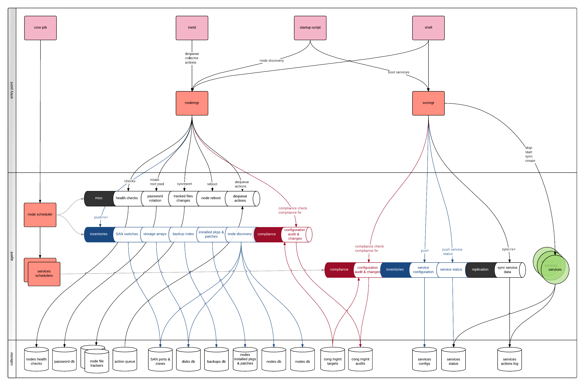

Agent architecture
******************

The "entry-point" lane shows how the daemon-less OpenSVC agent gets to run.

The system scheduler entry-point
================================

The system scheduler entry-point wakes the OpenSVC internal node scheduler, which in turn spawns the service schedulers in threads.

Each task of the node scheduler can be executed directly through the nodemgr command, and each task of the service scheduler can be executed directly through the svcmgr command.

Most tasks produce data sent to the collector for site-level aggregation.

Node scheduler tasks
++++++++++++++++++++

The node scheduler tasks schedules are defined in ``<OSVCETC>/node.conf``. Each task has its own section supporting the ``schedule`` parameter. The section name is visible in ``sudo nodemgr print schedule`` output in the ``config parameter`` column.

::

  $ sudo nodemgr print schedule
  action                last run               config parameter          schedule definition
  ------                --------               ----------------          -------------------
  auto_reboot           2015-07-28 17:00:01    reboot.schedule           16:00-17:00@1 sat:last,tue-mon:last * %2+1,feb-apr
  auto_rotate_root_pw   2015-02-25 17:17:17    rotate_root_pw.schedule   -
  checks                2015-09-22 07:50:01    checks.schedule           ["16:00-21:00@30 *:last", "! * wed", "*@1"]
  compliance_auto       2015-09-22 00:30:03    compliance.schedule       00:00-01:00@61
  dequeue_actions       2015-09-22 07:50:01    dequeue_actions.schedule  @1
  pushasset             2015-09-22 03:00:01    asset.schedule            00:00-06:00@361 mon-sun
  pushbrocade           2015-03-04 16:21:25    brocade.schedule          -
  pushdcs               2015-03-04 16:21:25    dcs.schedule              -
  pushdisks             2015-09-22 03:30:01    disks.schedule            00:00-06:00@361 mon-sun
  pushemcvnx            -                      emcvnx.schedule           -
  pusheva               2015-02-25 17:17:17    eva.schedule              -
  pushfreenas           -                      freenas.schedule          -
  pushhds               2015-03-04 16:21:25    hds.schedule              -
  pushhp3par            2015-02-25 17:17:11    hp3par.schedule           -
  pushibmds             2015-03-04 16:21:25    ibmds.schedule            -
  pushibmsvc            2015-02-25 17:17:16    ibmsvc.schedule           -
  pushnecism            2015-02-25 17:17:18    necism.schedule           -
  pushnsr               2015-02-25 17:16:56    nsr.schedule              -
  pushpatch             2015-09-22 03:20:02    patches.schedule          00:00-06:00@361 mon-sun
  pushpkg               2015-09-22 02:50:02    packages.schedule         00:00-06:00@361 mon-sun
  pushstats             2015-09-22 07:40:02    stats.schedule            ["00:00-23:59@10"]
  pushsym               2015-03-04 16:21:25    sym.schedule              -
  pushvioserver         2015-02-25 17:17:15    vioserver.schedule        -
  sysreport             2015-09-22 02:00:02    sysreport.schedule        00:00-06:00@361 mon-sun

Service scheduler tasks
+++++++++++++++++++++++

A service scheduler tasks schedules are defined in ``<OSVCETC>/<svcname>.env``. The section and parameter names are visible in ``sudo svcmgr -s <svcname> print schedule`` output in the ``config parameter`` column.

::

  $ sudo svcmgr -s testmd print schedule
  action                last run               config parameter          schedule definition
  ------                --------               ----------------          -------------------
  compliance_auto       2015-09-22 03:00:02    DEFAULT.comp_schedule     00:00-06:00@361
  push_appinfo          2015-09-22 01:11:03    app#1.schedule            00:00-06:00@361
  push_appinfo          2015-09-22 01:11:03    app#2.schedule            00:00-06:00@361
  push_appinfo          2015-09-22 01:11:03    app#3.schedule            00:00-06:00@361
  push_appinfo          2015-09-22 01:11:03    app#4.schedule            00:00-06:00@361
  push_env              2015-09-22 03:00:02    DEFAULT.push_schedule     00:00-06:00@361
  push_service_status   2015-09-22 07:50:02    DEFAULT.mon_schedule      @1
  syncall               2015-09-22 08:00:07    sync#1.schedule           ["00:00-01:00@61", "01:00-23:59@10"]
  syncall               2015-09-22 08:00:07    sync#i0.schedule          @2

Here, the ``push_appinfo`` and ``syncall`` tasks are mapped over respectivelly app and sync resources. Hence their number vary depending on the service configuration.

The inetd entry-point
=====================

Optionally, users can plug OpenSVC into the system's inetd service. A listening port is allocated to the agent and when the node receives a packet for this port, inetd executes the ``nodemgr dequeue actions`` command. This command fetch from the collector the list of agent actions to execute, executes them, and send results to the collector. This is the ``pull`` mode.

Alternaltively, the node can be configured to allow direct actions from the collector through ``ssh`` and ``sudo``. This is the ``push`` mode.

Example configuration for the pull mode and systemd
+++++++++++++++++++++++++++++++++++++++++++++++++++

``/etc/systemd/system/opensvc-actions@.service``::

  [Unit]
  Description=OpenSVC collector-queued actions handler
  
  [Service]
  ExecStart=-/usr/bin/nodemgr dequeue actions
  
``/etc/systemd/system/opensvc-actions.socket``::

  [Unit]
  Description=OpenSVC socket to receive collector notifications that actions are queued for the local agent
  
  [Socket]
  ListenStream=1214
  Accept=yes
  Service=opensvc-actions
  
  [Install]
  WantedBy=sockets.target

Activation::

  # sudo systemctl start opensvc-actions.socket
