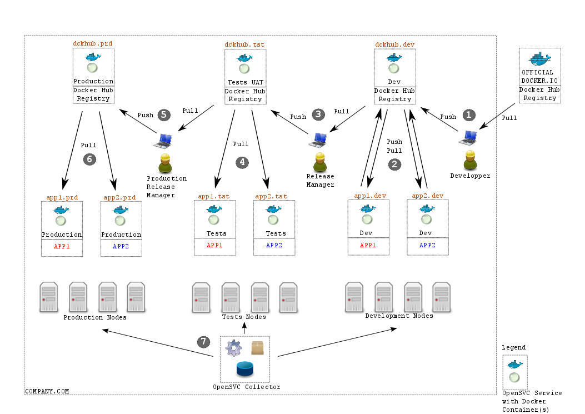

Docker Enterprise Architecture
==============================

If you are engaged in Docker at an enterprise scale level, you are certainly facing challenges like:

* how to build a robust and secure docker infrastructure ?
* how to deal with docker containers lifecycle ?
* how to implement segregated environments (production, development, integration, user acceptance tests, ...) ?

OpenSVC propose a ready to use model to integrate docker in your company, as described in the picture below

Description
-----------

This architecture is composed of 3 stages:

* Production on the left
* User Acceptance Tests in the middle
* Development on the right

Each stage has:

* a dedicated pool of physical nodes to host `OpenSVC services running Docker <agent.service.container.docker.multiple_docker_instances.html>`_
* a dedicated `docker private registry hub <agent.service.container.docker.private_registry.html>`_, storing the accurate docker images
* a set of OpenSVC services, embedding `one or more docker containers <agent.service.container.docker.multi_containers.html>`_, rendering mass docker container management very powerful

Step 1
^^^^^^

* First users in the docker infrastructure is the technical people involved in building new environments
* They have their own docker setup on their laptop, pull images from public docker hub registry, modify them, and push them on the Dev private docker hub, which is an OpenSVC service named ``dev/dckhub``

Step 2
^^^^^^

* Development teams are responsible of deploying docker containers, exactly like they are executed on production infrastructure.
* They work with clones of the production OpenSVC services. The service names or namespaces differ (``dev/app1`` vs ``prd/app1``).
* They can push/pull from/to the ``dckhub.dev`` private hub, and adjust their development/integration to meet application expectations.

Step 3
^^^^^^

* Application responsibles (called ``Release Manager``) decide when an application is ready for user acceptance tests.
* They pull the docker images from the ``dev/dckhub`` private Dev hub, and push them to the ``tst/dckhub`` test hub.

Step 4
^^^^^^

* Teams in charge of running test plans start testing on the new application just published by the ``Release Manager``
* They change the image tags in OpenSVC services ``tst/app*`` and restart the services (or re-deploy), then execute the test plans.
* If tests pass, images can go to production. If not, back to step 1.

Step 5
^^^^^^

* Application responsibles (called ``Production Release Manager``) decide when an application can go to production.
* They pull the docker images from the ``tst/dckhub`` private test hub, and push them to the ``prd/dckhub`` production hub.

Step 6
^^^^^^

* Operation/Production teams are responsible of running applications in production.
* They configure OpenSVC services (``prs/app1``, ``prd/app2``) to use the new docker image tags, plan downtime, and restart services.

OpenSVC collector useful sysbsystems
------------------------------------

The OpenSVC collector (optional in the architecture) can provide:

* Service configuration compliance

    * compliance rules are declared in the collector, and served to every OpenSVC agent
    * on schedule (once a week, once a day, ...), OpenSVC agents check the rules and report

 For example, you could setup this contextual ruleset:

    ::

      +- it.applications.app1 (contextual ruleset, shown to all app1 OpenSVC services)
         |
         +- it.applications.app1.dev (contextual ruleset, matching app1 **Dev** OpenSVC services)
         |  |
         |  +- container#1.image_id = 1111122222 (docker image id to be used to instantiate container)
         |  `- container#2.image_id = 2222211111
         |
         +- it.applications.app1.tst (contextual ruleset, matching app1 **Tst** OpenSVC services)
         |  |
         |  +- container#1.image_id = 3333344444
         |  `- container#2.image_id = 4444433333
         |
         `- it.applications.app1.prd (contextual ruleset, matching app1 **Prd** OpenSVC services)
            |
            +- container#1.image_id = 5555566666
            `- container#2.image_id = 6666655555 

  With this ruleset, you can very easily ensure that no change happen on your infrastructure: your docker containers stacked together, and managed through OpenSVC services will remain predictive, in 2 weeks, in 2 months, as long as compliance jobs are not reporting errors, you are sure the services are still setup the way they were deployed.

* Up-to-date inventory of in-use docker images, indexed by service, environment, node, application. This capabilty enables infrastructure billing and security risk assessment very easy.

* Web based OpenSVC services management

  * can be segregated to allow dev people to access dev services only, etc
  * in compliance subsystem, remediation campains can be scheduled and triggered from the web interface

Related topics
--------------

High Availability
^^^^^^^^^^^^^^^^^

If you need highly availability for the docker registries, please refer to `Docker high availability tutorial <agent.service.container.docker.high_availability.html>`_

Disaster Recovery
^^^^^^^^^^^^^^^^^

If you need a disaster recovery plan for the docker registries, please refer to `Docker Disaster Recovery Plan Tutorial <agent.service.container.docker.disaster_recovery_plan.html>`_

