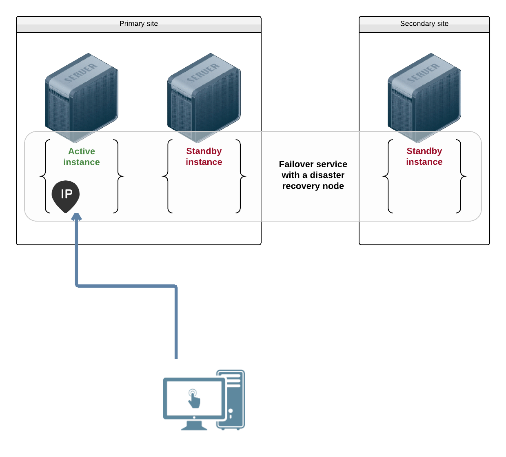
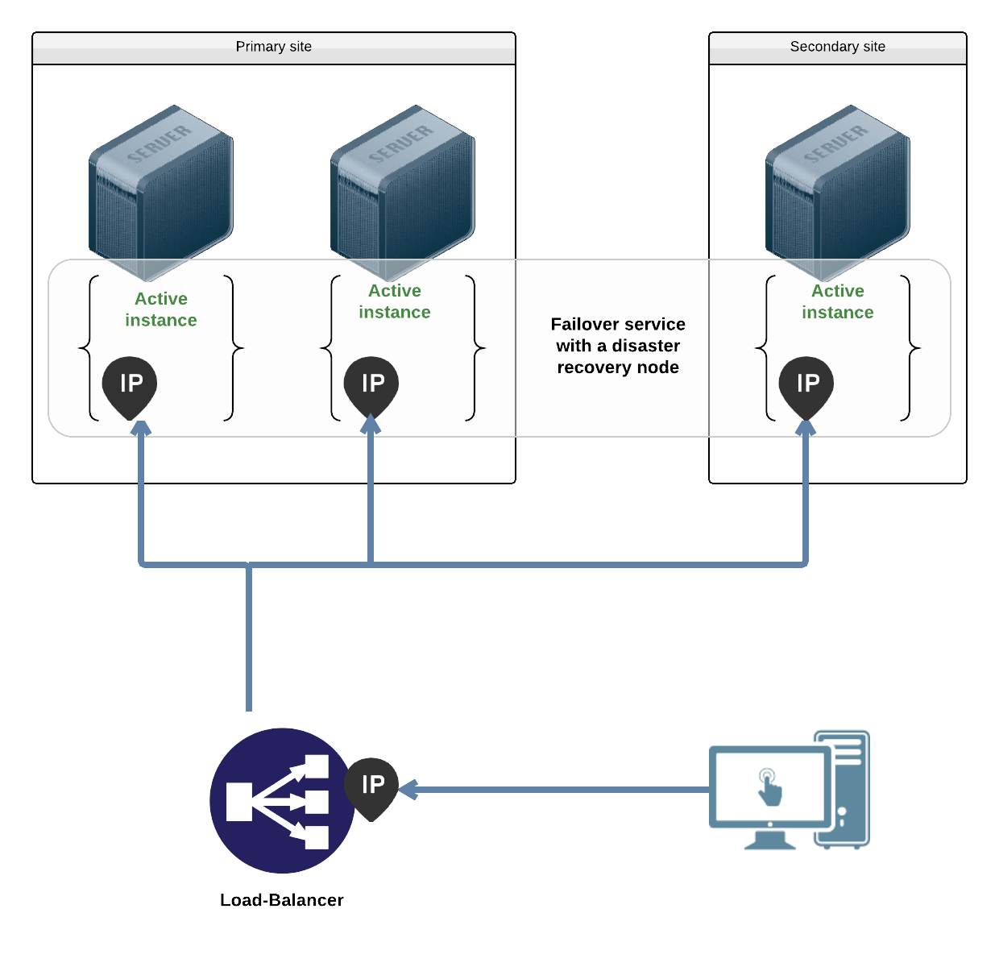
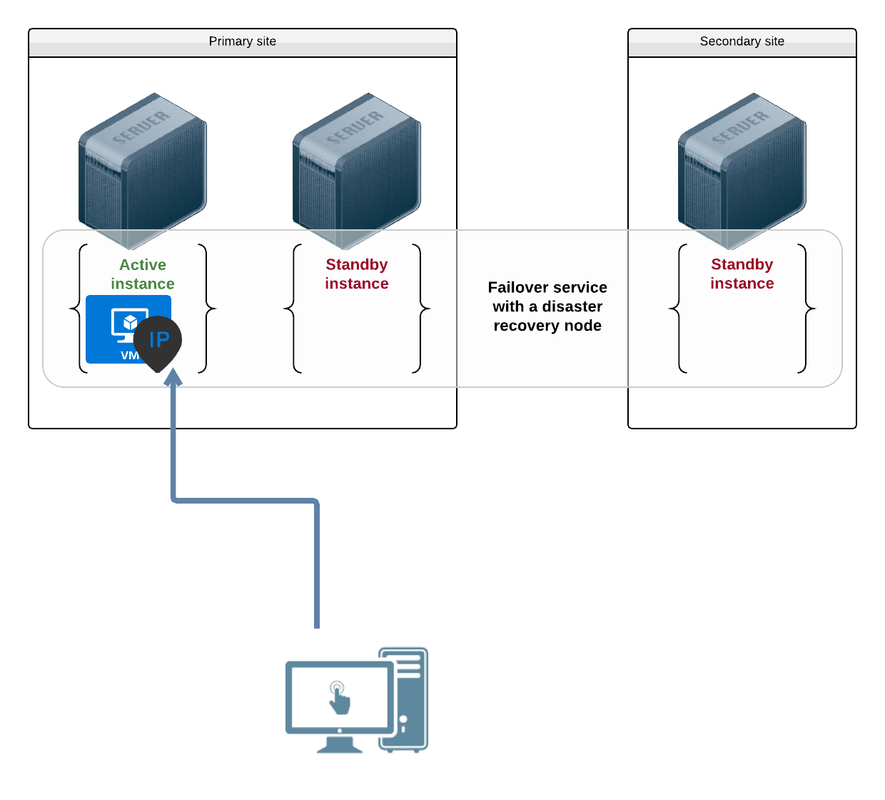
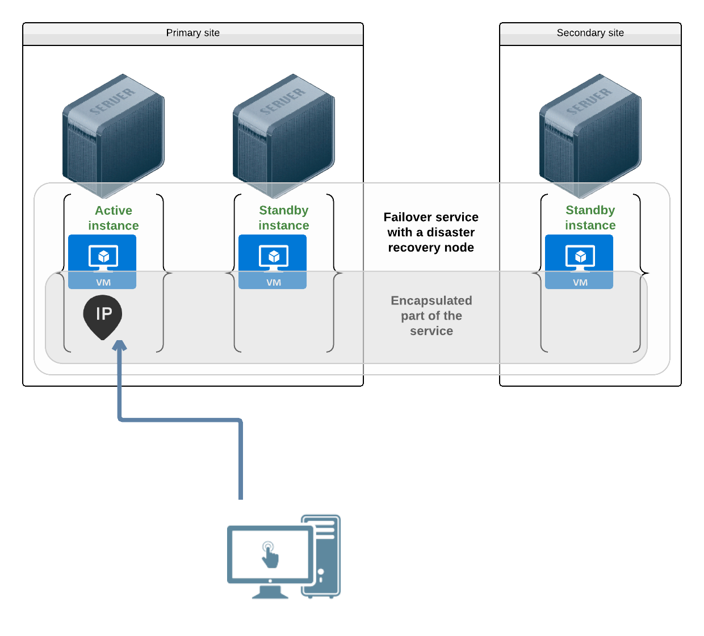

Service ip resources
====================

Introduction
************

A service must expose its middleware to other services and to end users through ip address. It is possible to expose through the service instance's node ip addresses, or through one or more ip addresses handled by the service.

Failover services should prefer exposing through service-private ip addresses, so that:

* relocating the service running instance on another node in the same network retains the same ip addresses.
* the service ip addresses can be used to avoid starting multiple instances simultaneously

Even flex services can benefit from private ip addresses:

* middlewares of different services running on the same node can bind the same port without conflict

This chapter presents the different ip management capabilities offered by the OpenSVC agent.

Failover
********

In this use-case, the middlewares are installed in the node either through operating system packages or as service-private binaries. They bind the service ip address.

Example non-containerized ip resource definition::

  [ip#0]
  ipname@nodes = ipname1
  ipname@drpnodes = ipname2
  ipdev = eth0

Flex with instance ip
*********************

In this use-case, the middlewares are installed in the node either through operating system packages or as service-private binaries. They bind each service instance ip addresses.

Example non-containerized ip resource definition::

  [ip#0]
  ipname@node1 = ipname1
  ipname@node2 = ipname2
  ipname@node3 = ipname3
  ipdev = eth0

Failover with application installed in a container
**************************************************

In this use-case, the middlewares are installed in the container through operating system packages. They bind the container ip address.

Example configuration::

  [container#0]
  name = vm1

Failover with application installed in a container with service encapsulation
*****************************************************************************

In this use-case, the middlewares are installed in the container through operating system packages or as service-private binaries. They bind the encapsulated service ip address. The service containers are set to start on each node just to highlight the fact that each container can have its own ip addresses. This can also be useful if you want sync resources at the encapsulated layer, as standby instance containers have to be running to receive the replication data.

Example configuration::

  [container#0]
  name = vm1
  always_on = nodes drpnodes
  
  [ip#0]
  ipname = ipname1
  ipdev = eth0
  tags = encap

