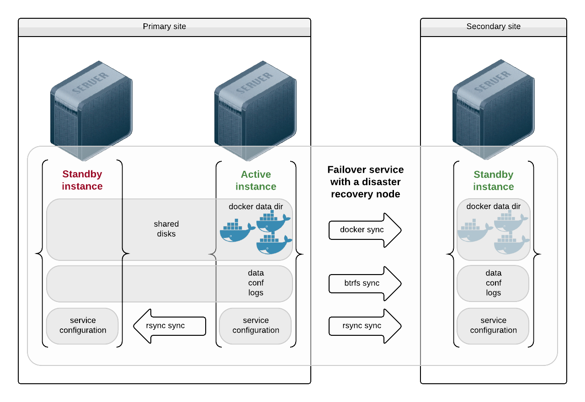
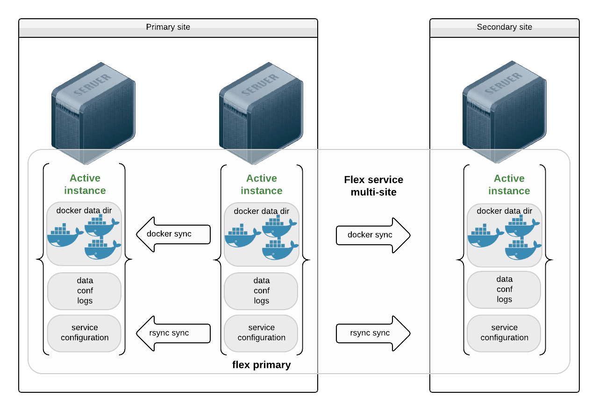
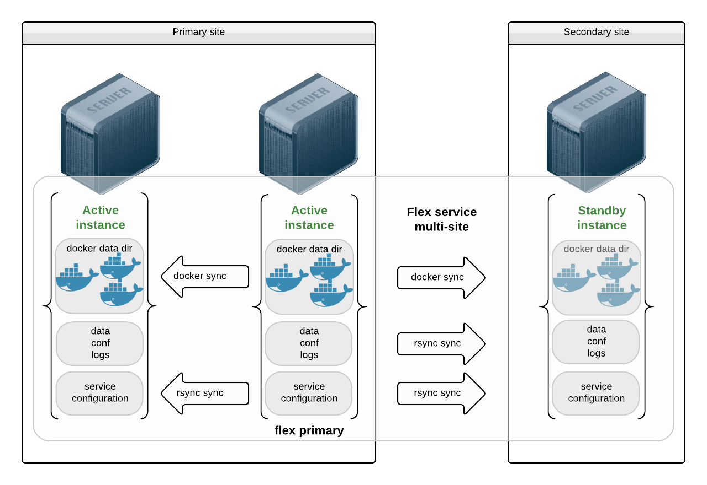

.. _agent-service-sync:

Sync
====

One of the OpenSVC infrastructure objective is to enable disaster recovery activation by non-expert persons at the service granularity. The sync resources are a critical component to meet this objective.

OpenSVC offers many sync resource drivers, each with its own set of financial, performance, bandwidth, synchronicity costs characterics. Different drivers can be used for different kind of replicated data. For example binaries can often be replicated asynchronously, even when their data needs full synchronicity.

This section presents different use-cases of replication and the possible sync resources configurations.

Drivers
+++++++

.. toctree::
   :maxdepth: 2

   storage.replication.soft
   storage.replication.hard
   storage.snapclone.hard

Use-cases
+++++++++

Failover with Application Installed as Micro-containers
*******************************************************

In this use-case, the middlewares are installed as docker micro-containers. The micro-containers see their data, configurations and logs through volume mappings from the host.

Nodes on the primary site are presented the same disks and the docker data directory is stored on those shared disks. A failover amongst primary nodes recovers container instances and data at the last transaction.

The node on the secondary site sees a different set of disks. It receives data from the service sync resources:

* The docker images are replicated through the docker driver, which makes sure all images ids referenced as container resources in the service configuration are present on the receiving end. If not, they are transfered through a docker save | ssh | docker load pipe.

* The data, configurations and logs are replicated through the brtfs sync driver.

Both sync resource need the secondary site service instance to have its receiving fs resources mounted. This is acheived through the ``standby@drpnode = true`` fs resource parameter.

Example configuration::

  [DEFAULT]
  nodes = n1 n2
  drpnodes = n3
  docker_data_dir = /srv/svc1/docker
  
  [ip#0]
  type = netns
  ipdev = eth0
  ipname = 10.0.3.3
  netmask = 255.255.255.0
  gateway = 10.0.3.1
  netns = container#0
  
  [container#0]
  type = docker
  image = google/pause
  rm = true
  
  [container#1]
  type = docker
  image = nginx
  netns = container#0
  rm = true
  
  [fs#0]
  dev@nodes = /dev/mapper/svc1.d0
  mnt = /srv/svc1/docker
  mnt_opt = defaults,subvol=docker
  standby@drpnodes = true

  [fs#1]
  dev@nodes = /dev/mapper/svc1.d0
  mnt = /srv/svc1/data
  mnt_opt = defaults,subvol=data
  standby@drpnodes = true

  [sync#0]
  type = docker
  target = drpnodes

  [sync#1]
  type = btrfs
  target = drpnodes
  src = svc1:data
  dst = svc1:data

Flex with Application Installed as Micro-Containers
***************************************************

In this use-case, the middlewares are installed as docker micro-containers. The micro-containers see their data, configurations and logs through volume mappings from the host. The mappings are hosted on local disks and the service handles no replication for these, as their content would be delivered through app deployment tools.

The docker data directory is stored on local disks too. The docker images are replicated through the docker driver, which makes sure all images ids referenced as container resources in the service configuration are present on the receiving end. If not, they are transfered through a docker save | ssh | docker load pipe.

Example configuration::

  [DEFAULT]
  nodes = n1 n2 n3
  flex_primary = n2
  orchestrate = start
  flex_min_nodes = 3
  docker_data_dir = /srv/svc1/docker
  
  [ip#0]
  type = netns
  ipdev = eth0
  ipname@n1 = 10.0.3.3
  ipname@n2 = 10.0.3.4
  ipname@n3 = 10.0.3.5
  netmask = 255.255.255.0
  gateway = 10.0.3.1
  netns = container#0
  
  [container#0]
  type = docker
  image = google/pause
  rm = true
  
  [container#1]
  type = docker
  image = nginx
  netns = container#0
  rm = true
  
  [fs#0]
  dev@nodes = /dev/mapper/svc1.d0
  mnt = /srv/svc1/docker
  mnt_opt = defaults,subvol=docker

  [fs#1]
  dev@nodes = /dev/mapper/svc1.d0
  mnt = /srv/svc1/data
  mnt_opt = defaults,subvol=data

  [sync#0]
  type = docker
  target = drpnodes

Flex with Application Installed as Micro-Containers and Failover Site
*********************************************************************

This use case is a variant of the previous case, with instances on the secondary site in standby. The nodes on the secondary site can be used to run non-production service to avoid wasting resources.

The major difference here is that the flex primary instance sends replication of the data and configuration to the remove site, so that application delivery can only care about the primary instances. In most cases this data cursor is small and changes only when new application versions are deployed, so a simple replication strategy like rsync is a good candidate.

Example configuration::

  [DEFAULT]
  nodes = n1 n2
  drpnodes = n3
  flex_primary = n2
  orchestrate = start
  docker_data_dir = /srv/svc1/docker
  
  [ip#0]
  type = netns
  ipdev = eth0
  ipname@n1 = 10.0.3.3
  ipname@n2 = 10.0.3.4
  ipname@n3 = 10.0.3.5
  netmask = 255.255.255.0
  gateway = 10.0.3.1
  netns = container#0
  
  [container#0]
  type = docker
  image = google/pause
  rm = true
  
  [container#1]
  type = docker
  image = nginx
  netns = container#0
  rm = true
  
  [fs#0]
  dev@nodes = /dev/mapper/svc1.d0
  mnt = /srv/svc1/docker
  mnt_opt = defaults,subvol=docker
  standby@drpnodes = true

  [fs#1]
  dev@nodes = /dev/mapper/svc1.d0
  mnt = /srv/svc1/data
  mnt_opt = defaults,subvol=data
  standby@drpnodes = true

  [sync#0]
  type = docker
  target = drpnodes

  [sync#1]
  src = /srv/svc1/data/
  dst = /srv/svc1/data
  dstfs = /srv/svc1/data
  options = --exclude=/srv/svc1/data/logs/*
  target = drpnodes

Replicating Middlewares
***********************

Some middlewares can take care of their own data on-site and off-site replication. For example Oracle RAC, cassandra and most Big Data middlewares. In this case, users may ponder the choice of using those replication methods or OpenSVC sync resources.

The trade-off is easy to state, but the choice is highly political:

* Using OpenSVC sync resources, you don't have to commission experts for each middleware to activate a disaster recovery
* Middleware replication drivers are most efficent, have a deep knowledge of how the middleware handles its data

Even if OpenSVC does not handle the replication (or even the ip and disk resources as in a RAC cluster), a service can still be wrapped around the cluster to gain service inventory, cluster coherency analysis collector tools, service moniitoring and service configuration management.

