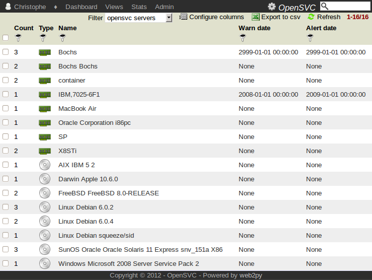
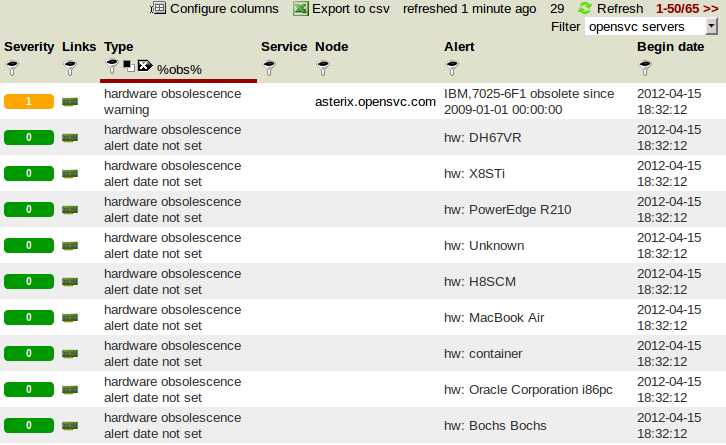

Obsolescence management
***********************

The collector helps plan operating systems and hardware upgrades through constant notification of items beyond user-defined warning and alerting thresholds.

This view is accessed through the :menuselection:`Admin --> Obsolescence Setup` menu.

Obsolescence setup
==================

Operating systems and hardware are collected from the asset database.

The count of nodes matching each different os and hardware type is displayed in the 'count' column. Clicking on the count number displays the list of nodes.

The 'Warn date' and 'Alert date' thresholds can be set by clicking on the table cell.

Dashboard alerts
================

**Missing obsolescence information**

  These notifications are displayed only to users with the 'Manager' role.  They show how many operating system and hardware type items have no warn and alert date set by the managers.

**Nodes above obsolescence thresholds**

  * Alerts and warnings generate different alerts in the dashboard.
  * Operating systems and hardware generate different alerts in the dashboard.

