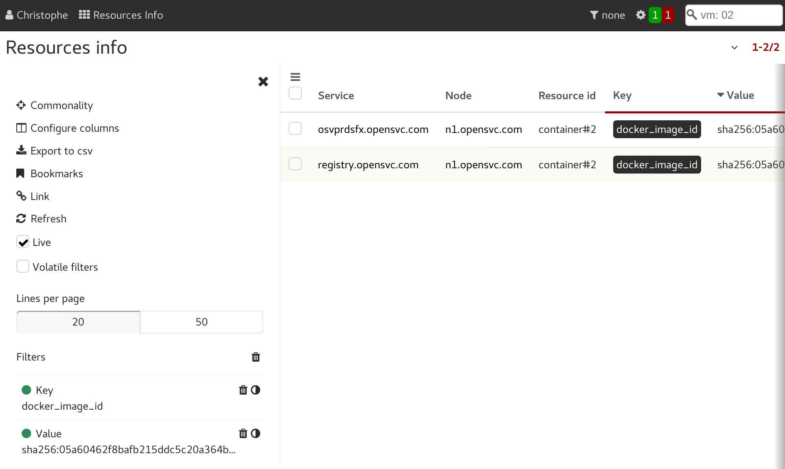

Docker registries
=================

Introduction
------------

The collector can act as docker private registries v2 authenticator, habilitator, logger and search provider.

Other products, like SuSE Portus or Cesenta docker auth, are available to assume these roles. The OpenSVC implementation has the following distinctive features:

* No additional service integration for users with a private collector or using the public collector
* All other collector features available (services and assets management, service monitoring, configuration management, nodes config file versioning, reporting, forms and workflows, ...)
* Zero maintenance ACLs : the collector already knows about users, groups, apps responsibles, apps publications, services' app
* Zero maintenance user management : the collector already has a user base and authentication mecanism, either internal, LDAP, AD, radius, ...
* Provide a service login and ACLs in addition to user login and ACLs, so users don't have to let docker store their own credentials on the nodes for pull ops.
* Working docker search on private registries, with results honoring the ACLs
* Expose the registries ops through the collector Rest API and CLI, honoring ACLs

This documentation shows how to setup the collector and the registries, and explains the Access Control policies applied by the collector.

Collector objects
-----------------

Registry
********

A registry describes a private docker registry v2 instance.
The following properties are attached to this object:

* **service**

  The unique identifier of the registry, as set with the ``REGISTRY_AUTH_TOKEN_SERVICE`` docker image parameter.

* **url**

  The url the collector uses to join the docker registry api

* **insecure**

  If set to ``True``, the ssl certificate checks are disabled.

* **restricted**

  If set to ``True``, authenticated users with the ``DockerRegistriesPusher`` privilege can push images to their ``users/<id>``, ``groups/<id>`` and ``apps/<id>`` if the registry is simply published to one of their group.

  If set to ``False``, authenticated users with the ``DockerRegistriesPusher`` privilege can push images to their ``users/<id>``, ``groups/<id>`` and ``apps/<id>`` if the registry responsibility is given to one of their group.

* **publications**

  Allow search, pull, get on the collector api only to the publication groups.
  Allow push of ``users/<id>``, ``groups/<id>`` and ``apps/<id>`` prefixed repositories on unrestricted registries

* **responsibles**

  Allow PUSH, POST, DELETE on the collector api only to the responsible groups.

Repository
**********

A repository is a collection of image tags.
Only repository are returned by a docker search.
The following properties are attached to this object:

* **name**

  The repository name, as returned in docker search results

* **description**

  The repository description, as returned in docker search results

* **stars**

  The repository scoring, as returned in docker search results

* **official**

  The repository official flag, as returned in docker search results

* **automated**

  The repository automated flag, as returned in docker search results

Tag
***

A tag is a revision of a repository.
Tags only have a name property.
Tags are deleteable through the collector gui and rest api. Deleting a tag also deletes the tag on the private registry if allowed by the ``REGISTRY_STORAGE_DELETE_ENABLED`` docker image parameter.

Access control
--------------

The collector serves JSON Web Tokens for the declared registries. A token can be served to any collector's authenticated users and to OpenSVC services.
The collector applies standard policies to specific repository paths.

users/<user_id> or users/<username>
***********************************

* The user identified by ``<user_id>`` or ``<username>`` is the only one allowed to push and pull repositories with that prefix.
* Pushing also requires the ``DockerRegistriesPusher`` privilege and registry publication to one of the user's groups on unrestricted registries.
* Pushing also requires the ``DockerRegistriesPusher`` privilege and registry responsibility to one of the user's groups on restricted registries.
* Pulling also requires the ``DockerRegistriesPuller`` privilege and registry publication to one of the user's groups.
* A service can never push or pull repositories with a ``users/`` prefix.

groups/<group_id> or groups/<groupname>
***************************************

* Members of the group identified by ``<group_id>`` or ``<groupname>`` are allowed to push and pull repositories with that prefix.
* Pushing also requires the ``DockerRegistriesPusher`` privilege and registry publication to one of the user's groups on unrestricted registries.
* Pushing also requires the ``DockerRegistriesPusher`` privilege and registry responsibility to one of the user's groups on restricted registries.
* Pulling also requires the ``DockerRegistriesPuller`` privilege and registry publication to one of the user's groups.
* A service can never push or pull repositories with a ``groups/`` prefix.

apps/<app_id> or apps/<appname>
*******************************

* Members of the groups the application identified by ``<app_id>`` or ``<appname>`` is published to are allowed to pull repositories with that prefix.
* Members of the groups responsible for the application identified by ``<app_id>`` or ``<appname>`` are allowed to push repositories with that prefix.
* Pushing also requires the ``DockerRegistriesPusher`` privilege and registry publication to one of the user's groups on unrestricted registries.
* Pushing also requires the ``DockerRegistriesPusher`` privilege and registry responsibility to one of the user's groups on restricted registries.
* Pulling also requires the ``DockerRegistriesPuller`` privilege and registry publication to one of the user's groups.
* A service can never push repositories with a ``apps/`` prefix.
* Services with a matching application code are allowed to pull repositories with a ``apps/`` prefix.

other prefixes
**************

* Only users member of one of the registry responsible groups and with the ``DockerRegistriesPusher`` privilege are allowed to push to an arbitrarily prefixed repository.
* Users member of one of the registry publication groups and with the ``DockerRegistriesPuller`` privilege are allowed to pull from an arbitrarily prefixed repository.
* Service whose application code is published to registry publication group are allowed to pull from an arbitrarily prefixed repository.

Public collector policies
-------------------------

Users created on the public collector all have the ``DockerRegistriesManager``, ``DockerRegistriesPusher`` and ``DockerRegistriesPuller`` privileges, so they can declare their own private registry on the public collector and control its responsible an publication groups. A new registry has its responsible and publication group set to the creator's primary group, which is quite restrictive.

Private collector policies
--------------------------

On a private collector, the collector managers have the choice to give the ``DockerRegistriesManager``, ``DockerRegistriesPusher`` and ``DockerRegistriesPuller`` privileges to a selected population.

The DockerRegistriesPuller and DockerRegistriesPusher privileges are sufficient to publish images in allowed ``users/`` ``groups/`` and ``apps/``. The DockerRegistriesManager is required to publish images to arbitrary locations (``global/``, ``site/`` for example).

Provision a registry service
----------------------------

::

	sudo svcmgr -s <svcname> create \
		--template docker.registry \
		--provision \
		--env bridge=<front-facing bridge device> \
		--env ipaddr=<service listen ip address> \
		--env netmask=<netmask in cidr or octal notation> \
		--env gateway=<gateway ip address>

* ``<svcname>`` should be set to a DNS resolved fully qualified domain name to be able to use the registry over internet. Example: ``registry.opensvc.com``
* This command does not handle the DNS configuration.
* The OpenSVC agent running this command must be registered on the OpenSVC public collector, hence the user running the command must have an account on this collector (free).

Unprovision a registry service
------------------------------

::

	sudo svcmgr -s <svcname> delete --unprovision

Provisioning details
--------------------

Service template
****************

Here is the template OpenSVC service configuration served by the public OpenSVC collector under the name ``docker.registry``.

::

	[DEFAULT]
	docker_data_dir = /srv/{svcname}/docker
	docker_daemon_args = --log-opt max-size=1m

	[ip#0]
	type = netns
	ipdev = {env.bridge}
	ipname = {env.ipaddr}
	netmask = {env.netmask}
	gateway = {env.gateway}
	netns = container#0
	tags = docker

	[disk#0]
	type = loop
	file = /srv/{svcname}.img
	size = 10g

	[fs#1]
	type = btrfs
	mnt = /srv/{svcname}/docker
	dev = {disk#0.file}
	mnt_opt = defaults,subvol=docker
	standby = true

	[fs#2]
	type = btrfs
	mnt = /srv/{svcname}/data
	dev = {fs#1.dev}
	mnt_opt = defaults,subvol=data
	post_provision = svcmgr -s {svcname} compliance fix --moduleset com.opensvc.svc.docker.registry --attach

	[container#0]
	type = docker
	image = google/pause
	rm = true

	[container#1]
	type = docker
	image = distribution/registry:master
	netns = container#0
	rm = true
	run_args = -v /srv/{svcname}/data/registry/data:/var/lib/registry
		-v /srv/{svcname}/data/registry/ssl:/ssl
		-v /srv/{svcname}/data/registry/conf/config.yml:/etc/docker/registry/config.yml
		-e REGISTRY_HTTP_ADDR=localhost:5000
		-e REGISTRY_HTTP_HOST=https://registry.mydomain.com
		-e REGISTRY_AUTH=token
		-e REGISTRY_AUTH_TOKEN_REALM=https://collector.opensvc.com/init/registry/token
		-e REGISTRY_AUTH_TOKEN_SERVICE="registry.mydomain.com"
		-e REGISTRY_AUTH_TOKEN_ISSUER=opensvc
		-e REGISTRY_AUTH_TOKEN_ROOTCERTBUNDLE=/ssl/collector.opensvc.com.crt
		-e REGISTRY_HTTP_SECRET={env.secret}
		-e REGISTRY_STORAGE_DELETE_ENABLED=true

	[container#2]
	type = docker
	image = nginx:latest
	netns = container#0
	rm = true
	run_args = -v /srv/{svcname}/data/nginx/conf/nginx.conf:/etc/nginx/conf.d/default.conf
		-v /srv/{svcname}/data/nginx/conf/ssl:/etc/nginx/ssl

	[env]
	bridge = docker0
	ipaddr =
	netmask =
	gateway =
	secret = {svcname}.secret

This template describes:

* A static ip address held by ``container#0``. All containers share the network namespace.
* A 10g loopback file formatted as btrfs, ``data`` and ``docker`` subvolumes, mounted under ``/srv/{svname}``.
* A nginx docker instance, proxying requests to either the registry or the OpenSVC public collector.
* A docker registry v2 docker instance, with persistent data stored in the volume binding.

Tuning the provisioning command
*******************************

Each ``--env`` parameter in the provisioning command overrides the corresponding parameter in the ``[env]`` section.

Registry container runtime configuration
****************************************

* ``REGISTRY_STORAGE_DELETE_ENABLED=true`` is required for the collector to be able to delete manifests
* ``REGISTRY_AUTH_TOKEN_ROOTCERTBUNDLE`` is required for the registry to validate the JSON Web Tokens provenance
* ``REGISTRY_AUTH_TOKEN_ISSUER=opensvc`` is required for the registry to validate the JSON Web Tokens provenance
* ``REGISTRY_AUTH_TOKEN_SERVICE=registry.mydomain.com`` is used as a unique registry identifier by the collector, so make sure you use a fqdn
* ``REGISTRY_AUTH_TOKEN_REALM=https://collector.opensvc.com/init/registry/token`` should be changed to your private collector url if needed
* ``REGISTRY_HTTP_ADDR=localhost:5000`` is the listening address. nginx hold the listener on the public address

In-provisioning service configuration management
************************************************

Provisioning this template runs a ``compliance fix`` after the data subvolume is provisionned, and before the docker instances are started. This step deploys the following configuration files, needed by the docker volume bindings:

::

	/srv/{svcname}/data/registry/conf/config.yml
	/srv/{svcname}/data/nginx/conf/nginx.conf
	/srv/{svcname}/data/registry/ssl/collector.opensvc.com.crt
	/srv/{svcname}/data/registry/ssl/server.key
	/srv/{svcname}/data/registry/ssl/server.crt

The files content is contextualized for the provisionned service.

/srv/{svcname}/data/registry/conf/config.yml
++++++++++++++++++++++++++++++++++++++++++++

::

	version: 0.1
	log:
	  fields:
	    service: <svcname>
	storage:
	  cache:
	    blobdescriptor: inmemory
	  filesystem:
	    rootdirectory: /var/lib/registry
	http:
	  addr: :5000
	  headers:
	    X-Content-Type-Options: [nosniff]
	health:
	  storagedriver:
	    enabled: true
	    interval: 10s
	    threshold: 3
	notifications:
	  endpoints:
	    - name: opensvc
	      url: https://collector.opensvc.com/init/registry/call/json/events
	      timeout: 500ms
	      threshold: 5
	      backoff: 1s

/srv/{svcname}/data/nginx/conf/nginx.conf
+++++++++++++++++++++++++++++++++++++++++

::

	server {
		listen 443 ssl;
		server_name <svcname>;
	 
		chunked_transfer_encoding on;
		client_max_body_size 0;

		add_header Docker-Distribution-Api-Version registry/2.0 always;
	 
		ssl on;
		ssl_certificate /etc/nginx/ssl/server.crt;
		ssl_certificate_key /etc/nginx/ssl/server.key;
	 
		proxy_set_header Host $host;
		proxy_set_header X-Forwarded-For $proxy_add_x_forwarded_for;
		proxy_set_header X-Real-IP $remote_addr;
		proxy_set_header X-Forwarded-Proto $scheme;
		proxy_set_header X-Original-URI $request_uri;
		proxy_set_header Docker-Distribution-Api-Version registry/2.0;
		proxy_read_timeout 900;
		proxy_connect_timeout 900;
	 
		location / {
			proxy_pass http://localhost:5000;
		}
		location /v1/search {
			proxy_pass https://collector.opensvc.com/init/registry/call/json/search;
		}
	}

Collector configuration and usage
---------------------------------

Add a registry
**************

This operation requires the ``DockerRegistriesManager`` privilege.

In any table's action menu, click :menuselection:`Add --> Docker Registry`, enter the service name as it is configured in ``REGISTRY_AUTH_TOKEN_SERVICE``, submit.
The user's primary group is setup as the initial registry's responsible and publication group.

Discovery
*********

A registries content discovery task is scheduled every two minutes.

Delete a repository tag
***********************

Select tags in the docker registries view and in the action menu click :menuselection:`On docker tags --> Delete`

Searching for registries objects
********************************

In the search box, to obtain only docker objects in the resultset use the ``docker:`` prefix.

Using the registries
--------------------

The following usage examples exercize a ``registry`` OpenSVC service dedicated docker daemon. All docker commands are wrapped by the service executable, so the communication socket to the docker daemon is set by the wrapper.

All these examples, except ``login %as_service%``, are applicable to the unwrapped system's docker daemon.

Login as a user
***************

::

	$ sudo registry docker logout 10.0.3.4
	Remove login credentials for 10.0.3.4

	$ sudo registry docker login -u test2@opensvc.com -p test --email test2@opensvc.com 10.0.3.4
	Login Succeeded

Login as a service
******************

::

	$ sudo registry docker logout 10.0.3.4
	Remove login credentials for 10.0.3.4

	$ sudo registry docker login %as_service% 10.0.3.4
	Login Succeeded

Searching the registry
**********************

::

	$ sudo registry docker search 10.0.3.4/b
	NAME                   DESCRIPTION       STARS     OFFICIAL   AUTOMATED
	opensvc/busybox        opensvc busybox   10        [OK]       [OK]
	busybox                                  0                    
	apps/opensvc/busybox                  

Pulling from the registry
*************************

::

	$ sudo registry docker pull 10.0.3.4/apps/opensvc/busybox
	Using default tag: latest
	latest: Pulling from apps/opensvc/busybox
	363a10951ae2: Already exists 
	5356a35496ab: Already exists 
	Digest: sha256:ea94d086ef3ef20ab38169d0137ad2d25d21d2447c7c5eb744fa4c83fb6b647f
	Status: Image is up to date for 10.0.3.4/apps/opensvc/busybox:latest

Pushing to the registry
***********************

::

	$ sudo registry docker tag busybox:latest 10.0.3.4/users/1/opensvc/busybox:latest

	$ sudo registry docker push 10.0.3.4/users/1/opensvc/busybox:latest
	The push refers to a repository [10.0.3.4/users/1/opensvc/busybox] (len: 1)
	5356a35496ab: Image successfully pushed 
	363a10951ae2: Image successfully pushed 
	latest: digest: sha256:d0c79b1dbb6b8433a1122f2e0346f14c1494b3ca43b3d972effd8520d7325e98 size: 2105

Identify all nodes and services using an image
**********************************************

In the "Resources info" table, filter on ``key=docker_image_id`` and ``value=<image_id>``.

