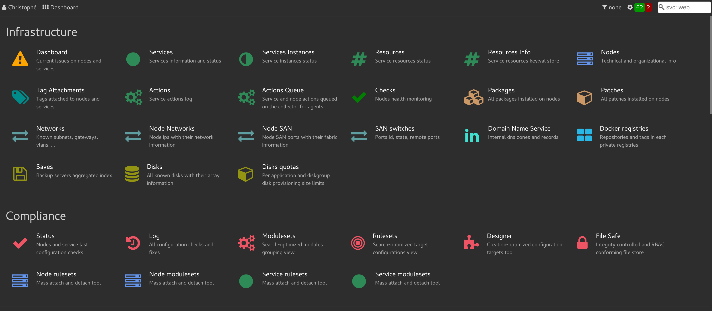
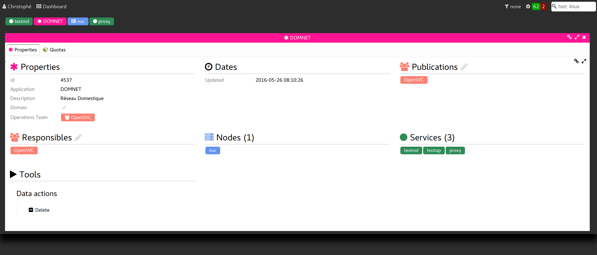
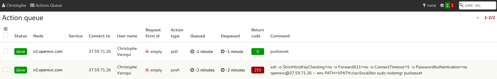
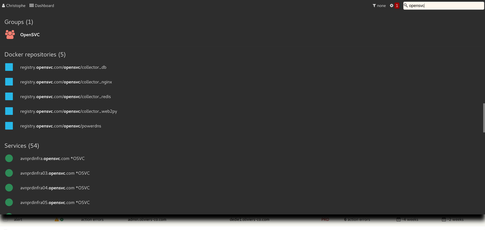

.. index:: header

Header
******

.. index:: navigation menu, widget

Navigation menu
===============

Data views are accessed through the navigation menu, second element in the application header.

The menu can be opened via:

* left-click
* the ``n`` keypress

Upon menu open, the search tool (last element of the header) is focused. A substring in this tool filters the menu entries, leaving only the entries with matching text displayed. The matching text is highlighted.

From the search tool, the ``<TAB>`` keypress focuses the first menu entry. Then the focus can be moved using the arrow keys. The focused menu entry can be loaded using the ``<ENTER>`` key.

The menu is organized in sections. If a section title matches the filtering substring, all its entries are displayed.

Sections
--------

========================= ================================================================================
Section Name              Description
========================= ================================================================================
Infrastructure            Tabular views of each opensvc infrastructure object types: nodes, services, ...
Compliance                Views dedicated to configuration management: current status, history, design.
Statistics                User defined reports and collector feed queue and scheduled tasks statistics
Requests                  Request portal, pending requests, and requests history.
Collector Administration  Views to audit, configure and manage the collector's objects: users, groups,
                          logs, tags, filters, application codes, acls, ...
Data Management           Tools to add, delete, refresh, import, export collector data with no requirement
                          of a selected dataset.
Shortcuts                 Supported keyboard shortcuts and the rest API reference.
========================= ================================================================================

.. index:: flash

Flash zone
==========

The flash zone is a foldable header panel used to keep an history of recently displayed information. The
last displayed objects are represented in a tag cloud. Clicking a tag displays the associated content
under the tag cloud.

Most objects presented as tags can be double-clicked to open details in the flash zone.

The flash zone can be closed via:

* ``<ESC>`` keypress.
* click on the empty header space between the menu and the action queue widget.

The flash zone can be opened via:

* click on the empty header space between the menu and the action queue widget.

.. index:: session filter, widget

Session filter
==============

.. image:: _static/session.filter.png

The selected session filter is applied to all collector data: table content, search results, ...  It persists when navigating from a view to view.

To set a session filter, click on the funnel icon in the header. A listing of all existing filtersets is displayed and the search tool is focused. If a search substring is written, the listing is trimmed to filtersets matching the substring. The ``<TAB>`` keypress moves the focus to the first list element, then the arrow keys can be used to move the focus to the next or previous element. The ``<ENTER>`` keypress sets the focused element as the session filter. Alternatively, clicking an element also sets it as the session filter.

To unset the session filter, set the element named ``None``.

The currently set session filter is displayed in the header widget, next to the funnel icon.

The current view is reloaded upon filter selection.

Filters can be designed from the :menuselection:`Admin --> Filters` and :menuselection:`Admin --> Filtersets` views, or using the filterset designer tabulation of a new filterset created though the ``Add filterset`` menu entry.

.. index:: action queue, widget

Action queue widget
===================

The collector maintains a list of actions to execute on the agents. The header widget highlighted with a gear icon is a summary of the action queue content. This icon can be followed by 3 numbers in color-coded tags:

* red: number of actions terminated in the last hour with a failed status
* green: number of actions terminated in the last hour with a success status
* orange: number of actions pending dispatch to a worker or currently running

Clicking on this widget loads the action queue view, where users can drill down information, cancel or restart actions.

.. index:: search, widget

Searching the collector
=======================

The top-right header input is a global search tool.

This input can be focused using the ``s`` shortcut key.

Only the first 10 matches are returned for each object type, with a count of the total number of matches.

Search Syntax
-------------

The multiple character wildcard is ``%``.

The single character wildcard is ``_``.

The search pattern is implicitely encased in ``%``.

Object Type Filtering 
---------------------

If the searched word start with ``<object type>:``, and the object type is supported, only candidates of the specified object type are displayed.

Example: The ``svc:erp`` search pattern only displays services matching ``%erp%``.

Supported object types::

	app:		application codes
	array:		storage arrays
	disk:		disks
	docker:		docker registries or images
	chart:		report charts
	form:		form
	fset:		filtersets
	group:		groups
	ip:		ip addresses
	metric:		report metrics
	modset:		compliance modulesets
	node:		nodes
	prov:		provisioning templates
	report:		reports
	rset:		compliance rulesets
	safe:		files in the safe store
	svc:		services
	user:		users
	var:		compliance variable
	vm:		virtual machine and container hostnames

Navigating the resultset
------------------------

After the candidates are displayed, the ``<tab>`` key moves focus to the first candidate.

The arrow keys move the focus between candidates.

The ``<enter>`` key opens the candidate details tabs, if available.

The ``<esc>`` key closes the resultset panel.

Drill down from the search resultset
------------------------------------

Clicking a candidate opens the object details tabs in a layered panel. From there, clicking on a tag-like object opens its details tabs. The two opened tabs are shown in a barel allowing nagivation between recently opened details tabs.

When the drill down session is over, the ``<esc>`` closes the layered panel, returning the search resultset visibility.

