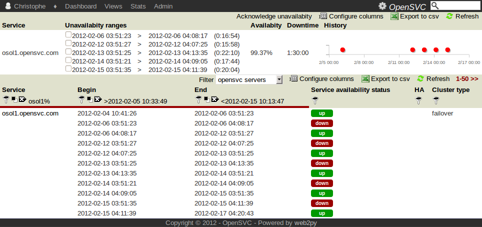

Service availability
********************

Usage
=====

This view presents service availability data the collector collects. A chart helps detect the problems at a glance, and a table displays each unavailability time range and aggregate availability ratio on the selected period.

The begin and end points of the analyzed period can be adjusted.

Each unavailability time range can be either:

**unacknowledged**
  The duration of this unvailability lowers the avail%. The chart draws this state in red.

**acknowledged and accounted**
  The duration of this unvailability lowers the availability ratio. This is used to explain an undue unavailability. The chart draws this state in red.

**acknowledged and unaccounted**
  The duration of this unvailability does not lowers the availability ratio. This is used to explain an unavailability range that was either planned or due to a collection error. The chart draws this state in grey.

An acknowledged range will show the ack message, ack author and ack date when the cursor moves over the range dates.

Clicking on a date will display a state transition graph to help determine which ressource caused to outage.

Screenshot
==========

