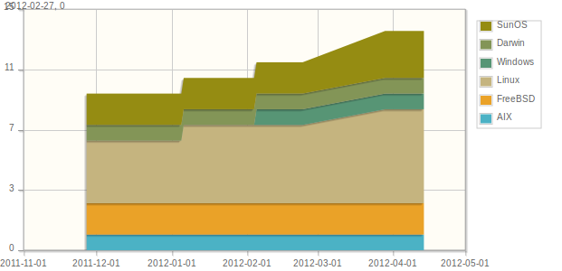
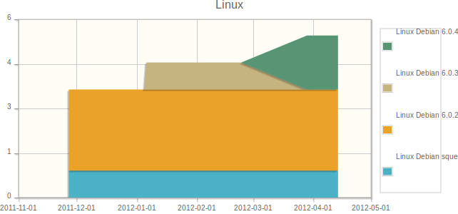

Operating system lifecycle
**************************

Usage
=====

This view charts the operating system dispatch of all the nodes it collects. A first chart presents the dispatch per operating system family. Subsequent charts focus on each family. These charts allow administrators and managers to analyse:

*   Operating system dependency
*   Which operating system is gaining ground over the others
*   Current status of an operating system upgrade compaign

Screenshots
===========

   Per operating system statistics

   Per operating system release statistics

