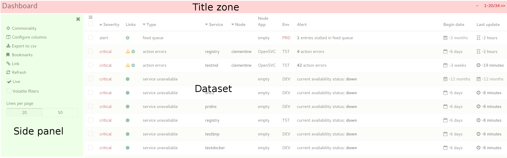
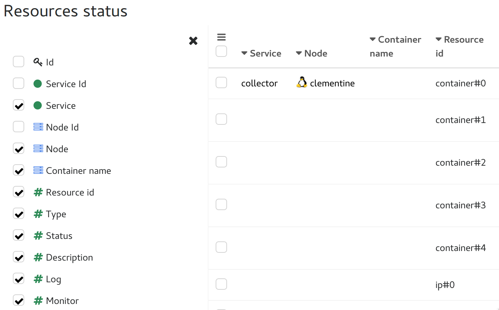
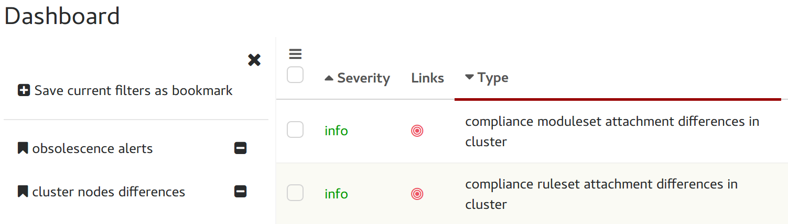
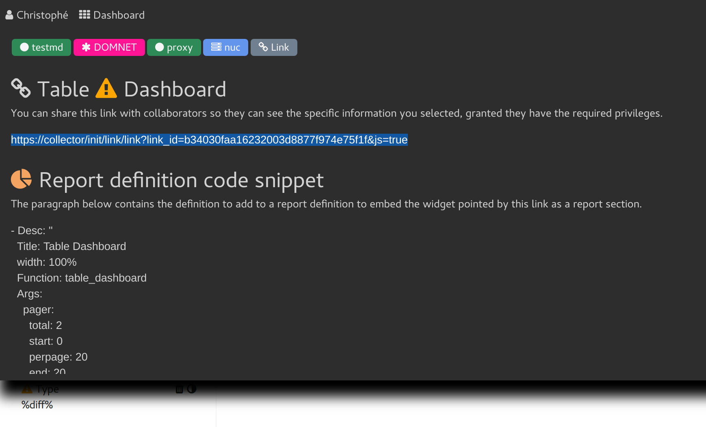
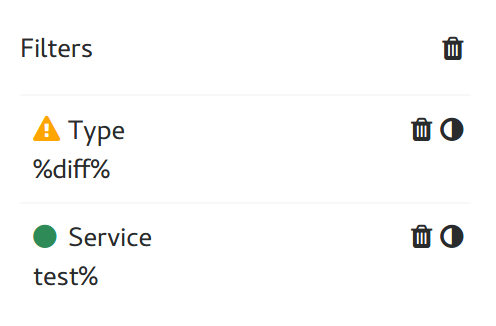
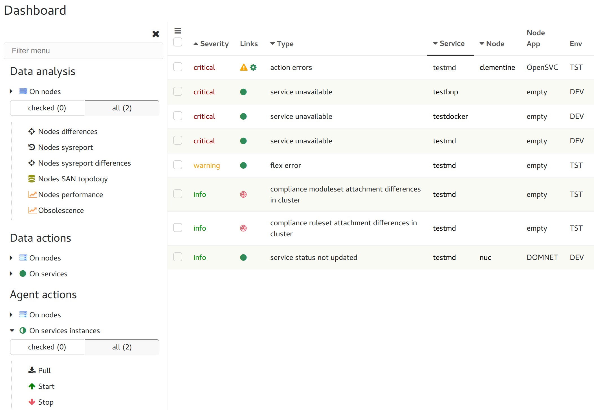
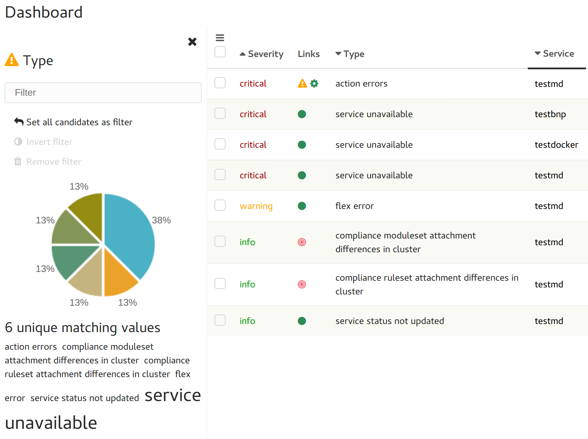

.. index:: table

Tables
******

Most views present data as tables and their features are key to achieve the OpenSVC productivity goals.

A Table layout is split in 3 zones:

* Title
* Dataset
* Side panel (hidden on table load)

.. index:: table title

Title
=====

The table title describes the table content.

Clicking on the title zone toggles the table tools side panel. If another side panel was open, the tools panel replaces it.

.. index:: table folding

Folding
=======

If a table has folding enabled, a top or bottom pointing icon is displayed right of the title zone.

Clicking the top-pointing icon folds the table, leaving only the title zone and the unfold icon visible.

Clicking the bottom-pointing icon unfold the table, displaying the table data zone and side-panel.

.. index:: table pager

Pager
=====

The pager widget is displayed right of the title zone, when the table is unfolded. It shows the currently loaded line numbers (<begin>-<end>) and the total number of lines in the dataset.

If next pages are available a ``>>`` link is appended, allowing to switch to the next page.

If previous pages are available a ``<<`` link is prepended, allowing to switch to the previous page.

Clicking on the pager opens the toolbar, where a widget allows the user to set the number of lines per page for this table. This setting persists across logins and navigations.

.. index:: table sort

Dataset sorting
===============

Left clicking a column title sets the column as the dataset primary sort key.

The column sort state one of a barel of 3 states: Ascending => Descending => None. Each subsequent click on the same column switches to the next state.

A column used as a sort key is flagged with a top pointing icon (ascending) or a bottom pointing icon (descending). A column with none of these icon is not used as a sort key.

The ``<CTRL>`` key left-click modifier, permits to set secondary sort keys.

.. index:: table tools

Tools panel
===========

.. index:: table commonality

Commonality
-----------

.. image:: _static/collector.commonality.png

Display in the side panel the most frequent value for each table column, alongside its frequency percentile.

.. index:: table column selector

Column selector
---------------

Table columns can be toggled on and off from the column selector. Each view has a default set of column displayed. User column selection is persistent across logins and navigations.

.. index:: table csv export

CSV export
----------

This tool can be used to extract the filtered dataset as a CSV-formatted file. Most browser will propose to load the dataset in a spreadsheet application or save it in a file.

.. index:: table bookmarks

Bookmarks
---------

Bookmarks are used to save column filters current values so users can switch rapidly between frequently used colum filters sets tailored to specific analysis.

.. index:: table links

Link
----

When clicked, this tool loads in the flash panel an url that the user can bookmark or send to co-workers. This url points directly to the table, with column filters and columning setup to mirror what the user currently sees.

The flash message also contain a js code snippet to use in a report definition to embed the table in the report.

.. index:: table refresh

Refresh
-------

Click to force a dataset reload. Only needed when the live table toggle is off.

.. index:: table live mode

Live table toggle
-----------------

When set, the table listens to websocket events hinting changes in the dataset and triggers refresh when opportune.

This toggle is usually disabled when the user starts a data selection with the intent of doing an action. In this case, the live mode could change the selection, which may cause unexpected consequences.

.. index:: table volatile filters

Volatile filters
----------------

A toggle controlling the column filters persistence. Filters can be set volatile to allow the user to perform a dataset filtering he does not want reflected in another window opened on the same table.

| When volatile filters are set, the filtered column titles are underlined in gray.
| When volatile filters are not set, the filtered column titles are underlined in red.

.. index:: table pager

Lines per page selector
-----------------------

The per-table lines per page setting. The live mode caps the per-page to 50 to limit the performance hit of the frequent dataset refreshs.

.. index:: table column filters

Column filters summary
----------------------

A list of currently set column filters.

For each, the column name and filter value is displayed, alongside two clickable tools:

* invert filter: negate the filter expression
* delete filter: unfilter this specific column

The trash icon above the list allows the user to delete all filters in a single click.

.. index:: table action menu

Action menu
===========

The dataset can contain objects the collector can run mass-actions on: nodes, services, ...

Submitting a mass-action is a 3-steps process:

Do a line selection
-------------------

============================================================ ===========================================
Method                                                       Selection
============================================================ ===========================================
Right click on a line's checkbox                             The line right-clicked

Check lines and right-click a checkbox                       The checked lines or right-clicked line

Click the triple horizontal bar icon top-left of the dataset All lines or checked lines

============================================================ ===========================================

Any of these methods trigger the display of the action menu as a side panel.

Choose the object type and scope
--------------------------------

The selection is analyzed and all possible actions are assembled in a menu, grouped by object type and action type.

================= =================================================================================
Action type       Description
================= =================================================================================
Data analysis     Does not change data, only specific reports on the dataset

Data management   Does change data collector-side, never run actions on nodes

Agent actions     Submit an agent action, which is usually followed by data changes collector-side
                  upon reception of agent updates

================= =================================================================================

Clicking an object type unfolds:

* a scope selector proposing either line/checked or checked/all, depending on the method used to open the action menu
* the actions supported for this object type

Choose the action
-----------------

Clicking the action will trigger the action on the selected scope.

Most actions ask for a confirmation to avoid accidentally triggering actions.

Filtering the action menu
-------------------------

Upon action menu side panel display, the filtering input is focused. Only actions matching the filtering pattern are displayed. The ``<TAB>`` keypress focuses the first filtered action, then the arrow keys can be used to navigate the entries.

.. index:: table column filters

Column filters
==============

Each column of the table supports filtering.

* A right click on the column title opens the filtering side panel without the filtering wizard.
* A right click on a column cell opens the filtering side panel with the filtering wizard.

The filtering side panel always displays:

* An filtering expression input box

  If the column is currently filtered, the filter is preloaded.
  Filters are applied upon ``<ENTER>`` keypress.
  Setting an empty filter removes the current filter and reloads the table dataset.

* A pie chart showing the column values frequency.

  Clicking on a pie sets the pie value as the column filter and reloads the table dataset.

* A tag cloud of the unique values in the column. Each tag font size proportional to its frequency.

  Clicking on a tag sets the value as the column filter and reloads the table dataset.

Filter box expressions are AND'ed. Filter syntax supports :

=========  ==========================================================================================================================
Operator   Description
=========  ==========================================================================================================================
``%``      Multiple character wildcard for SQL expressions. Can be used as a header, trailer or in the middle of a pattern (%gie%01%)
``.``      Single character wildcard for SQL expressions. Can be used as a header, trailer or in the middle of a pattern (%gie%01%)
``&``      AND multiple patterns (%gie%&%adomain.com)
``|``      OR multiple patterns (%gie%|%adomain.com)
``!``      Negate the pattern (!%gie%&%adomain.com)
``empty``  Select only empty cells (!empty)
``>``      Select only cells with value superior to specified value or date (>2012-04-01)
``<``      Select only cells with value inforior to specified value or date (<2012-04-01)
``>=``     Select only cells with value superior or equal to specified value or date (>=2012-04-01)
``<=``     Select only cells with value inforior or equal to specified value or date (<=2012-04-01)
=========  ==========================================================================================================================

If the column contains JSON data, additional filtering syntax can be used::

	<json path><op><value>

Where ``json_path`` is a mariadb json path expression like:

* $.timeout
* $.pollers[0]
* $.pollers[*]

Where ``op`` is:

===========  ==========================================================================================================================
Operator     Description
===========  ==========================================================================================================================
``=``        Select only cells with value at json path equals to ``<val>``
``>``        Select only cells with value at json path superior to specified value or date (>2012-04-01)
``<``        Select only cells with value at json path inforior to specified value or date (<2012-04-01)
``>=``       Select only cells with value at json path superior or equal to specified value or date (>=2012-04-01)
``<=``       Select only cells with value at json path inforior or equal to specified value or date (<=2012-04-01)
``:has:``    Select only cells with list at json path containing ``<val>``
``:sub:``    Select only cells with value at json path containing the substring ``<val>``
``:end:``    Select only cells with value at json path ending with the substring ``<val>``
``:start:``  Select only cells with value at json path ending with the substring ``<val>``
===========  ==========================================================================================================================

The column filters persist across logins and navigations, if the volatile filters toggle is not set nor locked off.

.. index:: table scrolling

Horizontal scrolling
====================

The table data may horizontally overflow the table zone. In this case shadowed left-right borders are displayed to hint to presence of more data on their side.

Clicking on the shadowed border trigger a horizontal page scroll.

.. index:: table cell decorators

Cell decorators
===============

Cells can be decorated to highlight or expose triggers.

Some decorators are used in many tables and follow important conventions.

Dates and times
---------------

The dates and times in table cells are commonly presented as deltas.

Examples:

* 3 weeks
* -1 hour

Conventions:

* Positive deltas are date or times in the future.
* Negative deltas are date or times in the past.

Hovering a date or time displays the exact value as a browser-timezone converted value.

Corner icons
------------

When hovering a cell displays a top-left corner icon, the cell value click event triggers the load of cell details in the flash zone.

When hovering a cell displays a bottom-left corner icon, the cell value click event triggers the load of cell details in an extra line after the cell's line.

In both cases, the ``<ESC>`` keypress will close the details.

