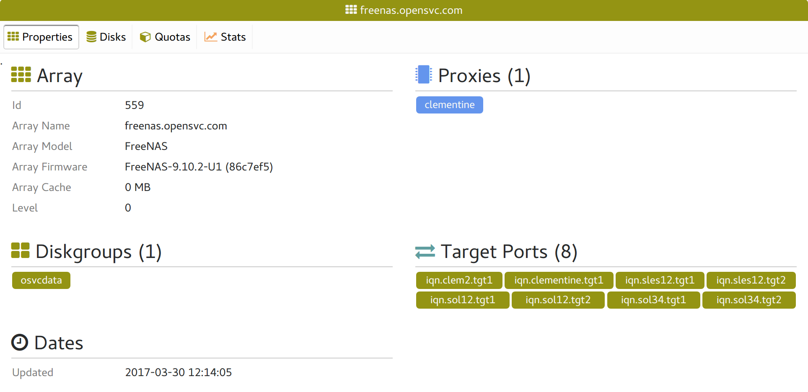
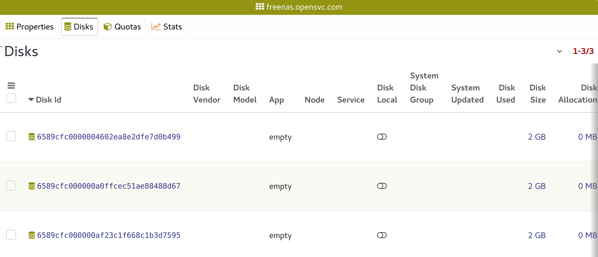
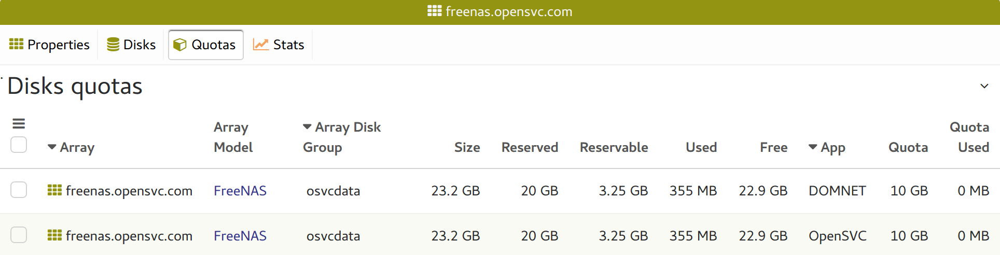
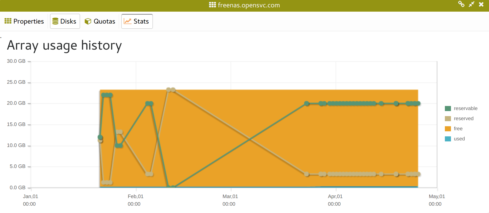

Storage array tabs
------------------

Properties
++++++++++

* Base array properties
* The list of proxies, ie the agents sending updates for the array
* The list of array disk groups
* The list of array target ports

Disks
+++++

The disks table filtered to display only the array.

Quotas
++++++

The storage arrays disk groups quotas per application code table filtered to display only the array.

Stats
+++++

A chart representing the daily evolution of the total quota usage and array backend space usage.

