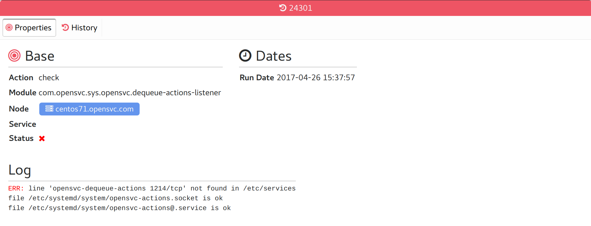
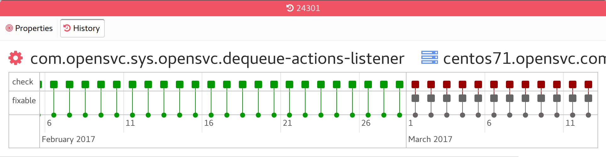

Compliance run tabs
-------------------

Properties
++++++++++

* Base moduleset properties
* Logs of the run

History
+++++++

A timeline of all runs of the same module on the same node and service.

A red pill means the run status was not ok, a green pill for ok, a gray pill for not applicable.

Hovering a pill displays the run logs as a tooltip.

The timeline can be scrolled horizontally and zoomed.

