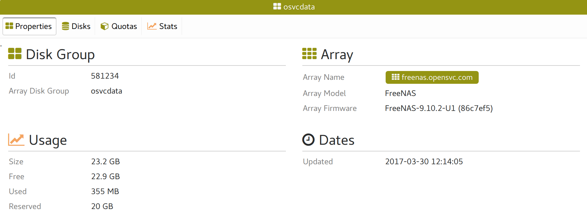
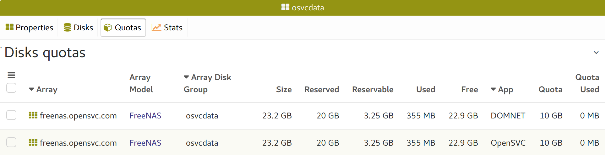
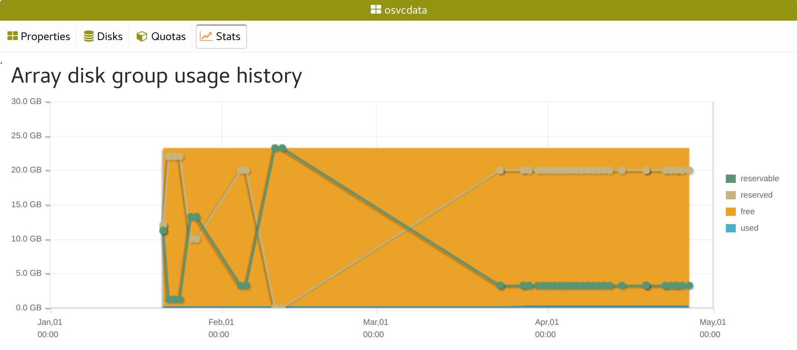

Storage array disk group tabs
-----------------------------

Properties
++++++++++

* Base array disk group properties
* Link to the hosting storage array
* Disk group quotas and backend usage

Disks
+++++

.. figure:: _static/collector.tabs.dg.disks.png

The disks table filtered to display only the disk group.

Quotas
++++++

The storage arrays disk groups quotas per application code table filtered to display only the disk group.

Stats
+++++

A chart representing the daily evolution of the total quota usage and array backend space usage.

