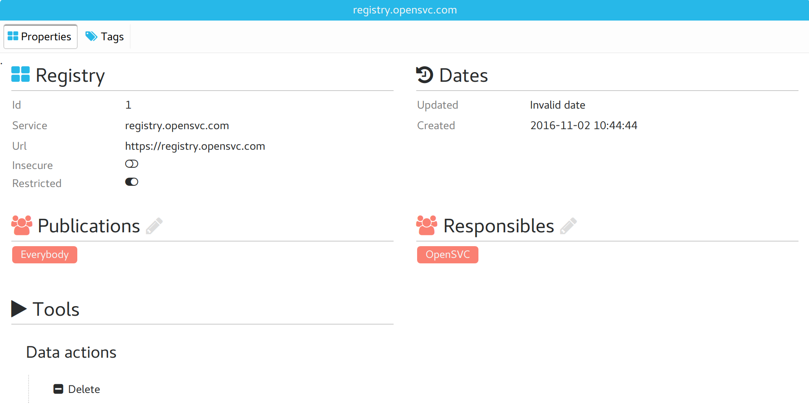
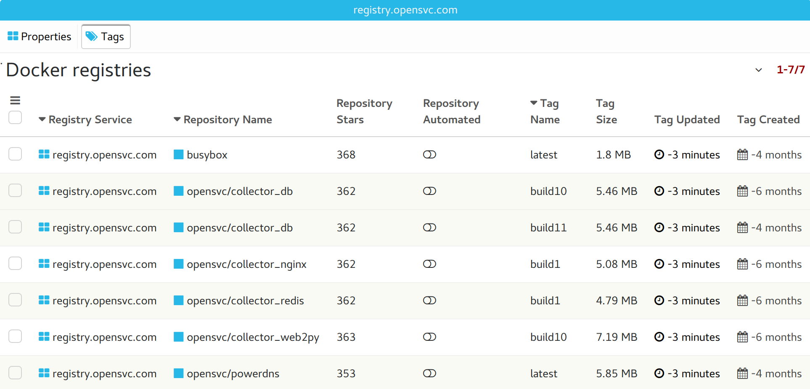

Docker registry tabs
--------------------

Properties
++++++++++

* Base registry properties
* The list of groups responsible for the registry
* The list of groups allowed to see and use the registry

=============== =================================================================================
Property        Description
=============== =================================================================================
service         The value of the registry REGISTRY_AUTH_TOKEN_SERVICE env parameter
--------------- ---------------------------------------------------------------------------------
url             The value of the registry REGISTRY_HTTP_HOST env parameter
--------------- ---------------------------------------------------------------------------------
insecure        * on: do not expect a valid ssl certificate for this registry
                * off: verify the registry uses a valid ssl certificate
--------------- ---------------------------------------------------------------------------------
restricted      * on: Only registry responsibles can push
                * off: Allow users not responsible of the registry to push to their users/<id>/,
                  the groups/<id>/ of groups they are member of, apps/<id>/ of apps they are
                  responsible of.
=============== =================================================================================

Tags
++++

The docker tags table filtered to display only the registry.

