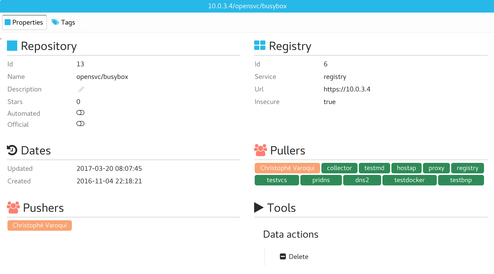
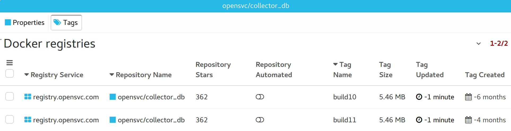

Docker repository tabs
----------------------

Properties
++++++++++

* Base repository properties
* The list of users, nodes and services allowed to push to the repository,
  deduced from the repository path and the hosting registry responsibles.
* The list of users, nodes and services allowed to pull to the repository,
  deduced from the repository path and the hosting registry publications.

Tags
++++

The docker tags table filtered to display only the repository.

