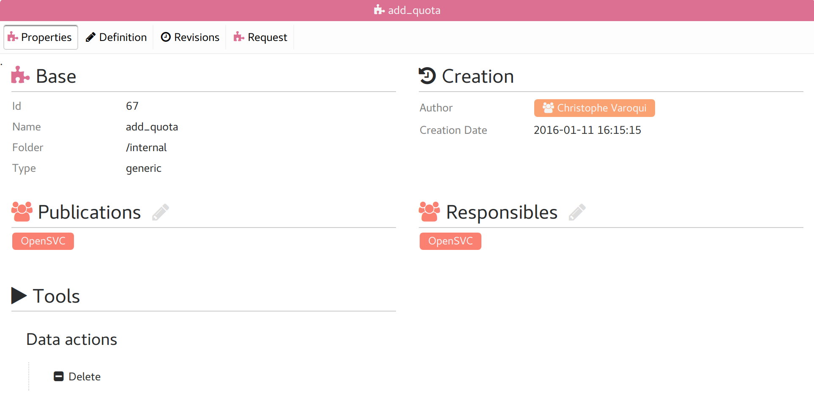
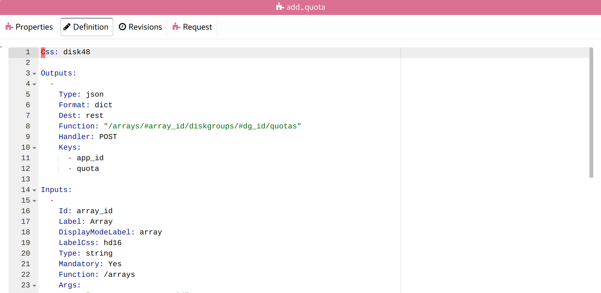
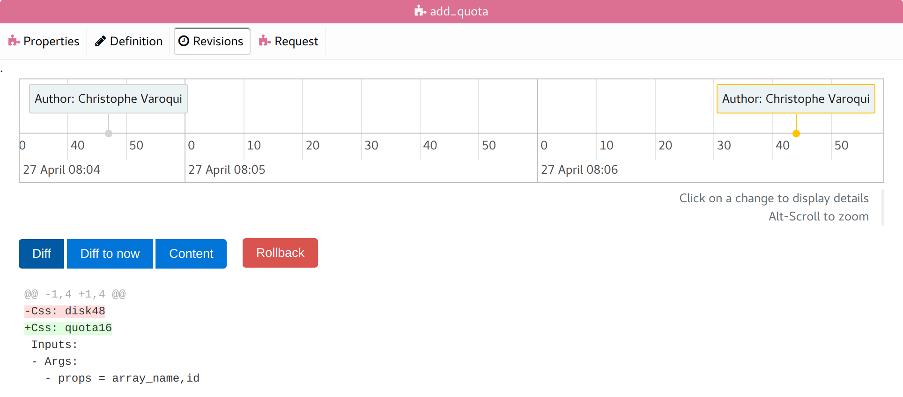
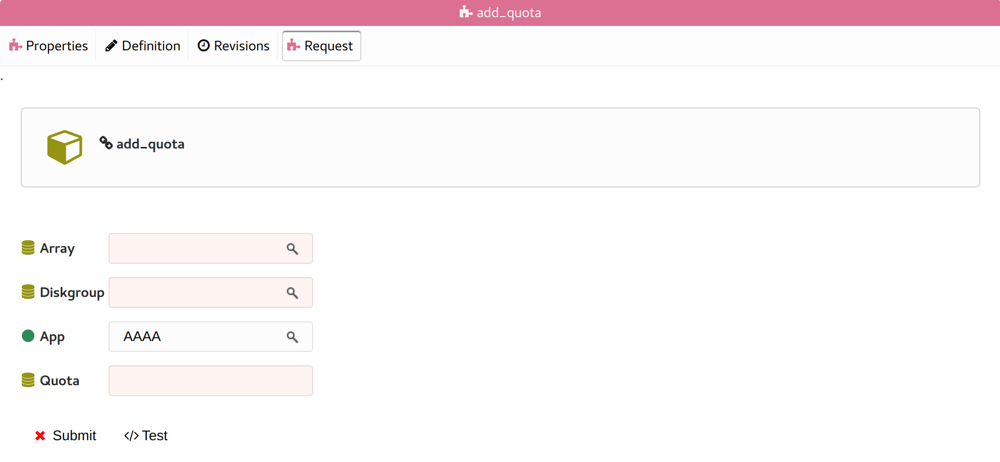

Form tabs
---------

Properties
++++++++++

* Base form properties
* List of groups responsible for the form
* List of groups allowed to see the form and post requests with it

Definition
++++++++++

The form YAML definition loaded in a text editor.

Saving the definition triggers:

* The creation of a new revision
* The reload of the request tabulation

Revisions
+++++++++

A timeline of all changes on the form definition.

The timeline can be scrolled horizontally and zoomed.

Clicking on a change displays:

* The diff of the change
* The "Diff" button: Show the diff between the selected revision and the previous revision.
* The "Diff to now" button: Show the diff between the selected revision and now.
* The "Content" button: Show the full definition of the selected revision.
* The "Rollback" button: Rollback the definition to the selected revision.

Request
+++++++

The form ready for user input, as it is displayed in the request portal.

