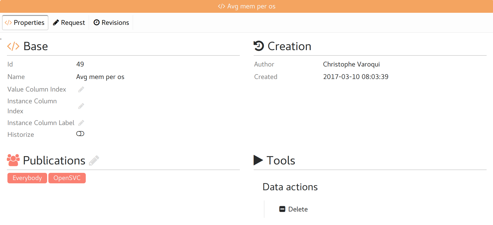
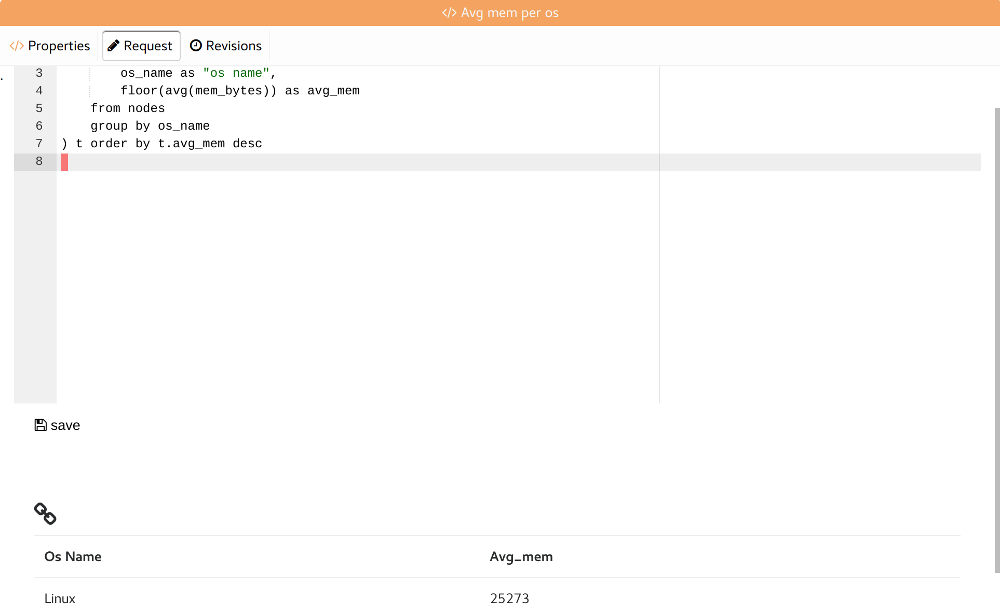
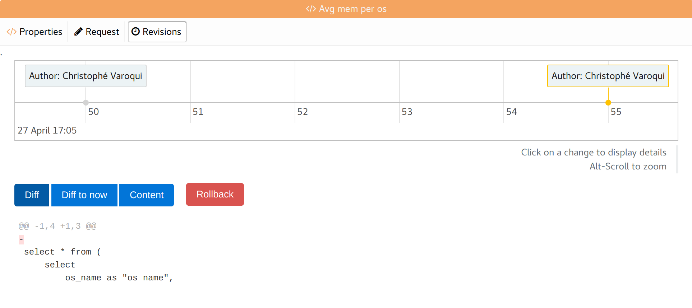

Metric tabs
-----------

Properties
++++++++++

* Base metric properties
* List of groups allowed to see the metric definition and rendering

Request
+++++++

The metric SQL request loaded in a text editor, and the tabular resultset.

Revisions
+++++++++

A timeline of all changes on the metric.

The timeline can be scrolled horizontally and zoomed.

Clicking on a change displays:

* The diff of the change
* The "Diff" button: Show the diff between the selected revision and the previous revision.
* The "Diff to now" button: Show the diff between the selected revision and now.
* The "Content" button: Show the full definition of the selected revision.
* The "Rollback" button: Rollback the definition to the selected revision.

