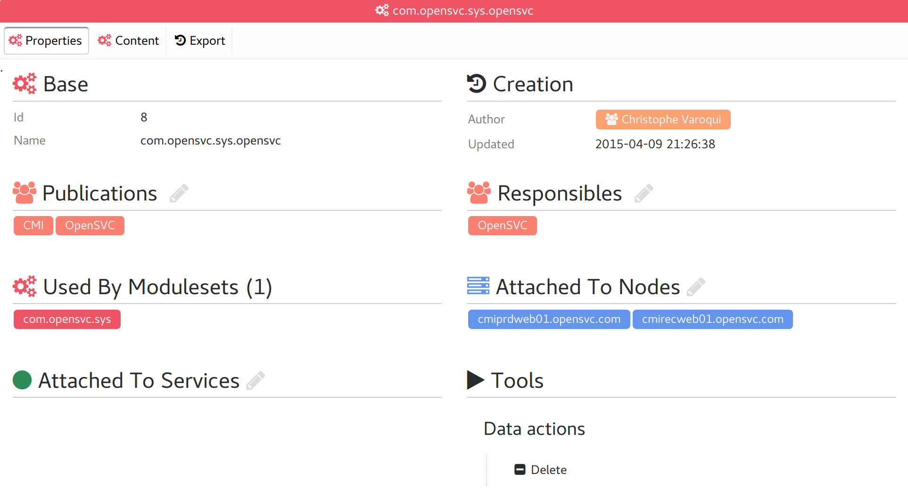
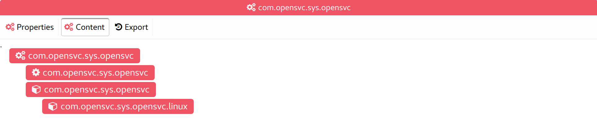
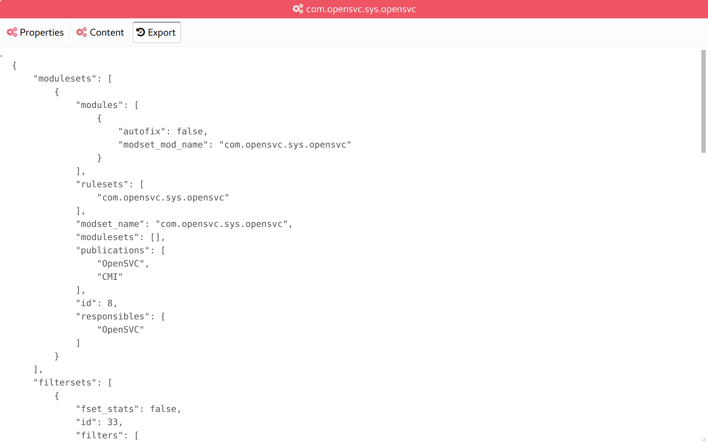

Compliance moduleset tabs
-------------------------

Properties
++++++++++

* Base moduleset properties
* The list of groups responsible for the moduleset
* The list of groups allowed to see and use the moduleset
* Moduleset usage in other modulesets
* Moduleset attachments to nodes and services

Content
+++++++

Display the moduleset structure as a tree of tags. Tag are double-clickable for drill-down.

Export
++++++

Display a JSON dump of the moduleset definition, ready for import in another collector or for sharing with others.

This export also contains all modulesets, filtersets and rulesets necessary to satisfy dependencies.

