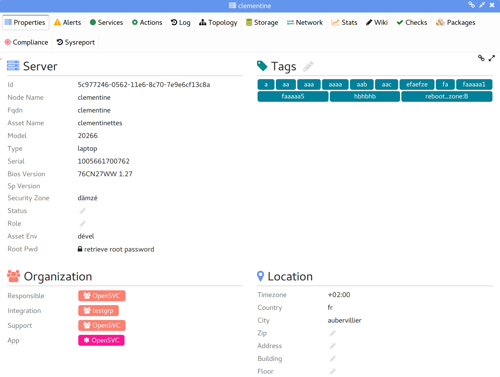
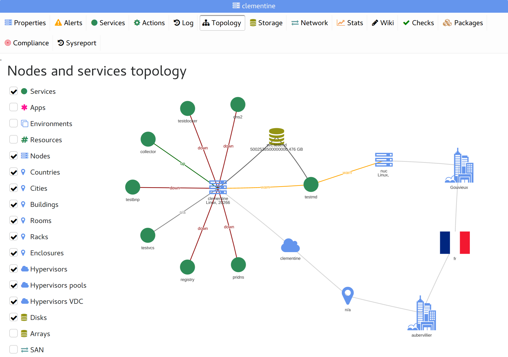
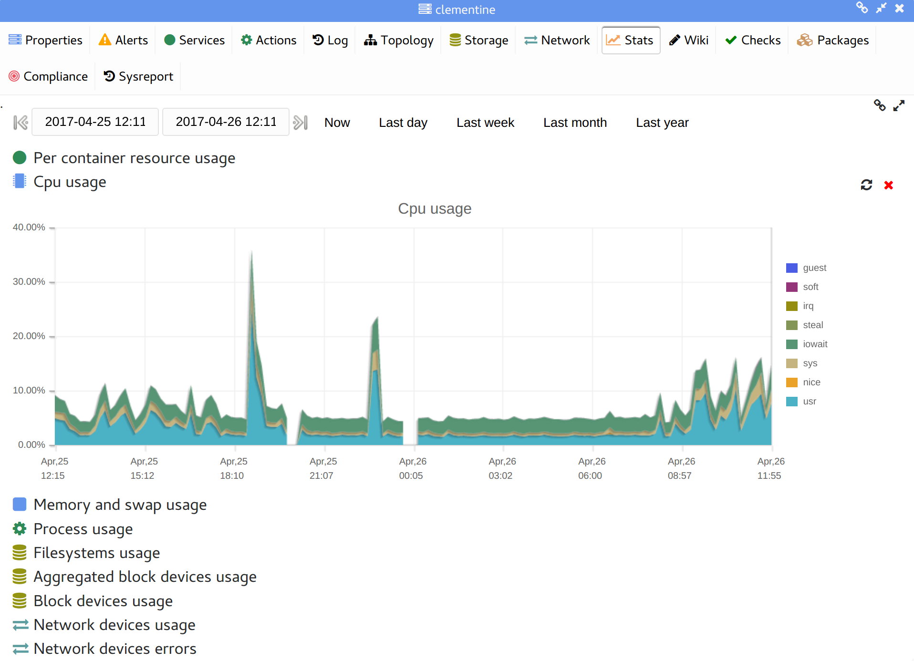
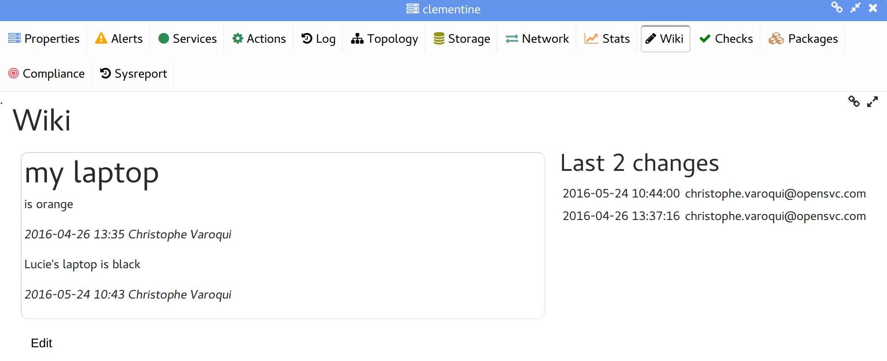
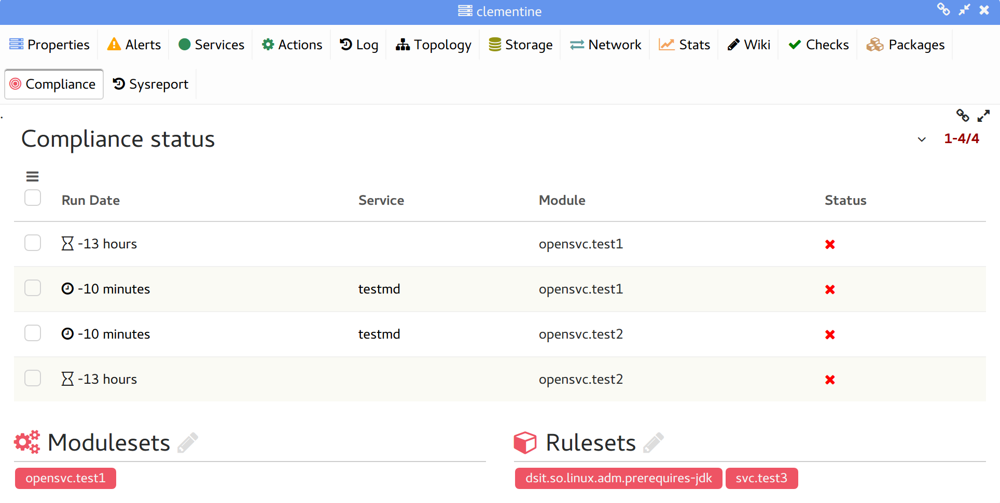
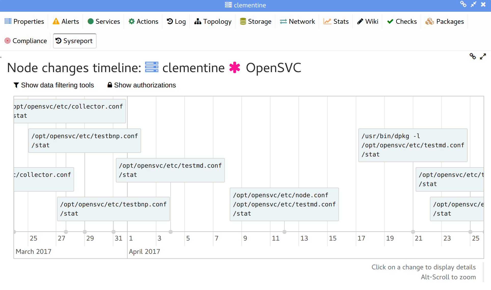

Node tabs
---------

Properties
++++++++++

Asset information can be loaded from a tiers enterprise asset manager or filled-in manually.

Alerts
++++++

The dashboard table filtered to display only the node alerts.

Services
++++++++

The service instances table filtered to display only the node's service instances.

Actions
+++++++

The service actions table filtered to display only the node's service actions.

Logs
++++

The logs table filtered to display only the node entries.

Topology
++++++++

A diagram of apps, resources, service, nodes, storage, locations relations.

Storage
+++++++

Display:

* The node-to-array cabling through the SAN
* A table of the node host bus adapter information
* A table of the node host bus adapter-to-target ports information, with used SAN views
* A table of the node disks, with their information parsed from storage arrays

Networks
++++++++

The nodes ips table filtered to display only the node ips and related information from the network CMDB.

Stats
+++++

Generate and display graphs of performance metrics on the user-selected time range. The metrics are gathered daily from tools like glance and sar running on the nodes. The opensvc agent pushes this information to database.

Metrics collection depend on the operating system. Some of them are:

*   cpu: usr, sys, wait, irq, guest, steal, idle, nice, iowait, soft

*   mem: commit, free, used by usr, buffer, cache, sys

*   swap: free, used, used but cached

*   load: avg1, avg5, avg15, runq size, proc list size

*   all-disks: io/s, bandwidth

*   per-disk: io/s, request size, wait time, service time, %util, bandwidth

Wiki
++++

A wiki page the service responsibles can use to share information about the node.

Packages
++++++++

The nodes packages table filtered to display only the node packages.

Compliance
++++++++++

Displays:

* The current per-module compliance status of the node
* The node rulesets and modulesets attachments
* Compliance alerts details

Sysreport
+++++++++

A timeline showing changed files on the node over time.

Changes can be filtered by path and time range.

Clicking a change in the timeline displays the change details: per file diff, files content at the time.

.. figure:: _static/collector.tabs.node.sysreport2.png

Selecting a time range produces a consolidated diff between the begin and end dates.

