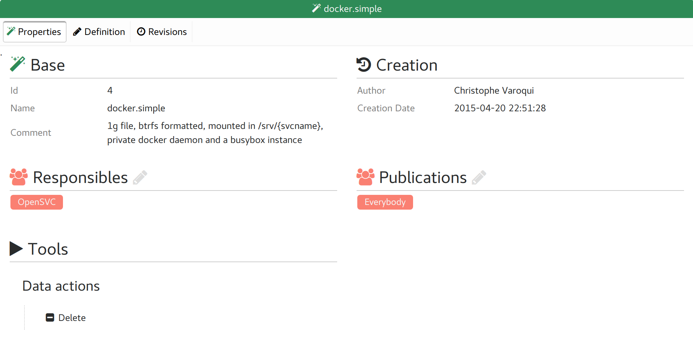
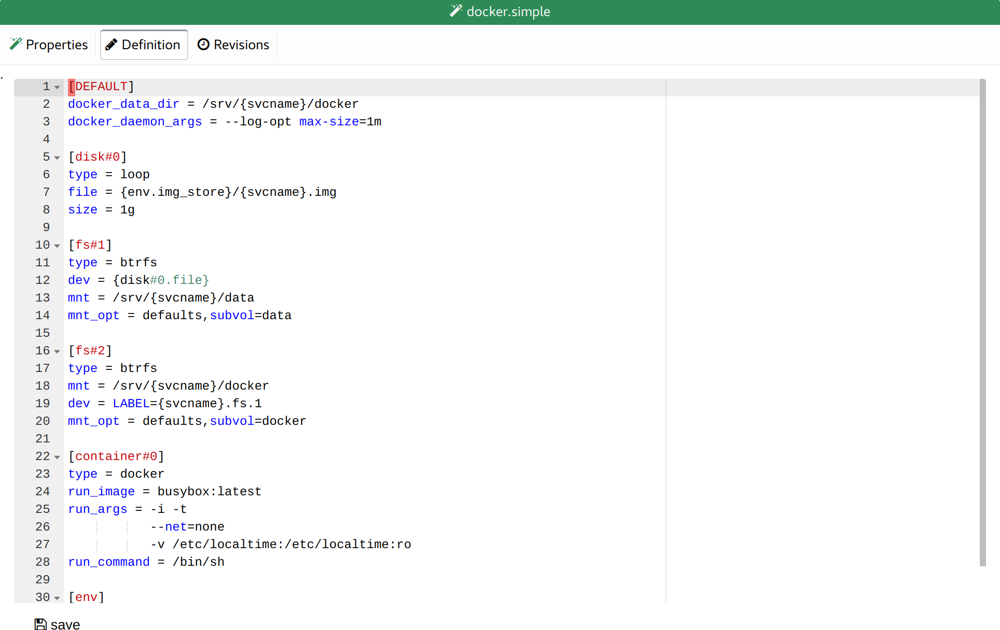
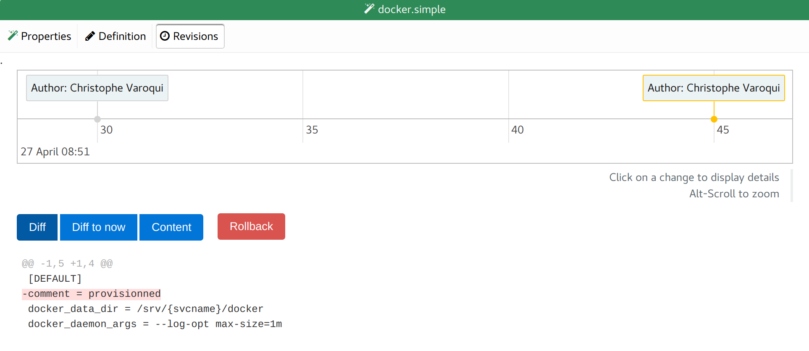

Service provisioning template tabs
----------------------------------

Properties
++++++++++

* Base template properties
* List of groups responsible for the template
* List of groups allowed to see the form and provision services with it

Definition
++++++++++

The template service configuration, in "ini" format, loaded in a text editor.

Revisions
+++++++++

A timeline of all changes on the template.

The timeline can be scrolled horizontally and zoomed.

Clicking on a change displays:

* The diff of the change
* The "Diff" button: Show the diff between the selected revision and the previous revision.
* The "Diff to now" button: Show the diff between the selected revision and now.
* The "Content" button: Show the full definition of the selected revision.
* The "Rollback" button: Rollback the definition to the selected revision.

