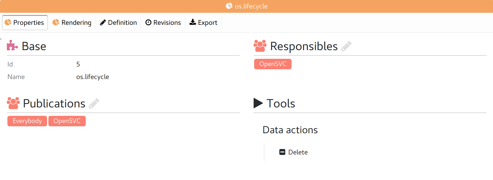
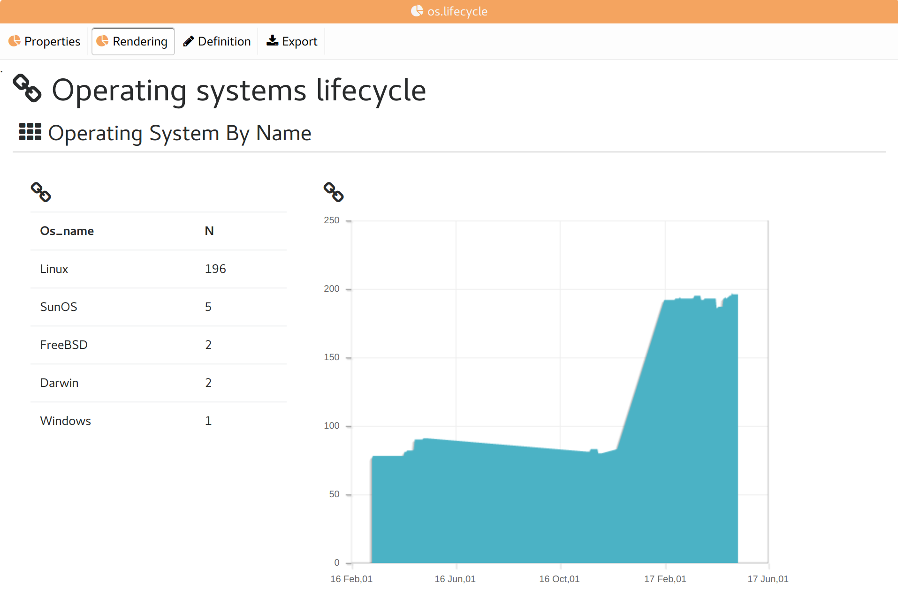
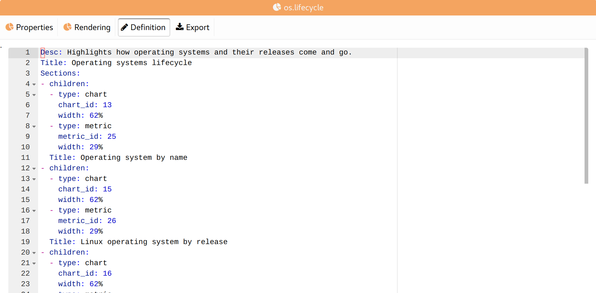
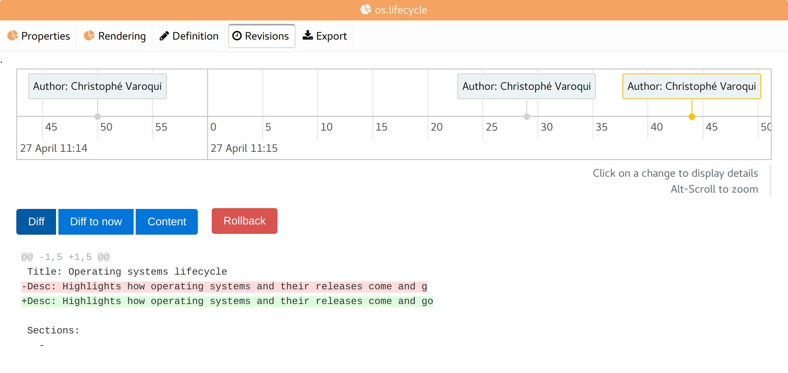
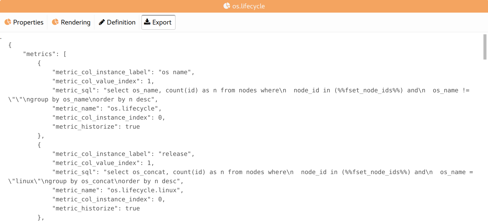

Report tabs
-----------

Properties
++++++++++

* Base report properties
* List of groups responsible for the report
* List of groups allowed to see the report definition and rendering

Rendering
+++++++++

The report rendering, as displayed in the "Reports" view.

Definition
++++++++++

The report YAML definition loaded in a text editor.

Revisions
+++++++++

A timeline of all changes on the report.

The timeline can be scrolled horizontally and zoomed.

Clicking on a change displays:

* The diff of the change
* The "Diff" button: Show the diff between the selected revision and the previous revision.
* The "Diff to now" button: Show the diff between the selected revision and now.
* The "Content" button: Show the full definition of the selected revision.
* The "Rollback" button: Rollback the definition to the selected revision.

Export
++++++

Display a JSON dump of the definition and properties of the report and its dependent charts and metrics, ready for import in another collector or for sharing with others.

