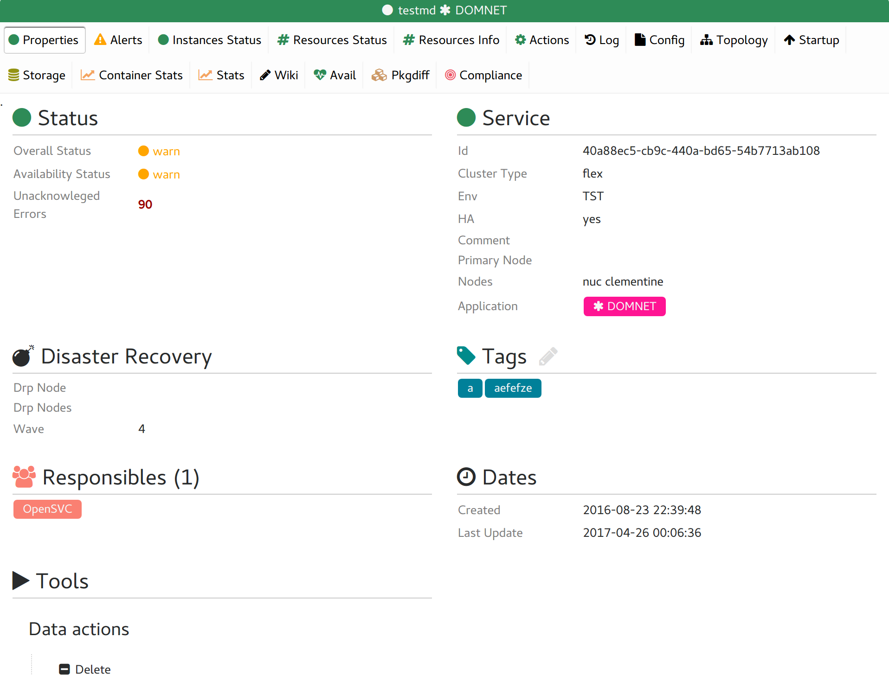
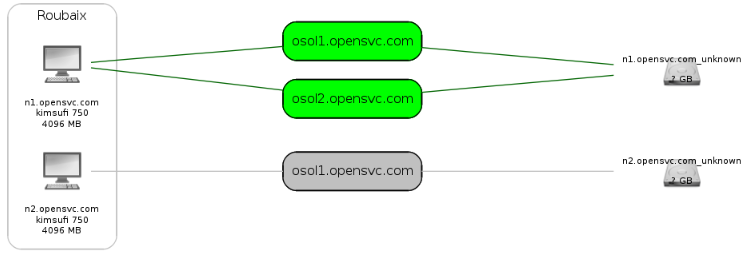

.. index:: tabs

Objects tabulations
*******************

Service tabs
------------

In all views, clicking on a service name will open the service tabs to display the most comprehensive data set the collector knows about this service.

properties
++++++++++

:command:`opensvc version`

  Pushed to database daily by the opensvc nodeware cronjob.

:command:`unackowledged errors`

  A count of the unacknowledged errors on this service found in the actions table.

:command:`type`

  Service type can be PRD, DEV, ...

:command:`comment`

  Pushed to database daily by the opensvc nodeware cronjob. This information resides in the service env file on the nodes.

:command:`last update`

  Timestamp updated upon service information receive from the nodeware cronjob.

:command:`container name`

  Host Name of the virtual machine encapsulated in the service, if any.

:command:`container type`

  Virtualisation driver to handle the encapsulated virtual machine, if any.

:command:`responsibles`

  List of administrators contact names for this service.

:command:`responsibles mail`

  List of administrators contact emails for this service.

:command:`primary node`

  Host name of the node where the service should be running in optimal situation.

:command:`nodes`

  All nodes where the service may be running in degraded situation (not in disaster recovery situation).

:command:`drp node`

  Host name of the node the service should be running in a disaster recovery situation.

:command:`drp nodes`

  All nodes where the service may be running in disaster recovery situation.

:command:`status`

  Display the per-node synthetic service status.

resources
+++++++++

Display the per-node per-resource detailled service status.

env
+++

Display the raw service configuration file pushed by the nodeware.

topology
++++++++

Sketches service-nodes-storage-sites relationships

Node tabs
---------

In all views, clicking on a node name will open the node tabs to display the most comprehensive data set the collector knows about this node.
server, os, mem, cpu, location, power

Information displayed in these tabs are extracted from the asset table. Assets can be loaded from a tiers enterprise asset manager or filled-in manually.

.. figure:: _static/doc_collector_node_tabs.png

stats
+++++

Generate and display graphs of performance metrics on the user-selected time range. The metrics are gathered daily from tools like glance and sar running on the nodes. The opensvc agent pushes this information to database.

Metrics collection depend on the operating system. Some of them are:

*   cpu: usr, sys, wait, irq, guest, steal, idle, nice, iowait, soft

*   mem: commit, free, used by usr, buffer, cache, sys

*   swap: free, used, used but cached

*   load: avg1, avg5, avg15, runq size, proc list size

*   all-disks: io/s, bandwidth

*   per-disk: io/s, request size, wait time, service time, %util, bandwidth

compliance
++++++++++

Displays:

* The current node ruleset
* The current per-module compliance status of the node
* The modulesets attached to the node

wiki
++++

A per-node wiki page the team responsible member can use to share information relative to the node.

