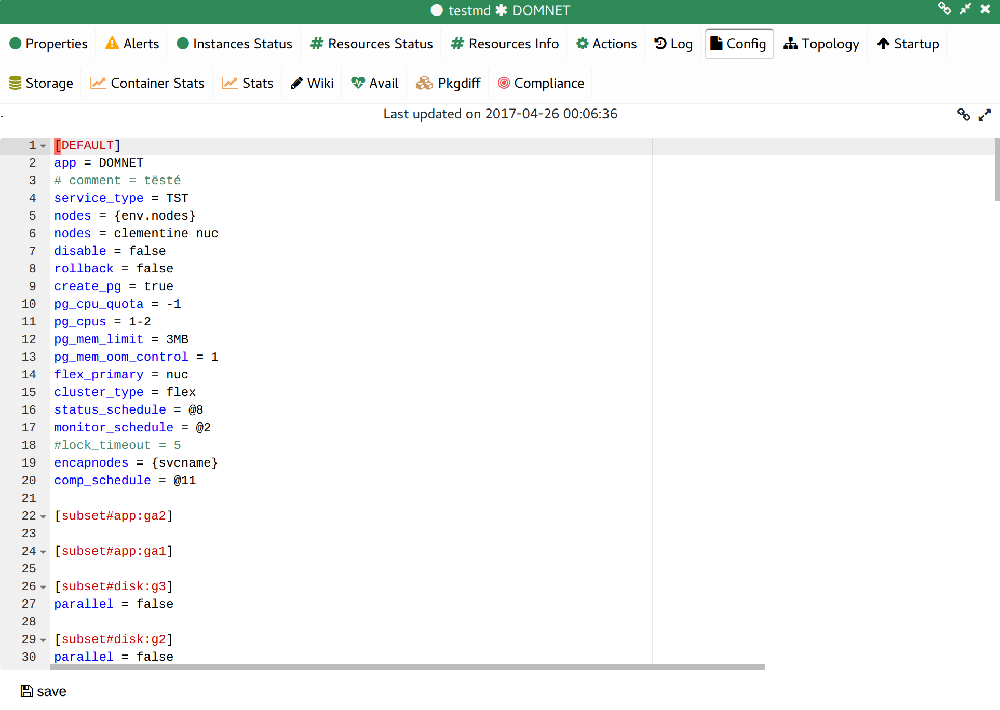
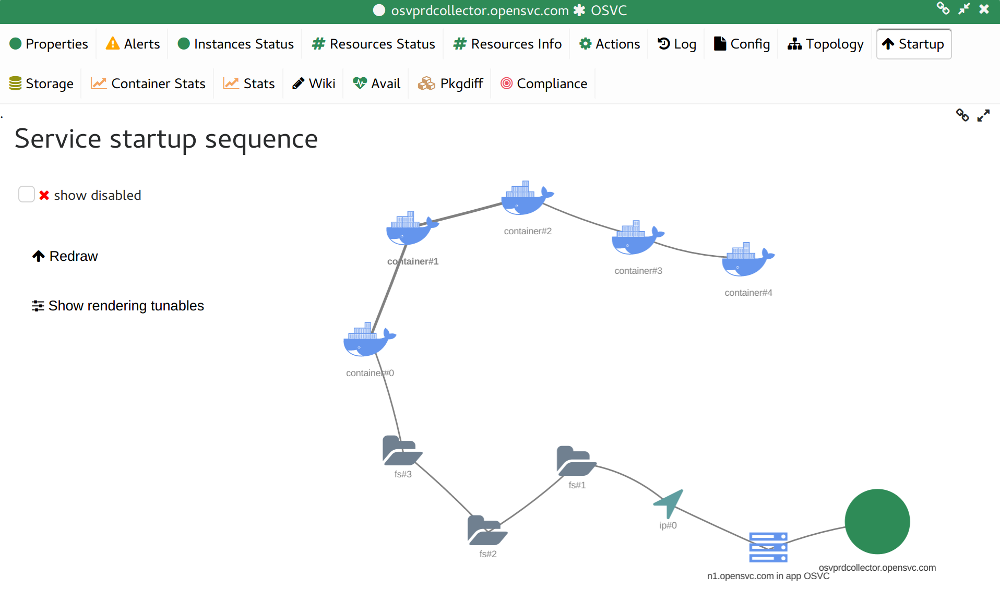
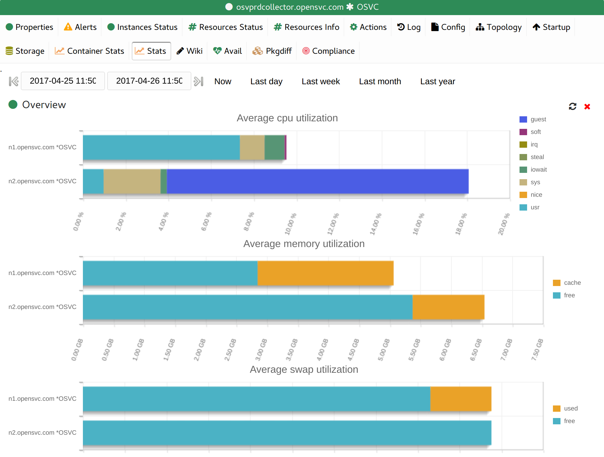
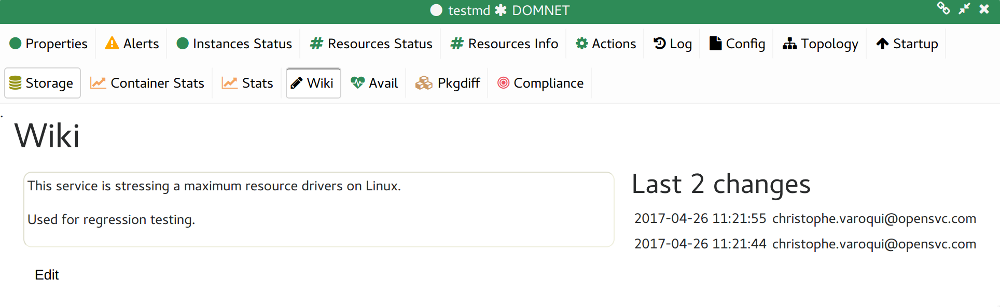
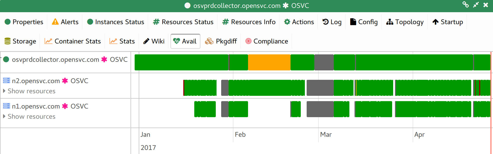
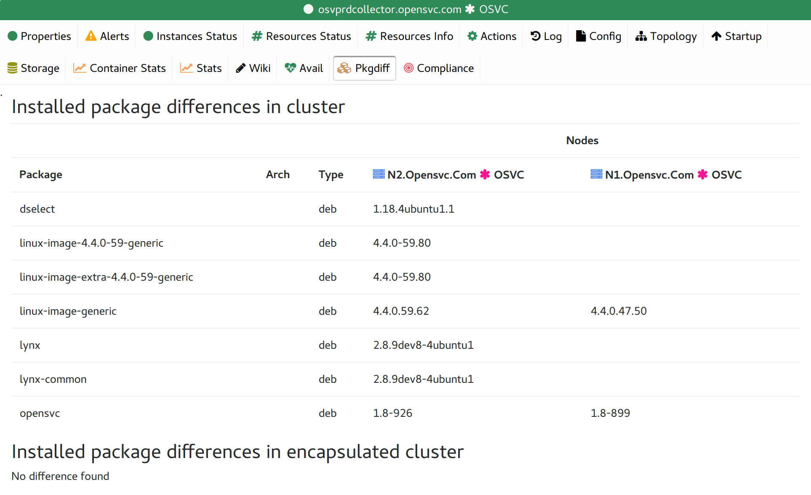
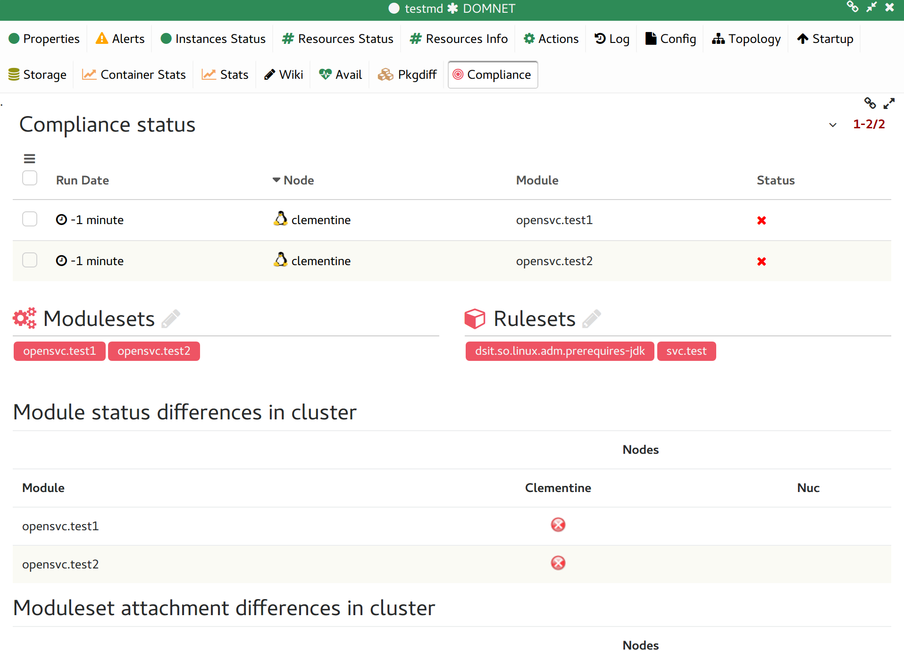

Service tabs
------------

Properties
++++++++++

.. figure:: _static/doc_collector_svc_tabs.png

================================ ========================================================================================
Property                         Description
================================ ========================================================================================
:command:`opensvc version`       Pushed to database daily by the opensvc nodeware cronjob.

:command:`unackowledged errors`  A count of the unacknowledged errors on this service found in the actions table.

:command:`type`                  Service type can be PRD, DEV, ...

:command:`comment`               Pushed to database daily by the opensvc nodeware cronjob.
                                 This information resides in the service env file on the nodes.

:command:`last update`           Timestamp updated upon service information receive from the nodeware cronjob.

:command:`container name`        Host Name of the virtual machine encapsulated in the service, if any.

:command:`container type`        Virtualisation driver to handle the encapsulated virtual machine, if any.

:command:`responsibles`          List of administrators contact names for this service.

:command:`responsibles mail`     List of administrators contact emails for this service.

:command:`primary node`          Host name of the node where the service should be running in optimal situation.

:command:`nodes`                 All nodes where the service may be running in degraded situation
                                 (not in disaster recovery situation).

:command:`drp node`              Host name of the node the service should be running in a disaster recovery situation.

:command:`drp nodes`             All nodes where the service may be running in disaster recovery situation.

:command:`status`                Display the per-node synthetic service status.

================================ ========================================================================================

Alerts
++++++

The dashboard table filtered to display only the service alerts.

Instances Status
++++++++++++++++

The service instances table filtered to display only the service instances.

Resources Status
++++++++++++++++

The resource status table filtered to display only the service resources.

Resources Info
++++++++++++++

The resource info table filtered to display only the service resources.

Actions
+++++++

The service actions table filtered to display only the service actions.

Logs
++++

The logs table filtered to display only the service entries.

Config
++++++

Display the service configuration file pushed by the agent in an online editor.

Topology
++++++++

A diagram of apps, resources, service, nodes, storage, locations relations.

.. figure:: _static/doc_collector_svc_tabs_topo.png

Startup
+++++++

A diagram of the service startup sequence, highlighting parallel and sequential steps.

Storage
+++++++

Display:

* The service node-to-array cabling through the SAN
* A table of the nodes host bus adapter information
* A table of the nodes host bus adapter-to-target ports information, with used SAN views
* A table of the service disks, with their information parsed from storage arrays

Container stats
+++++++++++++++

Performance statistics of the container resources of the service.

Stats
+++++

Performance statistics of the nodes hosting the service.

Wiki
++++

A wiki page the service responsibles can use to share information about the service.

Avail
+++++

A timeline of service instances and resources state changes.

Pkgdiff
+++++++

A comparison of installed packages differences between nodes hosting the service.

Compliance
++++++++++

Displays:

* The current per-module compliance status of the service
* The service rulesets and modulesets attachments
* Compliance alerts details

