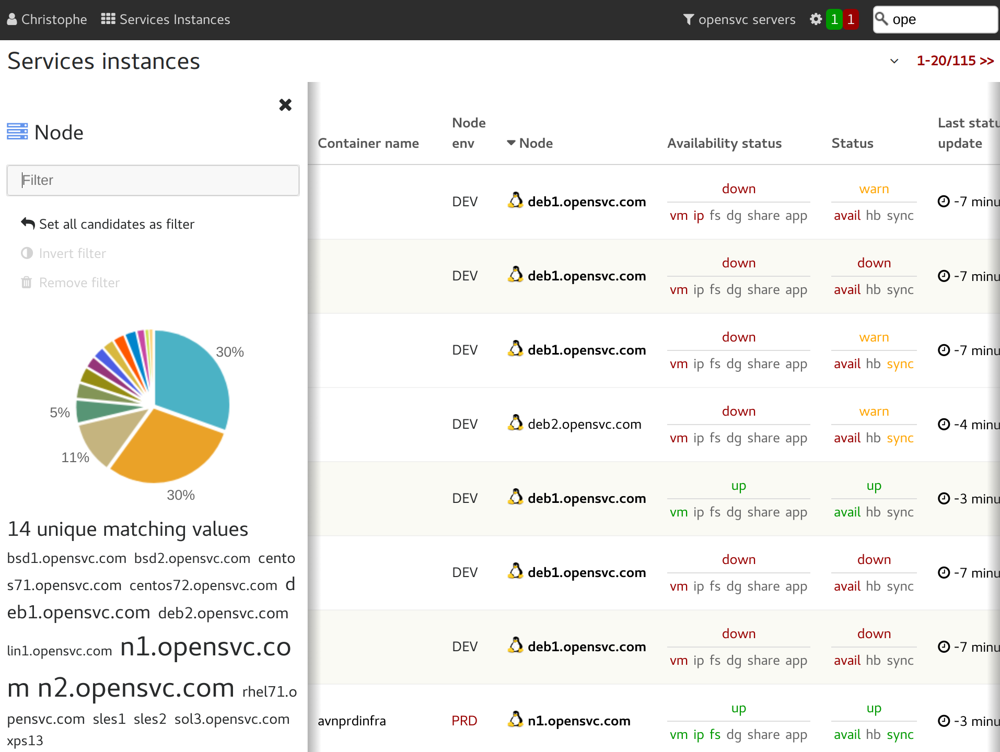
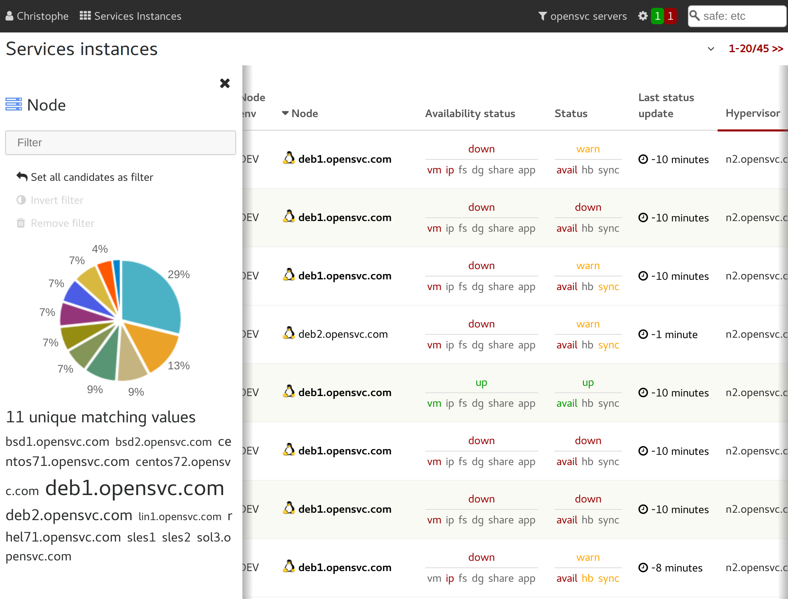
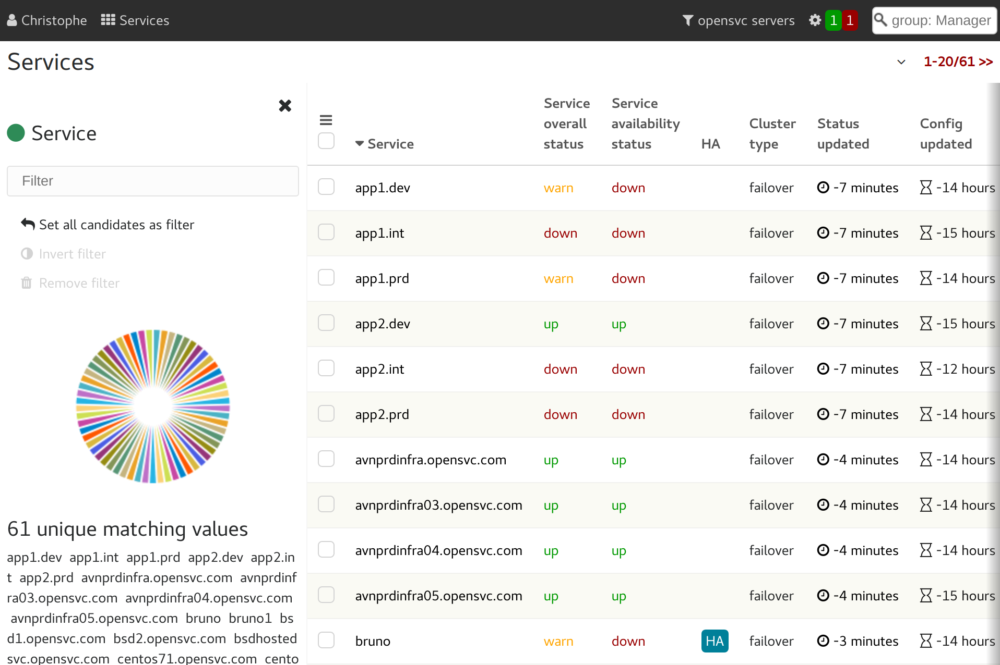

Use Cases
*********

This documentation shows how to collector makes it easy to extract useful information from the collector.

Number of cluster nodes
=======================

Interactive
-----------

In the service instance view, right click on the ``Node`` column header.

A side panel opens, showing the column data distribution and distinct values count.

API
---

::

        $ nodemgr collector cli --format json -- get /services_instances \
                --stats yes \
                --props nodes.node_id \
                --fset-id 16
        {
            "meta": {
                "distinct": {
                    "node_id": 14
                },
                "total": 115
            },
            "data": {
                "node_id": {
                    "751d8bad-0dfb-11e6-a5a5-ce07d318718f": 3,
                    "6a0b7270-71a7-4535-afbe-8151a1ad62d1": 1,
                    "d041382a-e1cc-40fc-92f3-efdad9db1f66": 34,
                    "751d8804-0dfb-11e6-a5a5-ce07d318718f": 1,
                    "751d81ab-0dfb-11e6-a5a5-ce07d318718f": 2,
                    "751d8f9b-0dfb-11e6-a5a5-ce07d318718f": 4,
                    "751d884d-0dfb-11e6-a5a5-ce07d318718f": 3,
                    "f3226e5a-0a30-4842-b32e-9140eef7020f": 13,
                    "751d9153-0dfb-11e6-a5a5-ce07d318718f": 4,
                    "751d8100-0dfb-11e6-a5a5-ce07d318718f": 6,
                    "5edcb65c-b2ec-43e6-99ca-41d4901135f8": 35,
                    "751d8896-0dfb-11e6-a5a5-ce07d318718f": 3,
                    "751d8159-0dfb-11e6-a5a5-ce07d318718f": 3,
                    "751d8f51-0dfb-11e6-a5a5-ce07d318718f": 3
                }
            }
        }

Here the fset_id 16 is the "opensvc servers" session filterset visible in the header in the screenshot above.

The ``meta.distinct.node_id`` is the number of cluster nodes in the OpenSVC infrastructure known to this collector.

Number of virtual cluster nodes
===============================

Interactive
-----------

In the service instance view, 

* set the ``Hypervisor`` column filter to ``!empty``
* right click on the ``Node`` column header.

A side panel opens, showing the column data distribution and distinct values count.

API
---

::

        $ nodemgr collector cli --format json -- get /services_instances \
                --stats yes \
                --props nodes.node_id \
                --filters 'nodes.hv !empty' \
                --fset-id 16

        {
            "meta": {
                "distinct": {
                    "node_id": 11
                },
                "total": 45
            },
            "data": {
                "node_id": {
                    "751d8bad-0dfb-11e6-a5a5-ce07d318718f": 3,
                    "f3226e5a-0a30-4842-b32e-9140eef7020f": 13,
                    "751d81ab-0dfb-11e6-a5a5-ce07d318718f": 2,
                    "751d8f9b-0dfb-11e6-a5a5-ce07d318718f": 4,
                    "751d884d-0dfb-11e6-a5a5-ce07d318718f": 3,
                    "751d8804-0dfb-11e6-a5a5-ce07d318718f": 1,
                    "751d9153-0dfb-11e6-a5a5-ce07d318718f": 4,
                    "751d8100-0dfb-11e6-a5a5-ce07d318718f": 6,
                    "751d8896-0dfb-11e6-a5a5-ce07d318718f": 3,
                    "751d8159-0dfb-11e6-a5a5-ce07d318718f": 3,
                    "751d8f51-0dfb-11e6-a5a5-ce07d318718f": 3
                }
            }
        }

The ``meta.distinct.node_id`` is the number of virtual cluster nodes in the OpenSVC infrastructure known to this collector.

Number of services
==================

Interactive
-----------

In the services view, right click on the ``Service`` column header.

A side panel opens, showing the column data distribution and distinct values count.

API
---

::

        $ nodemgr collector cli --format json -- get /services \
                --stats yes \
                --props svc_id \
                --fset-id 16

        {                                                     
            "meta": {                                         
                "distinct": {                                 
                    "svc_id": 61                              
                },                                            
            "total": 61                                   
            },                                                
            "data": {                                         
                "svc_id": {                                   
                    "ff821cd1-0e09-11e6-a5a5-ce07d318718f": 1,
                    "ff82290e-0e09-11e6-a5a5-ce07d318718f": 1,
                    "ff821c94-0e09-11e6-a5a5-ce07d318718f": 1,
                    ...
                }
            }
        }

The ``meta.distinct.svc_id`` is the number of services in the OpenSVC infrastructure known to this collector.

Number of HA failover services
==============================

Interactive
-----------

.. figure:: _static/collector.usecases.nb_ha_services.png

In the services view, 

* set the ``Cluster type`` column filter to ``failover``
* set the ``HA`` column filter to ``1``
* right click on the ``Service`` column header.

A side panel opens, showing the column data distribution and distinct values count.

API
---

::

        $ nodemgr collector cli --format json -- get /services \
                --stats yes \
                --props svc_id \
                --filters "svc_cluster_type failover" \
                --filters "svc_ha 1" \
                --fset-id 16

        {
            "meta": {
                "distinct": {
                    "svc_id": 3
                },
                "total": 3
            },
            "data": {
                "svc_id": {
                    "ff824585-0e09-11e6-a5a5-ce07d318718f": 1,
                    "ff8239aa-0e09-11e6-a5a5-ce07d318718f": 1,
                    "ff8241c6-0e09-11e6-a5a5-ce07d318718f": 1
                }
            }
        }

The ``meta.distinct.svc_id`` is the number of HA failover services in the OpenSVC infrastructure known to this collector.

Cluster nodes operating system dispatch
=======================================

API
---

::

        $ nodemgr collector cli --format json -- get /services_instances \
                --stats yes \
                --props nodes.node_id,nodes.os_name \
                --groupby nodes.node_id,nodes.os_name \
                --fset-id 16

        {
            "meta": {
                "distinct": {
                    "node_id": 14,
                    "os_name": 3
                },
                "total": 14
            },
            "data": {
                "node_id": {
                    "751d8bad-0dfb-11e6-a5a5-ce07d318718f": 1,
                    "6a0b7270-71a7-4535-afbe-8151a1ad62d1": 1,
                    "d041382a-e1cc-40fc-92f3-efdad9db1f66": 1,
                    "751d8804-0dfb-11e6-a5a5-ce07d318718f": 1,
                    "751d81ab-0dfb-11e6-a5a5-ce07d318718f": 1,
                    "751d8f9b-0dfb-11e6-a5a5-ce07d318718f": 1,
                    "751d884d-0dfb-11e6-a5a5-ce07d318718f": 1,
                    "f3226e5a-0a30-4842-b32e-9140eef7020f": 1,
                    "751d9153-0dfb-11e6-a5a5-ce07d318718f": 1,
                    "751d8100-0dfb-11e6-a5a5-ce07d318718f": 1,
                    "5edcb65c-b2ec-43e6-99ca-41d4901135f8": 1,
                    "751d8896-0dfb-11e6-a5a5-ce07d318718f": 1,
                    "751d8159-0dfb-11e6-a5a5-ce07d318718f": 1,
                    "751d8f51-0dfb-11e6-a5a5-ce07d318718f": 1
                },
                "os_name": {
                    "SunOS": 1,
                    "FreeBSD": 2,
                    "Linux": 11
                }
            }
        }

The ``data.os_name`` dictionary shows the cluster nodes operating system dispatch in the OpenSVC infrastructure known to this collector.

