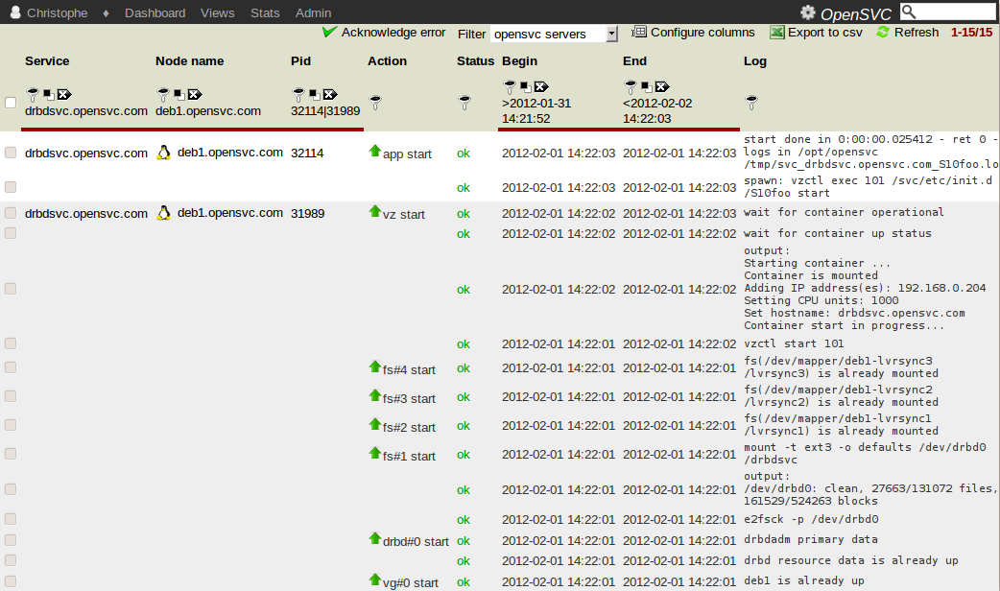

.. |video-icon| image:: _static/video.png

Actions view
************

Usage
=====

This view displays the journal of all services events with their status.

Typical usage:

**Quick insight of unacknowledged errors affecting a specific perimeter**
    Example: ``ack=0 & status=err & responsible=me``

**Retrospective problem analysis**
    Example: ``service=some_service & begin>2010-01-10% & end<2010-01-12%``

**Problem patterns**
    Example: ``service=some_service & action=syncnodes & status!=ok``

**Learn which system commands are run by the nodeware**
    Example: ``log=%sg_persist%|%scu%``

**Trace who was alerted of a problem, and when**

Screenshot
==========

Fields
======

**Service**

  Service name the action applied to. Private collectors usually report shortnames, shared collectors usually report service names with domain names.

**App**

  The application code is a way to group services dedicated/paid by some corporate entity or project. You can setup any application code you want in your services configuration file, using the app parameter.

**Responsible**
	
  The responsibles are persons receiving alerts for a service. Hovering the mouse over the icon spawns the name of the responsibles. No icon means no responsible, which is an anomaly, and as such, cause alerts to be emitted to the site's administrator/manager.

**Node**

  Node where the action has be executed. The node name is a link to the asset view.

**Action**

  The executed action name. An action usually aggregates a number of log lines, plus a line with no log message as a header. The default action view has an 'empty' log filter active so you are presented only actions without their logs. You can drill down a specific action by clicking on its pid.

  ============= ===================================================================================================================================================================================================
  Action        Description
  ============= ===================================================================================================================================================================================================
  start         start resources of type : ip, loop, disk group, zpool, fs, container, app
  stop          stop resources of type : app, container, fs, zpool, disk group, loop, ip
  startdisk     start resources of type : loop, disk group, zpool, fs
  stopdisk      stop resources of type : fs, zpool, disk group, loop
  startip       start resources of type : ip
  stopip        stop resources of type : ip
  startloop     start resources of type : loop
  stoploop      stop resources of type : loop
  startvg       start resources of type : disk group
  stopvg        stop resources of type : disk group
  mount         start resources of type : fs
  umount        stop resources of type : fs
  prstart       acquire scsi persistent reservations on disks of the service (wrapped by startvg and startdisk)
  prstop        release scsi persistent reservations on disks of the service (wrapped by stopvg and stopdisk)
  syncnodes     trigger hard-coded and user-defined file synchronization to secondary nodes. Optionally creates snapshots to send a coherent file set. No-op if run from a node not running the service.
  syncdrp       trigger hard-coded and user-defined file synchronization to disaster recovery nodes. Optionally creates snapshots to send a coherent file set. No-op if run from a node not running the service.
  print_status  print status of all service resources
  ============= ===================================================================================================================================================================================================

**Status**

  ===================== ==============================================================================================================
  Status Description
  ===================== ==============================================================================================================
  ok                    The action completed succesfully.
  warn                  The action completed with some warnings. No acknowledgement needed.
  err                   The action completed with some error. Investigation and acknowledgement are needed.
  err (strikethrough)   The action completed with some error. Acknowledged by a user.
  empty                 The collector has been informed of the action begining but has no yet received ending logs.
  ===================== ==============================================================================================================

**Begin**

  Begin timestamp of the action.

**End**

  End timestamp of the action.

**Pid**

  Process identifier of the session handling the action on the node. Click to active a pid filter with this value.

**Log**

  The action log as it is displayed on the node standart output.

Dashboard notifications
=======================

* Service action error count
