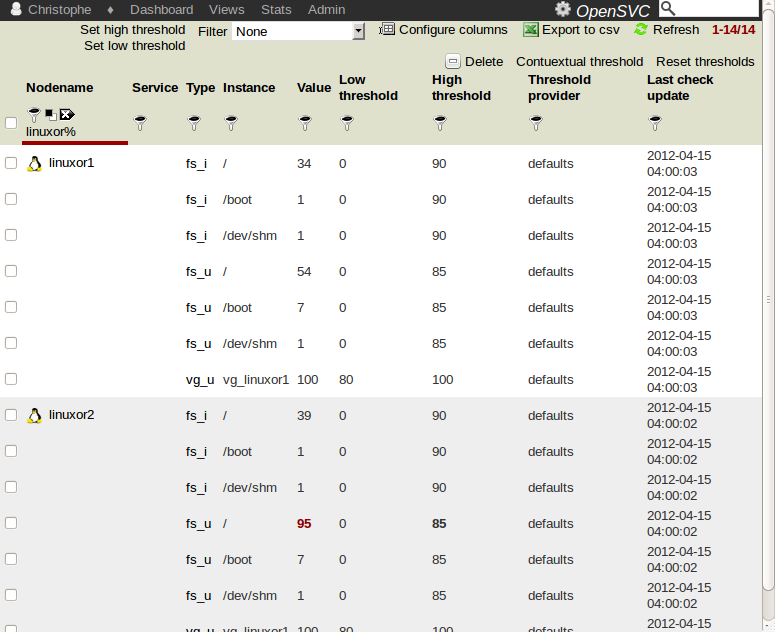

Checks view
***********

Usage
=====

The OpenSVC agent schedule and ``nodemgr checks`` push checkers values from the nodes to the collector. Current implemented checks are:

**fs_u**
  Filesystems usage percent.

**fs_i**
  Filesystems inodes usage percent.

**vg_u**
  Volume group usage percent.

**mpath**
  Multipath valid path count (native multipath on Linux, HP-UX, Solaris, PowerPath).

**raid** 
  Raid hardware error count (MegaRaid, SmartArray).

**fm**
  Fault Management. Server hardware error count (Solaris fmadm).

**lag**
  Link aggregate error count (Linux bonding, Solaris).

More checks will be implemented depending on client needs.

Each check is validated against high and low threshold values. If the current check value is outside boundaries, the check raises a warning in the dashboard and the value and crossed threshold are highlighted red in the checks view.

A check without value update for more than 24 hours will have its update date highlighted red. These checks instances should not be trusted.

Screenshot
==========

Dashboard notifications
=======================

* Check value out of bounds
* Check value not updated

Setting thresholds
==================

Check types have default high and low threshold values. These values can be customized for each node and instance of the check or a threshold can be attached to a filterset.

Clicking a checker name opens a dialog to change the default value.

To change the threshold values of a set of check instances, check the corresponding rows in the table and click the :menuselection:`Set low threshold` or :menuselection:`Set high threshold`.

