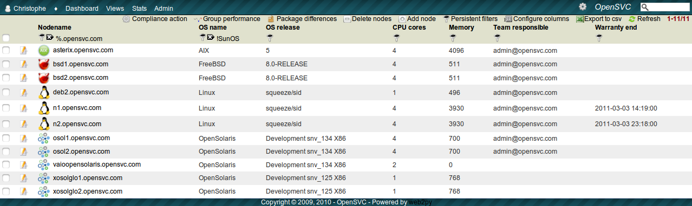

.. |video-icon| image:: _static/video.png

Nodes view
**********

Usage
=====

This view presents nodes information. Part of which is collected from the nodes themselves, through the OpenSVC agent. Information like geo-location, team responsible, power lines connexions, role, warranty end and status are either manually set or imported from the corporate asset manager.

Screenshot
==========

Tools
=====

* Group performance
* Installed packages comparison
* Node actions
* Add node
* Delete node

Dashboard notifications
=======================

* Nodes close to warranty end
* Nodes without asset information
