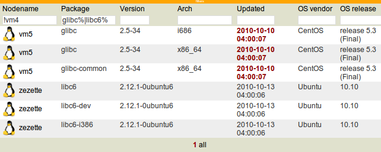

Packages view
*************

Usage
=====

The OpenSVC agent pushes installed package list from the nodes to the collector. Centralized package lists allow administrators to easily:

*   Compare installed version of packages across a set of nodes
*   Identify nodes vulnerable to bug or security problems known to certain package versions
*   Identify nodes where a package is installed or not installed
*   Plan upgrades

Packages database entries not refreshed for more than 24 hours will have its update date highlighted red. Information for such a package should not be trusted.

The toolbox of the nodes view proposes a tool to highlight package differences between selected nodes.

Screenshot
==========

Dashboard notifications
=======================

* Package differences amongst nodes of a cluster

