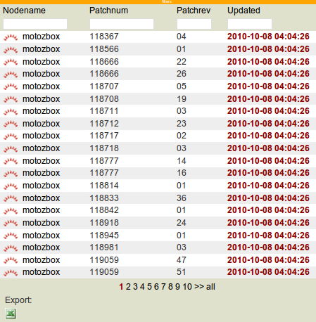

Patches view
************

Usage
=====

The OpenSVC nodeware gathers installed patches list from the nodes (Solaris) and pushes it to the collector. Centralized patches lists allow administrators to easily:

*   Compare installed version of patches across a set of nodes
*   Identify nodes vulnerable to bug or security problems known to certain patch levels
*   Identify nodes where a patch is installed or not installed
*   Plan patch compaigns

Patch database entries not refreshed for more than 24 hours will have its update date highlighted red. Information for such a patch should not be trusted.

Screenshot
==========

