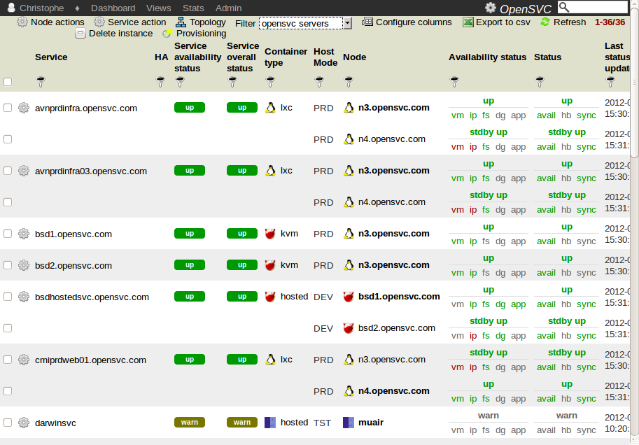

Services view
*************

Usage
=====

This view presents service inventory and health.

Typical use cases:

:strong:`Quick insight of live service status`

  ``status!=ok``

:strong:`List services matching criteria`

  Example: 'How many non-production services do I manage for the ERP system'
  ``app=ERP & type=!PRD``

  Example: 'I lost a power line, which services are impacted':
  ``nb_power_supply=1 & power_supply_1=POW_A``

:strong:`Generate diagrams of clusters to better communicate on disaster recovery plans and allocated resources`

  Check some rows and click :menuselection:`Topology`

:strong:`Trigger actions on a service or a group of services`

  Check some rows and click :menuselection:`Service action`

:strong:`Trigger actions on a node or a group of nodes`

  Check some rows and click :menuselection:`Node action`

:strong:`Provision a new service from a template`

  Click :menuselection:`Provisioning`

Screenshot
==========

Fields
======

**Container type**

  The container type reflect the service integration type of the service. This setting is set in the service configuration file on the nodes as the ``mode`` parameter. The possible values are:

  ======== ====================================================================================================================================================================================================================
  Mode     Description
  ======== ====================================================================================================================================================================================================================
  hosted   The service is hosted on bare metal, non-virtualized resources : ip plumbed on a physical interface, applications and data in filesystems mounted on a real server.
  zone     The service applications and data are deployed in a Solaris zone. The ip is still plumbed in the global zone. Filesystem resources are mounted in the global zone.
  lxc      The service applications and data are deployed in a Linux Container (zone-like). The ip is plumbed on a virtual interface, with virtualized mac address. Filesystem resources are mounted in the host system.
  vz       The service applications and data are deployed in a Linux Container (zone-like). The ip is plumbed on a virtual interface, with virtualized mac address or tunneled. Filesystem resources are mounted in the host system.
  kvm      The service applications and data are deployed in a KVM virtual machine. The ip is plumbed on a virtual interface, with virtualized mac address. Filesystem resources are mounted in the virtual host.
  vbox     The service applications and data are deployed in a VirtualBox virtual machine. The ip is plumbed on a virtual interface, with virtualized mac address. Filesystem resources are mounted in the virtual host.
  xen      The service applications and data are deployed in a Xen virtual machine. The ip is plumbed on a virtual interface, with virtualized mac address. Filesystem resources are mounted in the virtual host.
  hpvm     The service applications and data are deployed in a HP-UX native virtual machine. The ip is plumbed on a virtual interface, with virtualized mac address. Filesystem resources are mounted in the virtual host.
  ovm      The service applications and data are deployed in a Oracle Virtual Machine. The ip is plumbed on a virtual interface, with virtualized mac address. Filesystem resources are mounted in the virtual host.
  ======== ====================================================================================================================================================================================================================

**Responsible**
	
  The responsibles are persons receiving alerts for a service. Hovering the mouse over the icon spawns the name of the responsibles. No icon means no responsible, which is an anomaly, and as such, cause alerts to be emitted to the site's administrator/manager.

**Prefered node**

  Upon node reboot, only the services whose prefered node is set to this node are started. During those services start-up, the nodeware verifies the service is not running on another node and aborts the start-up if so.

**Service type**

  This property is used by the nodeware to sanity check actions asked by the admin.

  ====  ===============================================================================================
  Type  Description
  ====  ===============================================================================================
  PRD	Production service. Services of this type can be started on any type of node.
  DEV	Development service. Services of this type are not allowed to be started on production nodes.
  TMP	Temporary service. Like DEV, but alerts won't be sent for these services.
  ====  ===============================================================================================

**App**

  The application code is a way to group services dedicated/paid by some corporate entity or project. You can setup any application code you want in your services configuration file, using the app parameter.

**Status**

  Status gizmos present the overall service health on top, and individual resource type status below. Color codes are:
	

  ====== ===========================================
  Color  Description
  ====== ===========================================
  green  resource is up
  red    resource is down
  orange resource has warnings
  grey   resource type is not used by the service
  ====== ===========================================

  An all-greyed-out status marker indicates the presented data is too old to be trusted, though it displays the last overall known status. Hovering the mouse over the status markers will displayed the data refresh timestamp.

Tools
=====

* Node actions

  |video-icon| `Watch a video <http://www.youtube.com/watch?feature=player_embedded&v=Yh7P7F61DB0>`_

* Service actions

* Topology

Dashboard notifications
=======================

* Frozen services
* Service status not updated
* Services not up

