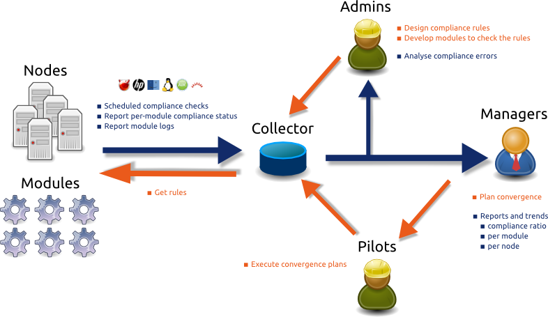
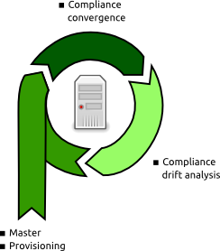
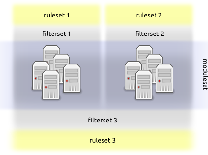
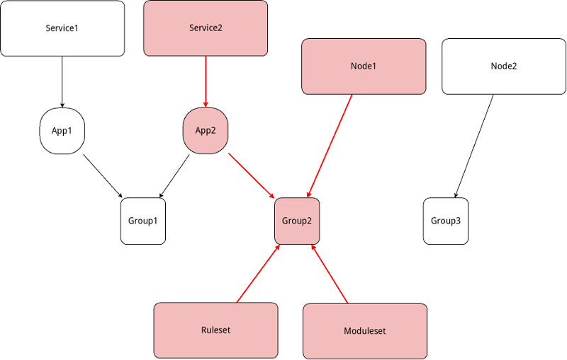

Concept
*******

.. |nbsp| unicode:: 0xA0 
   :trim:

Introduction
============

The "compliance" concept is all about mesuring the adherence of the hosts' configurations to the site's rules. The OpenSVC implementation goals are:

* Make recurrent configuration tasks fast, easy, outsourceable, whatever their complexity
* Ensure recurrent configuration tasks produce the same result, whoever the operator
* Ease change management and IT mergers
* Readable configuration rulesets
* Minimize the design workload and its maintenance
* Tight integration with the clustering layers
* Auditable host and service configurations
* Auditable scripts to apply changes to your hosts
* Fast and reliable nodes and services provisioning

Administrators describe the corporate server and service configuration ruleset in a central, auditable place. The OpenSVC agent modules compare the actual configurations to the expected configurations and log the result to the collector.

.. container:: clearer

   |nbsp|

The compliance framework can naturally be used for host post-installation. This strategy avoids extra maintenance of a systems post-installation framework, and ensures a newly delivered host is compliant with the current ruleset and is checked for drift after its delivery.

.. container:: clearer

   |nbsp|

Compliance glossary
===================

The compliance framework uses 3 types of objects.

**Rulesets, Rules**

    For detailled information about rulesets, read `this page <compliance.rulesets.html>`_.

    * Rules are designed, stored and served by the collector
    * Rules are variable/value pairs exported by the OpenSVC agent in the execution environment of the modules.
    * Only members of the 'CompManager' group are allowed to create or edit rulesets
    * A rule value can be complex, for example a json-serialized dictionnary. OpenSVC ships with a library of compliance objects and corresponding rule edition wizard. Using the objects in modules code abstracts the complex rule parsing, and using the wizards hides the json structures from the designer.
    * Rules are grouped into rulesets.
    * Rulesets can be explicitely attached to nodes or services, or contextually presented to nodes and services through a filterset.
    * Rulesets can be published or not
    * Rulesets can encapsulate other rulesets

**Filtersets, Filters**

    * A filter is a SQL-like condition on information available to the collector.
    * Filterable information is grouped into 3 categories : node, service and service status.
    * Available operators are ``>``, ``<``, ``=``, ``!=``, ``IN`` and ``LIKE``
    * Filters must be grouped into filtersets.
    * Filtersets can be grouped into filtersets.
    * Upon grouping, the designer must choose a ``AND`` or ``OR`` logical operator and the components ordering

**Modulesets, Modules**

    * Apply and verify the rules.
    * Modules are grouped into modulesets
    * Modulesets are explicitely attached to nodes
    * All matching rulesets' rules are visible to all modules of attached modulesets
    * Each module picks the rules it is coded to pick

Multi-tenancy
=============

Different groups, responsible for different sets of nodes and services, can define different and private compliance targets. For example, the front and back-office servers can be under the responsability of different teams. In this case, each team won't want to see the ruleset maintained by the other team.

The collector allows users to set owners to modulesets and rulesets, so that they are visible and attachable from services and nodes only if they share a common ownership.

**Example**

In this diagram,

* the orange ownership chains link the moduleset and ruleset to the node and services, meaning the endpoint moduleset and ruleset are visible and attachable from the node and services at the other end of the chains. In other words, Ruleset and Moduleset are visible and attachable only from Node1 and Service2 because they all share a common ownership by Group2.
* the blue ownership chains do not link the moduleset and ruleset to the nodes and services, meaning the endpoint moduleset and ruleset are not visible nor attachable from the node and services at the other end of the chains. In other words, Ruleset and Moduleset are not visible nor attachable from Node2 and Service1 because they don't share common groups.

**Trust chains charracteristics**

* node-to-ruleset and node-to-moduleset trust chains need only the group link
* service-to-ruleset and service-to-moduleset trust chains have an additional link : the service application code.
	* This code is set in each service configuration file by the ``DEFAULT.app`` parameter
	* It must map to an entry of the collector's application code registry
	* This registry is rendered by the ``Admin > Apps`` view.
	* The application codes ownership can be set by the collector administrators in this view

.. container:: clearer

   |nbsp|

