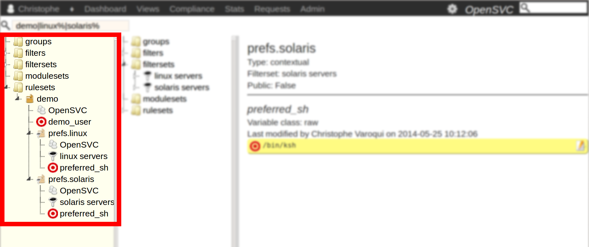
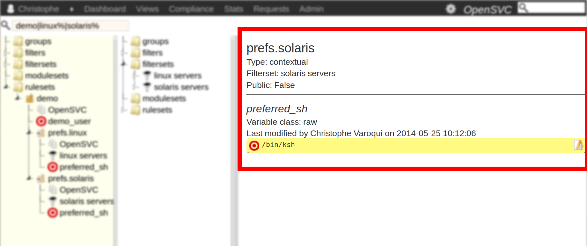
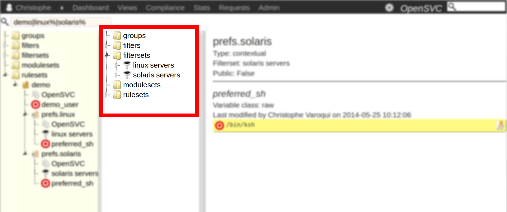
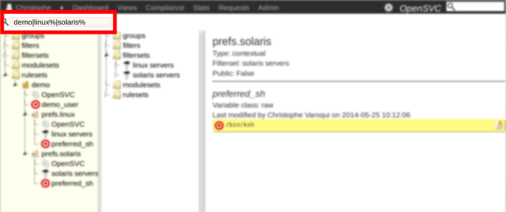

Designer
========

The designer is a tool optimized for ruleset and moduleset creation and edition, and for complex encapsulated rulesets visualization.

Layout
++++++

Left panel
^^^^^^^^^^

The left panel presents a tree of all compliance objects, grouped by categories : filters, filtersets, modulesets and rulesets.

Right panel
^^^^^^^^^^^

The right panel shows the properties of the object selected in the tree.

* author
* publishing flag of a ruleset
* contextual or explicit type of a ruleset
* users of a ruleset or moduleset
	* matching nodes and services
	* explicitely attached nodes and services
* rules in a rulesets
* modules in a modulesets

Foldable extra tree
^^^^^^^^^^^^^^^^^^^

The separator line between the left and right panels is clickable. When clicked, a second tree is shown. The content of both trees is the same, but each tree having its own scrollbar, you can focus on a different data cursor in each tree to facilitate drag-and-drop actions between objects far appart in the tree structure.

Search box
^^^^^^^^^^

A search box is displayed in the top-left corner. The search string is applied on the ``<return>`` keyup event. The search string syntax is the same used for column filtering in all collector data views. See `this page <collector.introduction.html#column-filters-bar>`_ for the syntax reference.

Only the filtersets, modulesets and top-level rulesets are filtered with the search string. A top-level ruleset not matching the search string will not be displayed, even if it contains matching child rulesets.

Usage
+++++

Screencast to come.

Noteworthy implementation choices
+++++++++++++++++++++++++++++++++

To help present a readable tree, the following implementation choices were made:

* Explicit and contextual rulesets have different icons
* Not published rulesets have a lighter icon
* All rulesets are created at the top of the rulesets tree branch
* Not published rulesets disappear from the top of the rulesets tree branch as soon as they are encapsulated. They are now visible only as child of their parent rulesets.

Actions
+++++++

Drag-and-drop
^^^^^^^^^^^^^

+---------------+-----------------------+-----------------------+-----------------------+-----------------------+-----------------------+-----------------------+
| dropped (A)   |                                                dropped over (B)                                                                               |
+---------------+-----------------------+-----------------------+-----------------------+-----------------------+-----------------------+-----------------------+
|               | ruleset               | rule                  | moduleset             | module                | filterset             | filter                |
+===============+=======================+=======================+=======================+=======================+=======================+=======================+
| **ruleset**   | A becomes a child of  | N/A                   | N/A                   | N/A                   | N/A                   | N/A                   |
|               | B. If B is not        |                       |                       |                       |                       |                       |
|               | published, A is no    |                       |                       |                       |                       |                       |
|               | longer visible at the |                       |                       |                       |                       |                       |
|               | head of the ruleset   |                       |                       |                       |                       |                       |
|               | branch.               |                       |                       |                       |                       |                       |
+---------------+-----------------------+-----------------------+-----------------------+-----------------------+-----------------------+-----------------------+
| **rule**      | A is copied from the  | N/A                   | N/A                   | N/A                   | N/A                   | N/A                   |
|               | parent ruleset to the |                       |                       |                       |                       |                       |
|               | B ruleset.            |                       |                       |                       |                       |                       |
|               |                       |                       |                       |                       |                       |                       |
|               |                       |                       |                       |                       |                       |                       |
+---------------+-----------------------+-----------------------+-----------------------+-----------------------+-----------------------+-----------------------+
| **moduleset** | N/A                   | N/A                   | N/A                   | N/A                   | N/A                   | N/A                   |
|               |                       |                       |                       |                       |                       |                       |
+---------------+-----------------------+-----------------------+-----------------------+-----------------------+-----------------------+-----------------------+
| **module**    | N/A                   | N/A                   | A is copied from its  | N/A                   | N/A                   | N/A                   |
|               |                       |                       | parent moduleset to B |                       |                       |                       |
+---------------+-----------------------+-----------------------+-----------------------+-----------------------+-----------------------+-----------------------+
| **filterset** | A is attached to B. if| N/A                   | N/A                   | N/A                   | A becomes a child of  | N/A                   |
|               | B is explicit, it is  |                       |                       |                       | B. A default AND      |                       |
|               | left explicit to avoid|                       |                       |                       | logical operator is   |                       |
|               | unexpected detachment |                       |                       |                       | set and the ordering  |                       |
|               | of B from nodes and   |                       |                       |                       | weight defaults to 0. |                       |
|               | services it is        |                       |                       |                       |                       |                       |
|               | currently attached to.|                       |                       |                       |                       |                       |
+---------------+-----------------------+-----------------------+-----------------------+-----------------------+-----------------------+-----------------------+
| **filter**    | N/A                   | N/A                   | N/A                   | N/A                   | A becomes a child of  | N/A                   |
|               |                       |                       |                       |                       | B. A default AND      |                       |
|               |                       |                       |                       |                       | logical operator is   |                       |
|               |                       |                       |                       |                       | set and the ordering  |                       |
|               |                       |                       |                       |                       | weight defaults to 0. |                       |
+---------------+-----------------------+-----------------------+-----------------------+-----------------------+-----------------------+-----------------------+

Cloning
^^^^^^^

Rulesets are clonable.

* A cloned ruleset's name is its ancestor's name suffixed with ``_clone``
* A cloned ruleset retains its ancestor's
	* publishing state
	* contextual or explicit type
	* filterset, if applicable
	* child ruleset relations
	* rules definitions
* A cloned ruleset looses its ancestor's
	* ownership information. It is owned only by the cloner private group so that the it is not visible from any node and services.
	* parent ruleset relation. It appears at the head of the ruleset branch.

