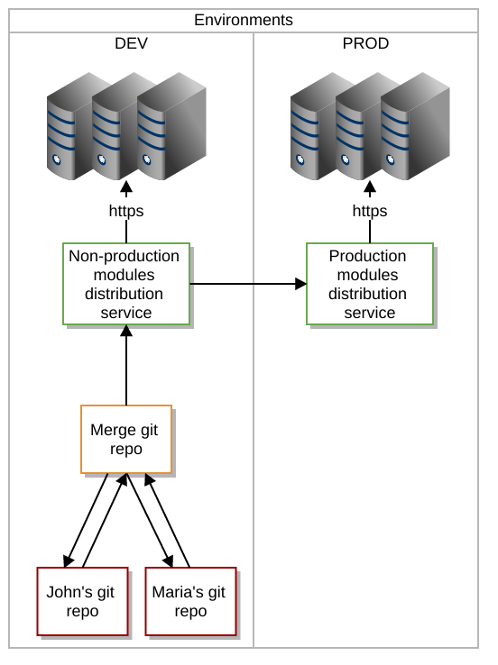

Modules lifecycle
*****************

Introduction
============

Modules are a critical security and audit components, as they run on nodes with high privileges to be able to change the systems' configuration. They lifecycle must be strictly defined and auditable.

OpenSVC does not impose any modules lifecycle organization, but strongly suggests the one described in this chapter.

Source tracking
===============

The modules changes should be

* auditable: who changed what, when and why.
* rollbackable

To meet this objective, modules should be source tracked. OpenSVC suggests the use of a distributed source tracker, like ``git``, which supports the organization described in the following sections.

Users with an on-site GitHub infrastructure can host the project there.

Source repositories relations
=============================

Workflow:

* Individual contributers develop in their own git clone of the merge project.
* An authorized reviewer merges individual contributions into the merge project and generates a distribution archive (current) in the non-production distribution service.
* An authorized production administrator picks a non-production distribution archive (current or older) for distribution through the production distribution service.

The distribution services have to serve the URI defined in the agents' ``node.conf`` ``node.repocomp`` parameter.

For example, the OpenSVC collector's ``init/static/`` directory can be used to serve both production and non-production modules archives through https, as the site's security policies must already allow the GET requests from the agents to the collector.

