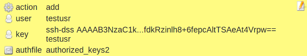
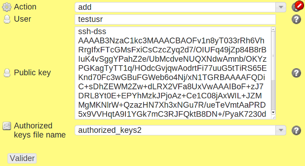

authkeys
********

Description
============

* Installs or removes ssh public keys from authorized_key files
* Looks up the authorized_key and authorized_key2 file location in the running sshd daemon configuration.

+-----------------------+-----+
| check action          | yes |
+-----------------------+-----+
| fix action            | yes |
+-----------------------+-----+
| variable substitution | no  |
+-----------------------+-----+

Supported operating systems
===========================

* Unix

Ouputs
======

Valid check::

	key 'ssh-dss AAAAB3Nza...+6fepcAltTSAeAt4Vrpw== testusr' is correctly installed for user testusr

Invalid check::

	ERR: key 'ssh-dss AAAAB3Nza...+6fepcAltTSAeAt4Vrpw== testusr' must be installed for user testusr

Fix::

	key 'ssh-dss AAAAB3Nza...+6fepcAltTSAeAt4Vrpw== testusr' installed for user testusr
	
Form
====

Display mode
++++++++++++

Edition mode
++++++++++++

Definition
++++++++++

.. code-block:: yaml

        Desc: |
          Describe a list of ssh public keys to authorize login as the specified Unix user.
        Css: comp48
        
        Outputs:
          -
            Dest: compliance variable
            Type: json
            Format: dict
            Class: authkey
        
        Inputs:
          -
            Id: action
            Label: Action
            DisplayModeLabel: action
            LabelCss: action16
            Mandatory: Yes
            Type: string
            Candidates:
              - add
              - del
            Help: Defines wether the public key must be installed or uninstalled.
        
          -
            Id: user
            Label: User
            DisplayModeLabel: user
            LabelCss: guy16
            Mandatory: Yes
            Type: string
            Help: Defines the Unix user name who will accept those ssh public keys.
        
          -
            Id: key
            Label: Public key
            DisplayModeLabel: key
            LabelCss: guy16
            Mandatory: Yes
            Type: text
            DisplayModeTrim: 60
            Help: The ssh public key as seen in authorized_keys files.
        
          -
            Id: authfile
            Label: Authorized keys file name
            DisplayModeLabel: authfile
            LabelCss: hd16
            Mandatory: Yes
            Candidates:
              - authorized_keys
              - authorized_keys2
            Default: authorized_keys2
            Type: string
            Help: The authorized_keys file to write the keys into.

Data format
===========

.. code-block:: json

	{
	 "action": "add",
	 "authfile": "authorized_keys2",
	 "user": "testusr",
	 "key": "ssh-dss AAAAB3NzaC1kc3MAAACBAOFv1n8yT033rRh6VhRrgIfxFTcGMsFxiCsCzcZyq2d7/OIUFq49jZp84B8rBIuK4vSggYPahZ2e/UbMcdveNUQXNdwAmnb/OKYzPGKagTyTT1q/HOdcGvjqwAodrtFi77uuG5tTiRS65EKnd70Fc3wGBuFGWeb6o4Nj/xN1TGRBAAAAFQDiC+sDhZEWM2Zw+dLRX2VFa8UxVwAAAIBoF+zJ7DRL8Yt0E+EPYhMzkJPjoAz+Ce1C08jAxWIL+JZMMgMKNlrW+QzazHN7Xh3xNGu7R/ueTeVmtAaPRD5x9VVHqtA9I1YGk7mC3RJFQktB8DN+/PyaK7230dVWxqHklrTS9HhKrNcmp1fmVKT64lMO56O1gb+Kc6t2fypaSQAAAIAtyg+TyvaKc1zNUNZLPOSQd32EiDYBIjDFMGTcBDJf52fXcLLJV9Az0rZcw+yAjnGtyYuYN8A/NZQklVCs/twhLmtARc9NS2y3ukGw0PGyk1kz6Y3THPbyV0bn+L6As/pwtBwD/q6V1FRffdkRzinlh8+6fepcAltTSAeAt4Vrpw== testusr"
	}

