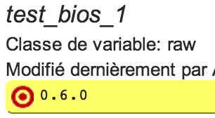
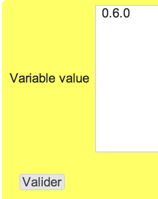

bios
****

Description
============

* Checks an exact BIOS version, as returned by dmidecode or sysfs
* Module need to be called with the exposed bios version as variable (bios.py $OSVC_COMP_TEST_BIOS_1 check)

+-----------------------+-----+
| check action          | yes |
+-----------------------+-----+
| fix action            |  no |
+-----------------------+-----+
| variable substitution |  no |
+-----------------------+-----+

Supported operating systems
===========================

* Linux

Ouputs
======

Valid check::

        bios version is 0.5.1, on target

Invalid check::

        ERR: bios version is 0.5.1, target 0.6.0

Form
====

Display mode
++++++++++++

Edition mode
++++++++++++

Definition
++++++++++

.. code-block:: yaml

	Desc: |
	  A rule defining the target bios version

	Outputs:
	  -
	    Dest: compliance variable
	    Class: raw
	    Type: raw
	    Format: string

Data format
===========

.. code-block:: guess

        "XXXX"
