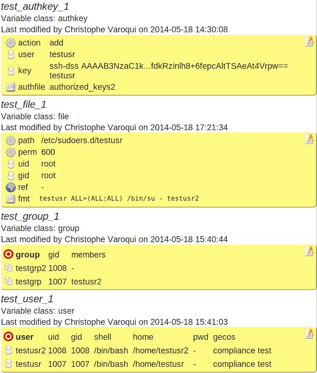

Account module
**************

Description
============

This example objects combination

* Checks and create users and groups exists and have theirs properties correctly set
* Checks and setup users' group membership
* Checks and install sudo privileges for the users
* Checks and install ssh key trusts for the users

Supported operating systems
===========================

* Unix

Ouputs
======

Valid check::

	group testgrp2 gid: 1008
	group testgrp gid: 1007
	user testusr2 shell: /bin/bash
	user testusr2 uid: 1008
	user testusr2 gid: 1008
	user testusr2 gecos: compliance test
	user testusr2 home: /home/testusr2
	/home/testusr2 owner is testusr2
	user testusr shell: /bin/bash
	user testusr uid: 1007
	user testusr gid: 1007
	user testusr gecos: compliance test
	user testusr home: /home/testusr
	/home/testusr owner is testusr
	group testgrp members: testusr2
	/home/testusr/.ssh/authorized_keys2
	key 'ssh-dss AAAAB3Nza...+6fepcAltTSAeAt4Vrpw== testusr' is correctly installed for user testusr
	/etc/sudoers.d/testusr is ok

Invalid check::

	group testgrp2 gid: 1008
	ERR: group testgrp members:  | target: testusr2
	group testgrp gid: 1007
	user testusr2 shell: /bin/bash
	user testusr2 uid: 1008
	user testusr2 gid: 1008
	user testusr2 gecos: compliance test
	user testusr2 home: /home/testusr2
	/home/testusr2 owner is testusr2
	user testusr shell: /bin/bash
	user testusr uid: 1007
	user testusr gid: 1007
	user testusr gecos: compliance test
	user testusr home: /home/testusr
	/home/testusr owner is testusr
	/home/testusr/.ssh/authorized_keys2
	key 'ssh-dss AAAAB3Nza...+6fepcAltTSAeAt4Vrpw== testusr' is correctly installed for user testusr
	/etc/sudoers.d/testusr is ok

Fix::

	usermod -G testgrp testusr2

Ruleset
=======

As designed
+++++++++++

As used by the module
+++++++++++++++++++++

.. code-block:: sh

	# om node compliance show ruleset | grep _TEST_
	  OSVC_COMP_TEST_AUTHKEY_1='{"action": "add", "authfile": "authorized_keys2", "user": "testusr", "key": "ssh-dss AAAAB3NzaC1kc3MAAACBAOFv1n8yT033rRh6VhRrgIfxFTcGMsFxiCsCzcZyq2d7/OIUFq49jZp84B8rBIuK4vSggYPahZ2e/UbMcdveNUQXNdwAmnb/OKYzPGKagTyTT1q/HOdcGvjqwAodrtFi77uuG5tTiRS65EKnd70Fc3wGBuFGWeb6o4Nj/xN1TGRBAAAAFQDiC+sDhZEWM2Zw+dLRX2VFa8UxVwAAAIBoF+zJ7DRL8Yt0E+EPYhMzkJPjoAz+Ce1C08jAxWIL+JZMMgMKNlrW+QzazHN7Xh3xNGu7R/ueTeVmtAaPRD5x9VVHqtA9I1YGk7mC3RJFQktB8DN+/PyaK7230dVWxqHklrTS9HhKrNcmp1fmVKT64lMO56O1gb+Kc6t2fypaSQAAAIAtyg+TyvaKc1zNUNZLPOSQd32EiDYBIjDFMGTcBDJf52fXcLLJV9Az0rZcw+yAjnGtyYuYN8A/NZQklVCs/twhLmtARc9NS2y3ukGw0PGyk1kz6Y3THPbyV0bn+L6As/pwtBwD/q6V1FRffdkRzinlh8+6fepcAltTSAeAt4Vrpw== testusr"}'
	  OSVC_COMP_TEST_FILE_1='{"path": "/etc/sudoers.d/testusr", "fmt": "testusr\\tALL=(ALL:ALL) /bin/su - testusr2", "gid": "root", "mode": 600, "uid": "root"}'
	  OSVC_COMP_TEST_GROUP_1='{"testgrp2": {"gid": 1008}, "testgrp": {"gid": 1007, "members": ["testusr2"]}}'
	  OSVC_COMP_TEST_USER_1='{"testusr2": {"shell": "/bin/bash", "uid": 1008, "gid": 1008, "gecos": "compliance test", "home": "/home/testusr2"}, "testusr": {"shell": "/bin/bash", "uid": 1007, "gid": 1007, "gecos": "compliance test", "home": "/home/testusr"}}'

Module code
===========

.. code-block:: sh

	#!/bin/bash

	PATH_SCRIPT="$(cd $(/usr/bin/dirname $(type -p -- $0 || echo $0));pwd)"
	PATH_LIB=$PATH_SCRIPT/com.opensvc
	PREFIX=OSVC_COMP_TEST

	typeset -i r=0

	case $1 in
	check)
		$PATH_LIB/groups.py ${PREFIX}_GROUP check
		[ $? -eq 1 ] && r=1
		$PATH_LIB/users.py ${PREFIX}_USER check
		[ $? -eq 1 ] && r=1
		$PATH_LIB/groups_membership.py ${PREFIX}_GROUP check
		[ $? -eq 1 ] && r=1
		$PATH_LIB/authkeys.py ${PREFIX}_AUTHKEY check
		[ $? -eq 1 ] && r=1
		$PATH_LIB/files.py ${PREFIX}_FILE check
		[ $? -eq 1 ] && r=1
		;;
	fix)
		$PATH_LIB/groups.py ${PREFIX}_GROUP fix
		[ $? -eq 1 ] && exit 1
		$PATH_LIB/users.py ${PREFIX}_USER fix
		[ $? -eq 1 ] && exit 1
		$PATH_LIB/groups_membership.py ${PREFIX}_GROUP fix
		[ $? -eq 1 ] && exit 1
		$PATH_LIB/authkeys.py ${PREFIX}_AUTHKEY fix
		[ $? -eq 1 ] && exit 1
		$PATH_LIB/files.py ${PREFIX}_FILE fix
		[ $? -eq 1 ] && exit 1
		;;
	fixable)
		exit 2
		;;
	esac

	exit $r

