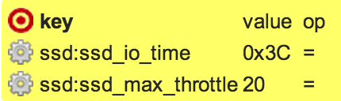
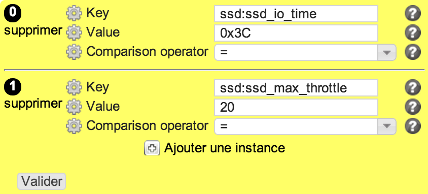

etcsystem
*********

Description
============

* Checks and setup values in /etc/system respecting strict targets or thresholds.

+-----------------------+-----+
| check action          | yes |
+-----------------------+-----+
| fix action            | yes |
+-----------------------+-----+
| variable substitution |  no |
+-----------------------+-----+

Supported operating systems
===========================

* Solaris

Ouputs
======

Valid check::

        ssd:ssd_io_time=0x3C on target
        ssd:ssd_max_throttle=20 on target

Invalid check::

        ERR: ssd:ssd_io_time key is not set
        ERR: ssd:ssd_max_throttle key is not set

Fix::

        ssd:ssd_io_time key is not set
        add 'set ssd:ssd_io_time = 0x3C' to /etc/system
        ssd:ssd_max_throttle key is not set
        add 'set ssd:ssd_max_throttle = 20' to /etc/system
	
Form
====

Display mode
++++++++++++

Edition mode
++++++++++++

Definition
++++++++++

.. code-block:: yaml

	Desc: |
	  A rule defining a list of /etc/system parameters, and their expected value

	Outputs:
	  -
	    Dest: compliance variable
	    Class: etcsystem
	    Type: json
	    Format: dict of dict

	Inputs:
          -
            Id: key
            Label: Key
            DisplayModeLabel: key
            LabelCss: action16
            Mandatory: Yes
            Help: The /etc/system parameter to check
            Type: string

          -
            Id: op
            Label: Comparison operator
            DisplayModeLabel: operator
            LabelCss: action16
            Help: "= > >= < <="
            Type: operator

          -
            Id: value
            Label: Value
            DisplayModeLabel: fmt
            LabelCss: action16
            Mandatory: Yes
            Help: The /etc/system parameter target value
            Type: string or url or integer

Data format
===========

.. code-block:: json

        [
         {"value": "0x3C", "key": "ssd:ssd_io_time", "op": "="},
         {"value": 20, "key": "ssd:ssd_max_throttle", "op": "="}
        ]
