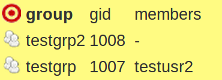
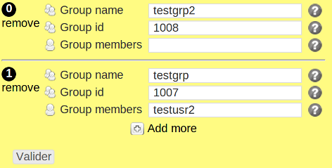

groups
*****

Description
============

* Checks a group exists and has correct gid.
* This object can share its rules with the ``groups_membership`` object.

.. note:: Use in modules before the groups_membership object

+-----------------------+-----+
| check action          | yes |
+-----------------------+-----+
| fix action            | yes |
+-----------------------+-----+
| variable substitution | yes |
+-----------------------+-----+

Supported operating systems
===========================

* Unix

Ouputs
======

Valid check::

	group testgrp2 gid: 1008
	group testgrp gid: 1007

Invalid check::

	ERR: group testgrp2 does not exist
	ERR: group testgrp does not exist

Fix::

	groupadd -g 1008 testgrp2
	groupadd -g 1007 testgrp

Form
====

Display mode
++++++++++++

Edition mode
++++++++++++

Definition
++++++++++

.. code-block:: yaml

	Desc: |
	  A rule defining a list of Unix groups and their properties. Used by the groups and group_membership compliance objects.

	Outputs:
	  -
	    Dest: compliance variable
	    Type: json
	    Format: dict of dict
	    Key: group
	    EmbedKey: No
	    Class: group

	Inputs:
	  -
	    Id: group
	    Label: Group name
	    DisplayModeLabel: group
	    LabelCss: guys16
	    Mandatory: Yes
	    Type: string
	    Help: The Unix group name.

	  -
	    Id: gid
	    Label: Group id
	    DisplayModeLabel: gid
	    LabelCss: guys16
	    Mandatory: Yes
	    Type: string or integer
	    Help: The Unix gid of this group.

	  -
	    Id: members
	    Label: Group members
	    DisplayModeLabel: members
	    LabelCss: guy16
	    Type: list of string
	    Help: A whitespace-separed list of Unix user names members of this group.

Data format
===========

.. code-block:: json

	{
	 "testgrp2": {
	  "gid": 1008
	 },
	 "testgrp": {
	  "gid": 1007,
	  "members": ["testusr2"]
	 }
	}
