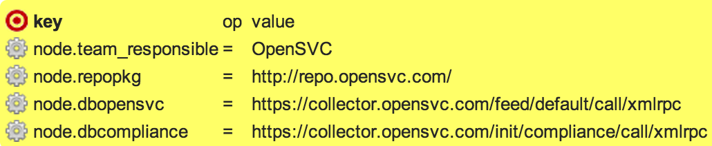
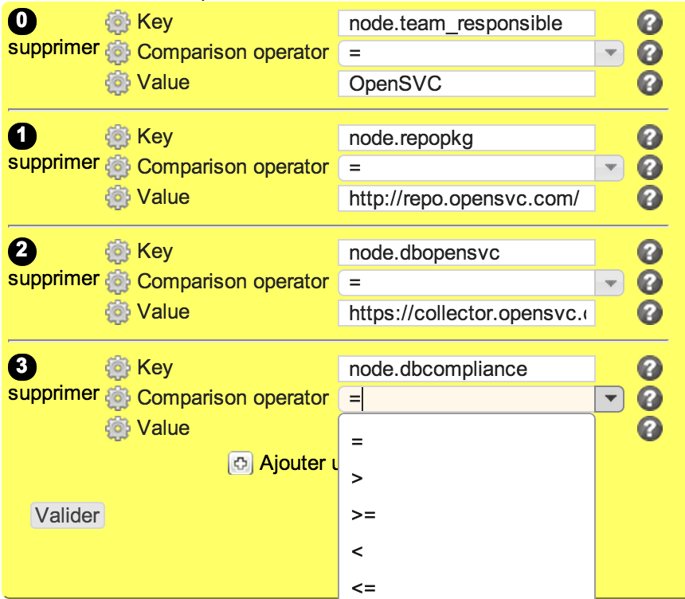

nodeconf
********

Description
============

* Checks the configuration of the opensvc node.conf parameters

+-----------------------+-----+
| check action          | yes |
+-----------------------+-----+
| fix action            | yes |
+-----------------------+-----+
| variable substitution |  no |
+-----------------------+-----+

Supported operating systems
===========================

* Unix

Ouputs
======

Examples below expect string "OpenSVC" as value of team_responsible of node section

Valid check::

	node.team_responsible=OpenSVC on target

Invalid check::

	node.team_responsible=Wrong_Value, target: OpenSVC

Another invalid check::

	node.repopkg key is not set

Fix::

	/opt/opensvc/bin/nodemgr set --param node.team_responsible --value OpenSVC
	
Form
====

Display mode
++++++++++++

Edition mode
++++++++++++

Definition
++++++++++

.. code-block:: yaml

        Desc: |
          A rule to set a parameter in OpenSVC node.conf configuration file. Used by the 'nodeconf' compliance object.
        Css: comp48
        
        Outputs:
          -
            Dest: compliance variable
            Type: json
            Format: list of dict
            Class: nodeconf
        
        Inputs:
          -
            Id: key
            Label: Key
            DisplayModeLabel: key
            LabelCss: action16
            Mandatory: Yes
            Type: string
            Help: The OpenSVC node.conf parameter to check.
        
          -
            Id: op
            Label: Comparison operator
            DisplayModeLabel: op
            LabelCss: action16
            Mandatory: Yes
            Type: string
            Default: "="
            Candidates:
              - "="
              - ">"
              - ">="
              - "<"
              - "<="
            Help: The comparison operator to use to check the parameter value.
        
          -
            Id: value
            Label: Value
            DisplayModeLabel: value
            LabelCss: action16
            Mandatory: Yes
            Type: string or integer
            Help: The OpenSVC node.conf parameter value to check.

Data format
===========

.. code-block:: json

        [
         {"value": "OpenSVC", "key": "node.team_responsible", "op": "="}, 
         {"value": "http://repo.opensvc.com/", "key": "node.repopkg", "op": "="}, 
         {"value": "https://collector.opensvc.com/feed/default/call/xmlrpc", "key": "node.dbopensvc", "op": "="}, 
         {"value": "https://collector.opensvc.com/init/compliance/call/xmlrpc", "key": "node.dbcompliance", "op": "="}
        ]
