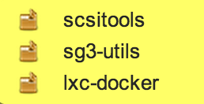
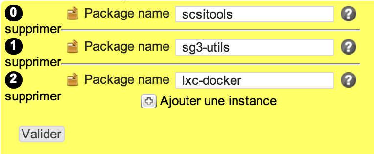

package
*******

Description
============

* Checks packages installation
* Installs packages
* On Linux, the architecture can be specified as the package name suffix (ex: .i386)
* If not specified the native operating system is selected. A wildcard suffix can be used to force selection of all available architectures.

+-----------------------+-----+
| check action          | yes |
+-----------------------+-----+
| fix action            | yes |
+-----------------------+-----+
| variable substitution | yes |
+-----------------------+-----+

Supported operating systems
===========================

* Unix

Ouputs
======

Valid check::

        package scsitools is installed
        package sg3-utils is installed
        package lxc-docker is installed

Invalid check::

	package scsitools is not installed

Fix::

        Reading package lists... Done
        Building dependency tree
        Reading state information... Done
        The following NEW packages will be installed:
          scsitools
        0 upgraded, 1 newly installed, 0 to remove and 16 not upgraded.
        Need to get 0 B/137 kB of archives.
        After this operation, 324 kB of additional disk space will be used.
        Selecting previously unselected package scsitools.
        (Reading database ... 59574 files and directories currently installed.)
        Unpacking scsitools (from .../scsitools_0.12-2.1_amd64.deb) ...
        Processing triggers for man-db ...
        Setting up scsitools (0.12-2.1) ...
	
Form
====

Display mode
++++++++++++

Edition mode
++++++++++++

Definition
++++++++++

.. code-block:: yaml

	Desc: |
	  A rule defining a list of packages that must be installed

	Outputs:
	  -
	    Dest: compliance variable
	    Class: package
	    Type: json
	    Format: dict

	Inputs:
	  -
	    Id: package
	    Label: Package name
	    DisplayModeLabel: package
	    LabelCss: action16
	    Mandatory: Yes
	    Help: Package name to install
	    Type: string

Data format
===========

.. code-block:: json

        [
         "scsitools",
         "sg3-utils",
         "lxc-docker"
        ]
