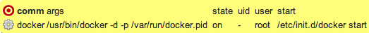
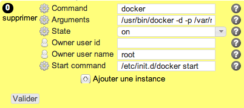

process
*******

Description
============

* Checks the presence (or absence) of a process and its ownership.
* Starts the process using the specified command. Used to start a daemon after package installation and rc setup.
* Stops the process if the expected state is "off"

+-----------------------+-----+
| check action          | yes |
+-----------------------+-----+
| fix action            | yes |
+-----------------------+-----+
| variable substitution | yes |
+-----------------------+-----+

Supported operating systems
===========================

* Unix

Ouputs
======

Valid check::

        process with command docker is started ... on target
        process with args /usr/bin/docker -d -p /var/run/docker.pid is started ... on target
        process with args /usr/bin/docker -d -p /var/run/docker.pid runs with user root ... on target

Invalid check::

        ERR: process with command docker is not started ... should be
        ERR: process with args /usr/bin/docker -d -p /var/run/docker.pid is not started ... should be

Fix::

        exec: /etc/init.d/docker start
        Starting Docker: docker.
	
Form
====

Display mode
++++++++++++

Edition mode
++++++++++++

Definition
++++++++++

.. code-block:: yaml

	Desc: |
	  A rule defining a list of unix processes, with their expected parameters, owner, state

	Outputs:
	  -
	    Dest: compliance variable
	    Class: process
	    Type: json
	    Format: dict of dict

	Inputs:
	  -
	    Id: comm
	    Label: Command
	    DisplayModeLabel: comm
	    LabelCss: action16
	    Mandatory: Yes
	    Help: The unix process command (ps -e -o comm)
	    Type: string

          -
            Id: args
            Label: Arguments
            DisplayModeLabel: args
            LabelCss: action16
            Mandatory: No
	    Help: The unix process command (ps -e -o args)
            Type: string

          -
            Id: state
            Label: State
            DisplayModeLabel: state
            LabelCss: action16
            Mandatory: Yes
            Help: The expected process state
            Type: yes/no

          -
            Id: uid
            Label: Owner user id
            DisplayModeLabel: uid
            LabelCss: guy16
            Mandatory: No
            Help: The unix user id owning the process
            Type: integer

          -
            Id: user
            Label: Owner user name
            DisplayModeLabel: user
            LabelCss: guy16
            Mandatory: No
            Help: The unix user name owning the process
            Type: string

          -
            Id: start
            Label: Start command
            DisplayModeLabel: start
            LabelCss: action16
            Mandatory: Yes
            Help: The command to start (if expected state is on) or stop (if expected state is off) the process, with full path and arguments
            Type: string

Data format
===========

.. code-block:: json

        [
         {"comm": "foo", "user": "foou", "state": "on","start": "/etc/init.d/foo start"},
         {"start": "/etc/init.d/docker start", "state": "on", "args": "/usr/bin/docker -d -p /var/run/docker.pid", "comm": "docker", "user": "root"},
         {"comm": "bar", "args": "/usr/bin", "uid": "2345", "state": "off", "start": "/etc/init.d/bar stop"},
        ]
