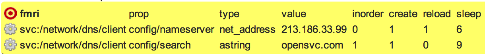
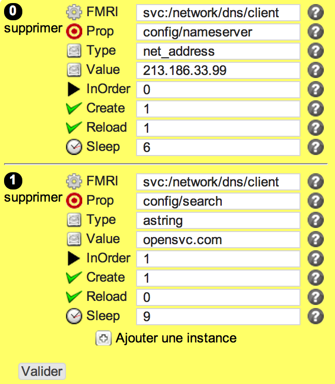

smfcfgs
*******

Description
============

* This object is dedicated to Service Management Facility (SMF) on Oracle Solaris 11 and beyond
* The reference content describes FMRI configuration, property, type of property, values
* The compliance object ensure checks and fix to meet requirements

+-----------------------+-----+
| check action          | yes |
+-----------------------+-----+
| fix action            | yes |
+-----------------------+-----+
| variable substitution |  no |
+-----------------------+-----+

Supported operating systems
===========================

* Solaris 11 and beyond

Ouputs
======

Example below is related to dns resolver configuration

Valid check::

        svc:/network/dns/client Prop config/nameserver type net_address is OK
        svc:/network/dns/client Prop config/search type astring is OK

Invalid check::

        NOK: svc:/network/dns/client Prop config/nameserver values Do Not match, got:[213.186.33.100], expected:[213.186.33.99]
        NOK: svc:/network/dns/client Prop config/search values Do Not match, got:[acme.com], expected:[opensvc.com]

Fix::

        svc:/network/dns/client try to fix config/nameserver = 213.186.33.99
        svc:/network/dns/client try to fix config/search = opensvc.com
        EXEC: /usr/sbin/svccfg -s svc:/network/dns/client setprop config/nameserver = 213.186.33.99
        EXEC: /usr/sbin/svcadm refresh svc:/network/dns/client
        EXEC: /usr/bin/sleep 6
        EXEC: /usr/sbin/svccfg -s svc:/network/dns/client setprop config/search = opensvc.com
	
Form
====

Display mode
++++++++++++

Edition mode
++++++++++++

Definition
++++++++++

.. code-block:: yaml

        Desc: |
          Define a list of FMRI with properties to check / set on the target system. Properties can contain substitution variables
        Css: action48
        
         
        
        Outputs:
          -
            Dest: compliance variable
            Type: json
            Format: list of dict
            Class: smfs
        
        Inputs:
          -
            Id: fmri
            Label: FMRI
            DisplayModeLabel: fmri
            LabelCss: action16
            Mandatory: Yes
            Type: string
            Help: "The name of the FMRI"
        
          -
            Id: prop
            Label: Prop
            DisplayModeLabel: prop
            LabelCss: comp16
            Type: string
            Help: "The FMRI prop."
        
          -
            Id: type
            Label: Type
            DisplayModeLabel: type
            LabelCss: hd16
            Type: string
            Help: "Prop type"
        
          -
            Id: value
            Label: Value
            DisplayModeLabel: value
            LabelCss: hd16
            Type: string
            Help: "Any value, any format."
        
          -
            Id: inorder
            Label: InOrder
            DisplayModeLabel: inorder
            LabelCss: right16
            Type: integer
            Default: 0
            Help: "Values in order or not"
        
          -
            Id: create
            Label: Create
            DisplayModeLabel: create
            LabelCss: check16
            Type: integer
            Default: 0
            Help: "Create if absent ?"
        
          -
            Id: reload
            Label: Reload
            DisplayModeLabel: reload
            LabelCss: check16
            Type: integer
            Default: 1
            Help: "Reload if modified ?"
        
          -
            Id: sleep
            Label: Sleep
            DisplayModeLabel: sleep
            LabelCss: time16
            Type: integer
            Default: 0
            Help: "Time to sleep if reload"
        

Data format
===========

.. code-block:: json

        [
         {
         "fmri": "svc:/network/dns/client",
         "type": "net_address",
         "create": 1,
         "value": "213.186.33.99",
         "prop": "config/nameserver",
         "reload": 1,
         "sleep": 6,
         "inorder": 0
         },
         {
         "fmri": "svc:/network/dns/client",
         "type": "astring",
         "create": 1,
         "value": "opensvc.com",
         "prop": "config/search",
         "reload": 0,
         "sleep": 9,
         "inorder": 1
         }
        ]
