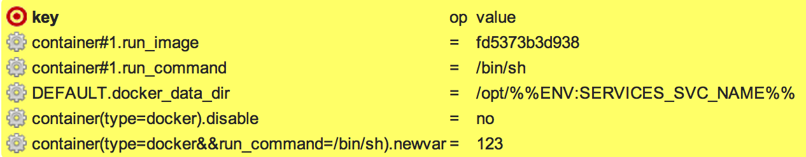
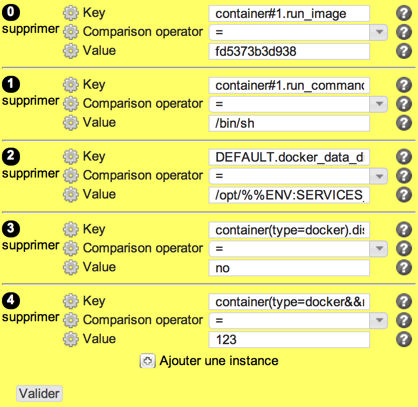

svcconf
*******

Description
============

* Checks the configuration of opensvc service.env file
* The reference content can include substitution variables, so that the content is contextually generated for the node or the service
* Rules can be designed with regexp to match multiple sections/parameters in the service env file (examples below). Expression matching string must be specified using parenthesis, like container(type=docker||type=kvm).disable, pointing to parameter "disable" of all kvm or docker containers in the service. Filter operators are || and &&.

+-----------------------+-----+
| check action          | yes |
+-----------------------+-----+
| fix action            | yes |
+-----------------------+-----+
| variable substitution | yes |
+-----------------------+-----+

Supported operating systems
===========================

* Unix

Ouputs
======

All examples below are related to the service configuration file content. The syntax is like [section].[parameter]. First example below means that section [container#1] is expected to have a parameter [run_command] set to [/bin/sh]. Extract of the service env file below :

.. code-block:: guess

        [container#1]
        run_image = fd5373b3d938
        newvar = 123
        disable = no
        type = docker
        run_command = /bin/sh

Valid check::

	container#1.run_command=/bin/sh on target

Invalid check::

	DEFAULT.docker_data_dir=/opt/app2.tst, target: /opt/app2.prd

Another invalid check::

	container#2.disable key is not set

Fix::

	svcmgr -s app2.prd set --param DEFAULT.docker_data_dir --value /opt/app2.prd
        svcmgr -s app2.prd set --param container#1.disable --value no
	
Form
====

Display mode
++++++++++++

Edition mode
++++++++++++

Definition
++++++++++

.. code-block:: yaml

        Desc: |
          A rule to set a parameter in OpenSVC .env configuration file. Used by the 'svcconf' compliance object.
        Css: comp48
        
        Outputs:
          -
            Dest: compliance variable
            Type: json
            Format: list of dict
            Class: svcconf
        
        Inputs:
          -
            Id: key
            Label: Key
            DisplayModeLabel: key
            LabelCss: action16
            Mandatory: Yes
            Type: string
            Help: The OpenSVC .env parameter to check.
        
          -
            Id: op
            Label: Comparison operator
            DisplayModeLabel: op
            LabelCss: action16
            Mandatory: Yes
            Type: string
            Default: "="
            Candidates:
              - "="
              - ">"
              - ">="
              - "<"
              - "<="
            Help: The comparison operator to use to check the parameter value.
        
          -
            Id: value
            Label: Value
            DisplayModeLabel: value
            LabelCss: action16
            Mandatory: Yes
            Type: string or integer
            Help: The OpenSVC .env parameter value to check.

Data format
===========

.. code-block:: json

        [
         {"value": "fd5373b3d938", "key": "container#1.run_image", "op": "="},
         {"value": "/bin/sh", "key": "container#1.run_command", "op": "="},
         {"value": "/opt/%%ENV:SERVICES_SVC_NAME%%", "key": "DEFAULT.docker_data_dir", "op": "="}
         {"value": "no", "key": "container(type=docker).disable", "op": "="},
         {"value": 123, "key": "container(type=docker&&run_command=/bin/sh).newvar", "op": "="}
        ]
