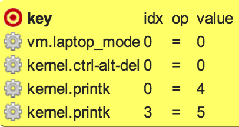
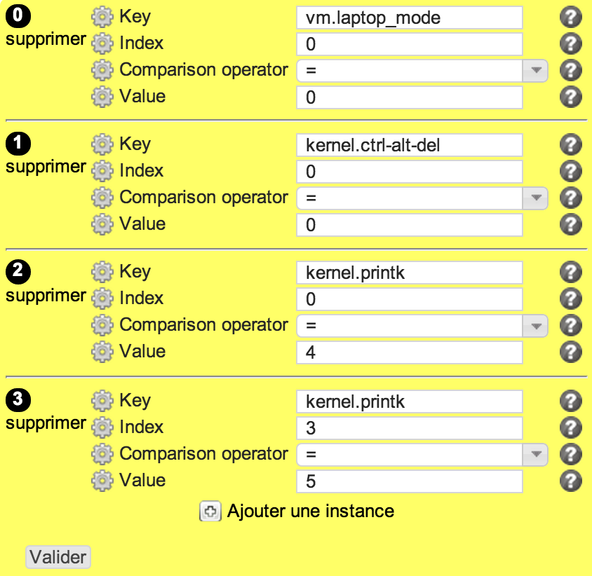

sysctl
******

Description
============

* Checks and sets values in /etc/sysctl.conf according the specific targets or thresholds

+-----------------------+-----+
| check action          | yes |
+-----------------------+-----+
| fix action            | yes |
+-----------------------+-----+
| variable substitution |  no |
+-----------------------+-----+

Supported operating systems
===========================

* Linux

Ouputs
======

Valid check::

        sysctl ok: vm.laptop_mode[0] = 0, on target
        sysctl ok: kernel.ctrl-alt-del[0] = 0, on target
        sysctl ok: kernel.printk[0] = 4, on target
        sysctl ok: kernel.printk[3] = 5, on target

Invalid check::

        ERR: key 'vm.laptop_mode' not found in sysctl.conf
        ERR: key 'kernel.ctrl-alt-del' not found in sysctl.conf
        ERR: key 'kernel.printk' not found in sysctl.conf
        ERR: key 'kernel.printk' not found in sysctl.conf

Fix::

        sysctl: set vm.laptop_mode = 0
        sysctl: set kernel.ctrl-alt-del = 0
        sysctl: set kernel.printk = 4 4 1 7
        sysctl: set kernel.printk[3] = 5
        sysctl: sysctl -e -p
	
Form
====

Display mode
++++++++++++

Edition mode
++++++++++++

Definition
++++++++++

.. code-block:: yaml

        Desc: |
          A rule to set a list of Linux kernel parameters to be set in /etc/sysctl.conf. Current values can be checked as strictly equal, or superior/inferior to their target value. Each field in a vectored value can be tuned independantly using the index key.
        Css: comp48
        
        Outputs:
          -
            Dest: compliance variable
            Type: json
            Format: list of dict
            Class: sysctl
        
        Inputs:
          -
            Id: key
            Label: Key
            DisplayModeLabel: key
            LabelCss: action16
            Mandatory: Yes
            Type: string
            Help: The /etc/sysctl.conf parameter to check.
        
          -
            Id: index
            Label: Index
            DisplayModeLabel: idx
            LabelCss: action16
            Mandatory: Yes
            Type: integer
            Help: The /etc/sysctl.conf parameter to check.
        
          -
            Id: op
            Label: Comparison operator
            DisplayModeLabel: op
            LabelCss: action16
            Mandatory: Yes
            Type: string
            Default: "="
            Candidates:
              - "="
              - ">"
              - ">="
              - "<"
              - "<="
            Help: The comparison operator to use to check the parameter current value.
        
          -
            Id: value
            Label: Value
            DisplayModeLabel: value
            LabelCss: action16
            Mandatory: Yes
            Type: string or integer
            Help: The /etc/sysctl.conf parameter target value.

Data format
===========

.. code-block:: json

        [
         {"index": 0, "value": 0, "key": "vm.laptop_mode", "op": "="},
         {"index": 0, "value": 0, "key": "kernel.ctrl-alt-del", "op": "="},
         {"index": 0, "value": 4, "key": "kernel.printk", "op": "="},
         {"index": 3, "value": 5, "key": "kernel.printk", "op": "="}
        ]
