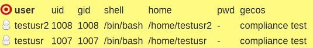
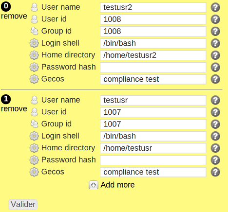

users
*****

Description
============

* Checks users have correctly setup /etc/passwd entries
* Create users
* Optionally checks homedir ownership

.. note:: Use in modules after the groups object to be sure the primary groups exists before creating users

+-----------------------+-----+
| check action          | yes |
+-----------------------+-----+
| fix action            | yes |
+-----------------------+-----+
| variable substitution | yes |
+-----------------------+-----+

Supported operating systems
===========================

* Unix

Ouputs
======

Valid check::

	user testusr2 shell: /bin/bash
	user testusr2 uid: 1008
	user testusr2 gid: 1008
	user testusr2 gecos: compliance test
	user testusr2 home: /home/testusr2
	/home/testusr2 owner is testusr2
	user testusr shell: /bin/bash
	user testusr uid: 1007
	user testusr gid: 1007
	user testusr gecos: compliance test
	user testusr home: /home/testusr
	/home/testusr owner is testusr

Invalid check::

	ERR: user testusr2 does not exist
	ERR: user testusr does not exist

Fix::

	useradd -s /bin/bash -u 1008 -g 1008 -c "compliance test" -p x -d /home/testusr2 -m testusr2
	useradd -s /bin/bash -u 1007 -g 1007 -c "compliance test" -p x -d /home/testusr -m testusr
	
Form
====

Display mode
++++++++++++

Edition mode
++++++++++++

Definition
++++++++++

.. code-block:: yaml

	Desc: |
	  A rule defining a list of Unix users and their properties. Used by the users and group_membership compliance objects.

	Outputs:
	  -
	    Dest: compliance variable
	    Type: json
	    Format: dict of dict
	    Key: user
	    EmbedKey: No
	    Class: user

	Inputs:
	  -
	    Id: user
	    Label: User name
	    DisplayModeLabel: user
	    LabelCss: guy16
	    Mandatory: Yes
	    Type: string
	    Help: The Unix user name.

	  -
	    Id: uid
	    Label: User id
	    DisplayModeLabel: uid
	    LabelCss: guy16
	    Mandatory: Yes
	    Type: string or integer
	    Help: The Unix uid of this user.

	  -
	    Id: gid
	    Label: Group id
	    DisplayModeLabel: gid
	    LabelCss: guys16
	    Mandatory: Yes
	    Type: string or integer
	    Help: The Unix principal gid of this user.

	  -
	    Id: shell
	    Label: Login shell
	    DisplayModeLabel: shell
	    LabelCss: action16
	    Type: string
	    Help: The Unix login shell for this user.

	  -
	    Id: home
	    Label: Home directory
	    DisplayModeLabel: home
	    LabelCss: action16
	    Type: string
	    Help: The Unix home directory full path for this user.

	  -
	    Id: password
	    Label: Password hash
	    DisplayModeLabel: pwd
	    LabelCss: action16
	    Type: string
	    Help: The password hash for this user. It is recommanded to set it to '!!' or to set initial password to change upon first login. Leave empty to not check nor set the password.

	  -
	    Id: gecos
	    Label: Gecos
	    DisplayModeLabel: gecos
	    LabelCss: action16
	    Type: string
	    Help: A one-line comment field describing the user.

Data format
===========

.. code-block:: json

	{
	 "testusr2": {
	  "shell": "/bin/bash",
	  "uid": 1008,
	  "gid": 1008,
	  "gecos": "compliance test",
	  "home": "/home/testusr2"
	 },
	 "testusr": {
	  "shell": "/bin/bash",
	  "uid": 1007,
	  "gid": 1007,
	  "gecos": "compliance test",
	  "home": "/home/testusr"
	 }
	}
