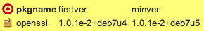
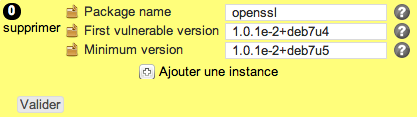

vuln
****

Description
============

* Checks a package is installed with a minimum release or not installed at all.
* Unices need to pass the URI of their package depot as last argument of this object.

+-----------------------+-----+
| check action          | yes |
+-----------------------+-----+
| fix action            | yes |
+-----------------------+-----+
| variable substitution | yes |
+-----------------------+-----+

Supported operating systems
===========================

* Unix

Ouputs
======

Valid check::

        openssl-1.0.1e-2+deb7u6. installed and not vulnerable (TEST_VULN_1:not vulnerable)

Invalid check::

        ERR: package openssl-1.0.1e-2+deb7u6 is vulnerable. upgrade to 1.0.1e-2+deb7u999 (TEST_VULN_1:need upgrade)

Fix::

        Reading package lists... Done
        Building dependency tree
        Reading state information... Done
        The following packages will be upgraded:
          openssl
        1 upgraded, 0 newly installed, 0 to remove and 15 not upgraded.
        Need to get 0 B/137 kB of archives.
        After this operation, 324 kB of additional disk space will be used.
        Selecting previously unselected package scsitools.
        (Reading database ... 59574 files and directories currently installed.)
        Unpacking openssl (from .../openssl_1.0.1e-2+deb7u7_amd64.deb) ...
        Processing triggers for man-db ...
        Setting up openssl (1.0.1e-2+deb7u7) ...
	
Form
====

Display mode
++++++++++++

Edition mode
++++++++++++

Definition
++++++++++

.. code-block:: yaml

	Desc: |
	  A rule defining a list of packages, with constraints about minimum version

	Outputs:
	  -
	    Dest: compliance variable
	    Class: vuln
	    Type: json
	    Format: dict of dict

	Inputs:
	  -
	    Id: pkgname
	    Label: Package name
	    DisplayModeLabel: pkgname
	    LabelCss: pkg16
	    Mandatory: Yes
	    Help: The package name, as known by the target system's package manager
	    Type: string

          -
            Id: firstver
            Label: First vulnerable version
            DisplayModeLabel: firstver
            LabelCss: pkg16
            Mandatory: No
	    Help: Package version that introduce the vulnerability
            Type: string

          -
            Id: minver
            Label: Minimum version
            DisplayModeLabel: minver
            LabelCss: pkg16
            Mandatory: Yes
            Help: Package version that fix the vulnerability
            Type: yes/no

Data format
===========

.. code-block:: json

        [
         {"pkgname": "kernel", "minver": "2.6.18-238.19.1.el5"},
         {"pkgname": "kernel-xen", "minver": "2.6.18-238.19.1.el5"}
         {"pkgname": "openssl", "firstver": "1.0.1e-2+deb7u4", "minver": "1.0.1e-2+deb7u5"}
        ]
