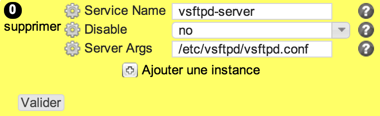

xinetd
******

Description
============

* Checks the configuration of a xinetd service
* Sets up service xinetd configuration

+-----------------------+-----+
| check action          | yes |
+-----------------------+-----+
| fix action            | yes |
+-----------------------+-----+
| variable substitution | no  |
+-----------------------+-----+

Supported operating systems
===========================

* Linux

Ouputs
======

Valid check::

        xinetd service vsftpd-server server_args: /etc/vsftpd/vsftpd.conf
        xinetd service vsftpd-server disable: no

Invalid check::

        ERR: xinetd service vsftpd-server server_args: /etc/ftpd.conf target: /etc/vsftpd/vsftpd.conf
        ERR: xinetd service vsftpd-server disable: yes target: no

Fix::

        set server_args = /etc/vsftpd/vsftpd.conf in /etc/xinetd.d/vsftpd-server
        set disable = no in /etc/xinetd.d/vsftpd-server

Form
====

Display mode
++++++++++++

Edition mode
++++++++++++

Definition
++++++++++

.. code-block:: yaml

	Desc: |
	  A rule defining how a xinetd service should be configured

	Outputs:
	  -
	    Dest: compliance variable
	    Class: xinetd
	    Type: json
	    Format: dict of dict
	    Key: xinetdsvc
	    EmbedKey: No

	Inputs:
	  -
	    Id: xinetdsvc
	    Label: Service Name
	    DisplayModeLabel: service
	    LabelCss: action16
	    Mandatory: Yes
	    Help: The xinetd service name, ie the service file name in /etc/xinetd.d/
	    Type: string

          -
            Id: disable
            Label: Disable
            DisplayModeLabel: Disable
            LabelCss: action16
	    Help: Defines if the xinetd service target state is enabled or disabled
            Type: string
	    Default: yes
	    Candidates:
	      - "yes"
	      - "no"

          -
            Id: server_args
            Label: Server Args
            DisplayModeLabel: args
            LabelCss: action16
            Help: Command line parameter to pass to the service's server executable
            Type: string

Data format
===========

.. code-block:: json

	{
	  "vsftpd-server": {
	    "disable": "no",
	    "server_args": "/etc/vsftpd/vsftpd.conf"
	  }
	}

