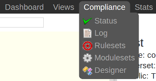
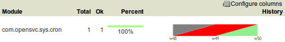
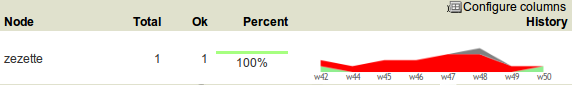
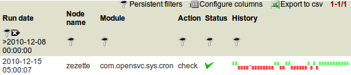
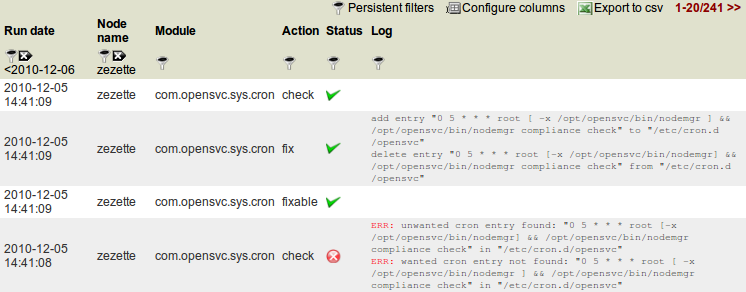

Collector compliance views
**************************

Collector's interfaces to analyze compliance data and to configure the framework are all grouped in the menu ``Compliance``.

Switch between compliance views using the drop-down menu.

.. container:: clearer

   |nbsp|

Status
------

This view has 4 stacked panels. The top 3 are folded upon page load.

Per-module compliance status
++++++++++++++++++++++++++++

This panel present the compliant/not-compliant status aggregated by module.

The aggregation is done on the data cursor filtered in the downmost, unaggregated, view.

It helps answer the following questions:

* What corporate rule is alarmingly not respected
* What corporate rule is surprisingly well respected
* How the compliance ratio of a rule evolved in the last year
* Which modules runs on more than 1000 nodes

.. function:: Module column

   The module name.

.. function:: Total column

   The number of nodes checked by this module.

.. function:: Ok column

   The number of nodes passing the compliance checks of the module.

.. function:: Percent column

   100 * Ok / Total.

.. function:: History column

   Week over week plot of ok/not ok/not applicable status returned by modules for the node. The plotted status are the worst case in the week, meaning if a module returned 'not ok' then 'ok' during week 50, only 'not ok' will be accounted.

Per-service compliance status
+++++++++++++++++++++++++++++

This panel present the compliant/not-compliant status aggregated by service.

The aggregation is done on the data cursor filtered in the downmost, unaggregated, view.

It helps answer the following questions:

* Which are the least compliant services
* Which are the most compliant services
* How the compliance ratio of a service evolved in the last year
* Which services run less than 10 modules

.. function:: Service column

   The service name.

.. function:: Total column

   The number of modules checked for this service.

.. function:: Ok column

   The number of modules passing the compliance checks for this service.

.. function:: Percent column

   100 * Ok / Total.

.. function:: History column

   Week over week plot of ok/not ok/not applicable status returned by modules for the service. The plotted status are the worst case in the week, meaning if a module returned 'not ok' then 'ok' during week 50, only 'not ok' will be accounted.

Per-node compliance status
++++++++++++++++++++++++++

This panel present the compliant/not-compliant status aggregated by node.

The aggregation is done on the data cursor filtered in the downmost, unaggregated, view.

It helps answer the following questions:

* Which are the least compliant nodes
* Which are the most compliant nodes
* How the compliance ratio of a node evolved in the last year
* Which servers run less than 10 modules

This view is also used to pilot remediation campaigns, using the ``action`` tool on selected servers.

.. function:: Node column

   The node name.

.. function:: Total column

   The number of modules run on the node.

.. function:: Ok column

   The number of modules passing compliance checks.

.. function:: Percent column

   100 * Ok / Total.

.. function:: History column

   Week over week plot of ok/not ok/not applicable status returned by modules for the node. The plotted status are the worst case in the week, meaning if a module returned 'not ok' then 'ok' during week 50, only 'not ok' will be accounted.

Detailled compliance status
+++++++++++++++++++++++++++

This panel present the compliant/not-compliant status without aggregation. It can be used to filter the dataset aggregated in the above panels.

It helps answer the following questions:

* Which servers infringe a module's rules
* Which Linux servers infringe a module's rules
* Verify a single server compliance to the whole set of rules
* Verify a single server compliance to a single module's rules

.. function:: Date column

   The module run date on the node.

.. function:: Node column

   The node name.

.. function:: Module column

   The compliance  module name.

.. function:: Action column

   The module action which returned the logged status. Always 'check' in this view.

.. function:: Status column

   The module check run status. Can be 'ok' (0), 'not ok' (1) or 'not applicable' (2).

.. function:: History column

   A run over run status sparkline. This columns present no timeline information.

Logs
----

This view presents raw logs of the compliance modules runs on every nodes.

It helps answer the following questions:

* Since when a server is not compliant to a modules' rules
* What was the compliance state of a server at the date of a crisis situation (post-mortem analysis)

.. function:: Run date column

   The module action run date on the node.

.. function:: Node column

   The node name.

.. function:: Module column

   The compliance module name

.. function:: Action column

   The module action which returned the logged status. Can be 'check', 'fixable' or 'fix'.

.. function:: Status column

   The module action run status. Can be 'ok' (0), 'not ok' (1) or 'not applicable' (2).

.. function:: Log column

   The output of the compliance module for the run.

Rules
-----

This tabular view is optimized for browsing and searching the configured compliance rules.

Example searchs:

* Show all variables of class ``authkeys``
* Show all variables referencing ``/etc/sudoers.d/``
* Show all variables changed in the last week
* Show all variables in the ``prereq-tomcat`` ruleset
* Show all variables exported to Red Hat 6 servers

Some design actions are available from this view, but the preferred view for a compliance design session is ``Compliance > Designer``.

Create an empty ruleset
+++++++++++++++++++++++

* Click 'Create ruleset'
* Choose a unique ruleset name
* Choose contextual/explicit
* Click 'Submit'

The new ruleset now appears in the ruleset list, ready to receive variables.

Add variables
+++++++++++++

* Click 'Add variable'
* Choose a variable name
* Choose a variable value
* Click 'Submit'

Edit variables
++++++++++++++

* Click either the variable name or the variable value top-right 'edit' icon
* Edit the input or content
* Press 'Enter' to save the change

Note the rules of a contextual ruleset can not be edited from this view. This is to help the administrator realize the scope of the change is broader than the line in the ruleset table. To edit such a rule, you have to use the compliance designer tool.

Attach filterset
++++++++++++++++

If the ruleset is contextual, the following procedure attach a filter to the ruleset.

* Click 'Attach filterset'
* Choose a pre-existing filterset from the list box
* Click 'Submit'

Clone ruleset
+++++++++++++

Cloning a ruleset helps administrators who want their rulesets immutable : when a variable change is needed, the administrator clones the ruleset and apply the change to the clone. This governance policy implies ruleset names are versioned.

* Click 'Clone ruleset'
* Choose a pre-existing ruleset from the list box
* Choose a name for the cloned ruleset
* Click 'Submit'

Attach rulesets to nodes
++++++++++++++++++++++++

This facility is offered by the bottom tables of the ruleset view. The table filters are useful to select the nodes efficiently.

* Check the nodes in the left-side table
* Check the rulesets in the right-side table
* Click 'Attach ruleset'

Filters
-------

The filters view allow compliance administrators to create complex filtersets to limit the ruleset scope to a specific node cursor. All fields from the node asset table can be combined.

A typical filterset would be 'All Red Hat 4 servers whose team responsible is SomeTeam'.

A filterset is a combination of filters or filtersets. Filters are created through the top table and filterset created through the bottom table. Only member of the 'CompManager' group are allowed to create or edit filters.

Create a filter
+++++++++++++++

* Click 'Create filter'
* Choose a table name. Available table names: 'nodes'
* Choose a field name. Available field names: 'warranty_end', 'status', 'role', 'environnement', 'mem_bytes', 'mem_banks', 'mem_slots', 'os_vendor', 'os_name', 'os_kernel', 'os_release', 'os_arch', 'cpu_freq', 'cpu_dies', 'cpu_cores', 'cpu_model', 'cpu_vendor', 'type', 'nodename', 'team_responsible', 'serial', 'model', 'loc_addr', 'loc_city', 'loc_zip', 'loc_rack', 'loc_floor', 'loc_country', 'loc_building', 'loc_room', 'power_supply_nb', 'power_cabinet1', 'power_cabinet2', 'power_protect', 'power_protect_breaker', 'power_breaker1', 'power_breaker2', 'updated'
* Choose an operator. Available operators: '=', 'LIKE', 'NOT LIKE', '<', '<=', '>', '>=', 'IN', 'NOT IN'
* Set a filter value. The wildcard character for the 'LIKE' and 'NOT LIKE' operators is '%'. List values for the 'IN' and 'NOT IN' operators are comma-separated.

Create a filterset
++++++++++++++++++

Filtersets are created empty, then filters or filtersets are attached to the new filterset.

* Click 'Create filterset'
* Set a filterset name
* Click on 'Submit'

Populate a filterset
++++++++++++++++++++

* Click 'Attach filterset' or 'Attach filter'
* Choose the filterset to attach to in the list box
* Choose the filterset or filter to attach in the list box
* Set a logical operator to combine the filter/filterset with. Available logicial operators: 'AND', 'OR'.
* Optionally set an order. Defaults to '0'. Ordering is important when you mix 'AND' and 'OR' in the same filterset
* Click on 'Submit'

Best practice
+++++++++++++

It is recommended for readability to define filtersets combining with only one logical operator (only ANDs or ORs). For example, a filterset implementing 'all Linux or HP-UX servers whose team responsible is SOMETEAM should be implemented as 2 encapsulated filtersets:

* filter1: 'nodes.os_name = HP-UX'
* filter2: 'nodes.os_name = Linux'
* filter3: 'nodes.team_responsible = SOMETEAM'
* filterset1: filter1 OR filter2
* filterset2: filterset1 AND filter3

Of course, more explicit filterset names are recommended.

Modules
-------

The modulesets view allow compliance administrators to group modules into modulesets.
Only the designer view can render the moduleset encapsulations though.
The modulesets can then be attached to nodes through the nodemgr command line::

	# nodemgr compliance attach --moduleset modset1

Only attached modulesets' modules are scheduled for a compliance action by the OpenSVC agents.

Only member of the 'CompManager' group are allowed to create or edit modulesets.
