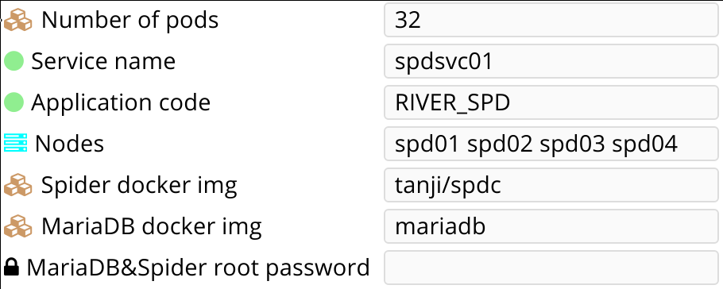

Service deploy and run automation
=================================

Introduction
------------

This document presents most of the OpenSVC collector and agent automation features through a typical use-case:

* collector forms
* service provisioning
* service resources provisioning
* middleware provisioning leveraging the Docker features
* nodes and services configuration management

The service is a 32-way sharded mariadb/spider cluster hosted on the Google cloud. The service topology is 'flex', meaning all instances of the service are up and running. The relayout of the shards amongst the flex available nodes is a common operation, implying the nodes can be destroyed while retaining the service data. The cloud resources billing also imposes to make it easy the stop the nodes while retaining the service data.

The flex primary node is the first node. This node is allowed to replicate data amongst the flex nodes and to execute cluster-wide service actions.

Project data
------------

Node names
++++++++++

The nodes are named spd<n>, where <n> is a 2-digit padded increment. Example for a 4-node flex:

* spd01
* spd02
* spd03
* spd04

Middleware grouping
+++++++++++++++++++

An abstract object we'll call a 'pod' groups 2 middlewares : a pure mariadb instance and a spider mariadb instance. A 32-way sharded cluster has 32 pods. Hence a 4-node cluster has 8 pods per node. A pod can be reassigned from one flex node to another during a relayout operation.

Network subnet
++++++++++++++

The service will use the 10.0.0.0/24 Google cloud private subnet. Each node and middleware use its own ip address in this subnet, following this convention:

* 1 to 32: node ip addresses
* 33 to 253: docker instances ip addresses

The private nodes ip addresses are plumbed on a backend bridge named br0. The ip forwarding must be enabled during the cloud node instanciation.

Network Routes
++++++++++++++

Google cloud routes are required to let the cloud routers known on which node a middleware instance is hosted. We'll name Google cloud routes ip-rt<n>, where <n> is the last packet of the cidr ip address. Example:

* ip-rt1: 10.0.0.1/32 next hop spd01
* ip-rt2: 10.0.0.1/32 next hop spd01
* ...

Disks
+++++

To limit the number of disks, we allocate one disk per service instance (ie, per node) in the Google cloud, plus one disk per pod. These disks are named:

* 4 service instance disks: <svcname>-<nodename>
* 32 pod disks: <svcname>-pod<n>

Example:

* spdsvc01-pod1
* spdsvc01-pod2
* ...
* spdsvc01-pod8

Google cloud resources configurations
-------------------------------------

Nodes
+++++

Note:

* the scopes parameter allow the OpenSVC agent to provision and configure cloud resources like disks and routes.
* the can-ip-forward parameter is required for packets sent to middlewares to be delivered to the backend bridge

::

    gcloud compute instances create spd01 spd02 spd03 spd04 --image ubuntu-15-10 --zone europe-west1-b --machine-type n1-highmem-2 --can-ip-forward --scopes cloud-platform

Firewall rules
++++++++++++++

Allow nodes to exchange packets on the service private subnet.

::

    gcloud compute firewall-rules create allow-internal --allow icmp,udp,tcp --source-range 10.0.0.0/8

Allow the OpenSVC collector the notify the node agents that actions are waiting for dequeue.

::

    sudo gcloud compute firewall-rules create default-allow-opensvc-notifications --allow tcp:1214

Node routes
+++++++++++

::

    for i in $(seq 1 32); do gcloud routes create rt-ip$i --next-hop-instance spd$(printf %.2d $i) --next-hop-instance-zone europe-west1-b --destination-range 10.0.0.$i/32 ; done

Configuration management
------------------------

Node configuration management
+++++++++++++++++++++++++++++

Handled configurations:

* installation of the required packages
* configuration of the opensvc agent
* configuration of the backend network bridge
* kernel tuning

Configuration targets export
____________________________

::

    {
        "modulesets": [
            {
                "modules": [
                    {
                        "autofix": false,
                        "modset_mod_name": "com.opensvc.sys.opensvc.dequeue-actions-listener"
                    }
                ],
                "rulesets": [
                    "com.opensvc.sys.opensvc.dequeue-actions-listener"
                ],
                "modset_name": "com.opensvc.sys.opensvc.dequeue-actions-listener",
                "modulesets": [],
                "publications": [
                    "OpenSVC"
                ],
                "id": 11,
                "responsibles": [
                    "OpenSVC"
                ]
            },
            {
                "modules": [
                    {
                        "autofix": false,
                        "modset_mod_name": "spdc.kernel"
                    }
                ],
                "rulesets": [
                    "spdc.kernel"
                ],
                "modset_name": "spdc.kernel",
                "modulesets": [],
                "publications": [
                    "OpenSVC"
                ],
                "id": 19,
                "responsibles": [
                    "OpenSVC",
                    "SPD"
                ]
            },
            {
                "modules": [
                    {
                        "autofix": false,
                        "modset_mod_name": "spdc.network"
                    }
                ],
                "rulesets": [
                    "spdc.network"
                ],
                "modset_name": "spdc.network",
                "modulesets": [],
                "publications": [
                    "OpenSVC",
                    "SPD"
                ],
                "id": 16,
                "responsibles": [
                    "OpenSVC",
                    "SPD"
                ]
            },
            {
                "modules": [],
                "rulesets": [],
                "modset_name": "spdc.node",
                "modulesets": [
                    "com.opensvc.sys.opensvc.dequeue-actions-listener",
                    "spdc.packages",
                    "spdc.opensvc",
                    "spdc.network",
                    "spdc.kernel"
                ],
                "publications": [
                    "OpenSVC",
                    "SPD"
                ],
                "id": 13,
                "responsibles": [
                    "OpenSVC",
                    "SPD"
                ]
            },
            {
                "modules": [
                    {
                        "autofix": false,
                        "modset_mod_name": "spdc.opensvc"
                    }
                ],
                "rulesets": [
                    "spdc.opensvc"
                ],
                "modset_name": "spdc.opensvc",
                "modulesets": [],
                "publications": [
                    "OpenSVC",
                    "SPD"
                ],
                "id": 15,
                "responsibles": [
                    "OpenSVC",
                    "SPD"
                ]
            },
            {
                "modules": [
                    {
                        "autofix": false,
                        "modset_mod_name": "spdc.packages"
                    }
                ],
                "rulesets": [
                    "spdc.packages"
                ],
                "modset_name": "spdc.packages",
                "modulesets": [],
                "publications": [
                    "OpenSVC",
                    "SPD"
                ],
                "id": 14,
                "responsibles": [
                    "OpenSVC",
                    "SPD"
                ]
            }
        ],
        "filtersets": [
            {
                "fset_stats": false,
                "id": 31,
                "filters": [
                    {
                        "filter": {
                            "f_op": "=",
                            "f_field": "os_name",
                            "f_value": "SunOS",
                            "f_table": "nodes",
                            "id": 36
                        },
                        "f_order": 0,
                        "f_log_op": "AND",
                        "filterset": null
                    },
                    {
                        "filter": {
                            "f_op": "=",
                            "f_field": "team_responsible",
                            "f_value": "OpenSVC",
                            "f_table": "nodes",
                            "id": 15
                        },
                        "f_order": 0,
                        "f_log_op": "AND",
                        "filterset": null
                    }
                ],
                "fset_name": "opensvc solaris servers"
            },
            {
                "fset_stats": false,
                "id": 49,
                "filters": [
                    {
                        "filter": {
                            "f_op": "=",
                            "f_field": "pkg_name",
                            "f_value": "systemd",
                            "f_table": "packages",
                            "id": 54
                        },
                        "f_order": 0,
                        "f_log_op": "AND",
                        "filterset": null
                    }
                ],
                "fset_name": "servers with systemd"
            },
            {
                "fset_stats": false,
                "id": 50,
                "filters": [
                    {
                        "filter": {
                            "f_op": "=",
                            "f_field": "pkg_name",
                            "f_value": "xinetd",
                            "f_table": "packages",
                            "id": 55
                        },
                        "f_order": 0,
                        "f_log_op": "AND",
                        "filterset": null
                    }
                ],
                "fset_name": "servers with xinetd"
            }
        ],
        "rulesets": [
            {
                "fset_name": null,
                "ruleset_name": "com.opensvc.sys.opensvc.dequeue-actions-listener",
                "variables": [],
                "ruleset_public": false,
                "ruleset_type": "explicit",
                "rulesets": [
                    "com.opensvc.sys.opensvc.dequeue-actions-listener.systemd",
                    "com.opensvc.sys.opensvc.dequeue-actions-listener.smf",
                    "com.opensvc.sys.opensvc.dequeue-actions-listener.xinetd"
                ],
                "publications": [
                    "OpenSVC"
                ],
                "id": 66,
                "responsibles": [
                    "OpenSVC"
                ]
            },
            {
                "fset_name": "servers with systemd",
                "ruleset_name": "com.opensvc.sys.opensvc.dequeue-actions-listener.systemd",
                "variables": [
                    {
                        "var_author": "Christophe Varoqui",
                        "var_class": "file",
                        "var_value": "{\"path\": \"/etc/systemd/system/opensvc-actions@.service\", \"fmt\": \"[Unit]\\nDescription=OpenSVC collector-queued actions handler\\n\\n[Service]\\nExecStart=-/opt/opensvc/bin/nodemgr dequeue actions\\n\", \"gid\": \"root\", \"mode\": 644, \"uid\": \"root\"}",
                        "var_updated": "2015-12-01 19:23:19",
                        "var_name": "opensvc_dequeue_actions_file_service",
                        "id": 212
                    },
                    {
                        "var_author": "Christophe Varoqui",
                        "var_class": "file",
                        "var_value": "{\"path\": \"/etc/systemd/system/opensvc-actions.socket\", \"fmt\": \"[Unit]\\nDescription=OpenSVC socket to receive collector notifications that actions are queued for the local agent\\n\\n[Socket]\\nListenStream=1214\\nAccept=yes\\nService=opensvc-actions\\n\\n[Install]\\nWantedBy=sockets.target\\n\", \"gid\": \"root\", \"mode\": 644, \"uid\": \"root\"}",
                        "var_updated": "2015-12-01 19:24:25",
                        "var_name": "opensvc_dequeue_actions_file_socket",
                        "id": 213
                    }
                ],
                "ruleset_public": false,
                "ruleset_type": "contextual",
                "rulesets": [],
                "publications": [
                    "OpenSVC"
                ],
                "id": 67,
                "responsibles": [
                    "OpenSVC"
                ]
            },
            {
                "fset_name": "opensvc solaris servers",
                "ruleset_name": "com.opensvc.sys.opensvc.dequeue-actions-listener.smf",
                "variables": [
                    {
                        "var_author": "Christophe Varoqui",
                        "var_class": "file",
                        "var_value": "{\"path\": \"%%ENV:OPENSVC_DEQUEUE_ACTIONS_MANIFEST_PATH%%\", \"fmt\": \"<?xml version='1.0'?>\\n<!DOCTYPE service_bundle SYSTEM '/usr/share/lib/xml/dtd/service_bundle.dtd.1'>\\n<service_bundle type='manifest' name='export'>\\n  <service name='network/opensvc-dequeue-actions/tcp' type='service' version='0'>\\n    <restarter>\\n      <service_fmri value='svc:/network/inetd:default'/>\\n    </restarter>\\n    <exec_method name='inetd_start' type='method' exec='/opt/opensvc/bin/nodemgr dequeue_actions' timeout_seconds='0'>\\n      <method_context>\\n        <method_credential user='root' group='root'/>\\n      </method_context>\\n    </exec_method>\\n    <exec_method name='inetd_disable' type='method' exec=':kill' timeout_seconds='0'>\\n      <method_context/>\\n    </exec_method>\\n    <property_group name='inetd' type='framework'>\\n      <propval name='endpoint_type' type='astring' value='stream'/>\\n      <propval name='isrpc' type='boolean' value='false'/>\\n      <propval name='name' type='astring' value='opensvc-dequeue-actions'/>\\n      <propval name='proto' type='astring' value='tcp'/>\\n      <propval name='wait' type='boolean' value='false'/>\\n      <propval name='tcp_wrappers' type='boolean' value='false'/>\\n      <propval name='tcp_trace' type='boolean' value='false'/>\\n    </property_group>\\n    <instance name='default' enabled='true'>\\n      <property_group name='inetd' type='framework'>\\n        <propval name='wait' type='boolean' value='false'/>\\n      </property_group>\\n    </instance>\\n    <stability value='External'/>\\n    <template>\\n      <common_name>\\n        <loctext xml:lang='C'>opensvc-dequeue-actions</loctext>\\n      </common_name>\\n    </template>\\n  </service>\\n</service_bundle>\\n\\n\", \"gid\": \"root\", \"mode\": 644, \"uid\": \"root\"}",
                        "var_updated": "2015-12-02 16:25:31",
                        "var_name": "opensvc_dequeue_actions_file_manifest",
                        "id": 209
                    },
                    {
                        "var_author": "Christophe Varoqui",
                        "var_class": "raw",
                        "var_value": "svc:/network/opensvc-dequeue-actions/tcp:default",
                        "var_updated": "2015-12-01 18:16:25",
                        "var_name": "opensvc_dequeue_actions_service_name",
                        "id": 210
                    },
                    {
                        "var_author": "Christophe Varoqui",
                        "var_class": "raw",
                        "var_value": "/var/svc/manifest/network/opensvc-dequeue-actions-tcp.xml",
                        "var_updated": "2015-12-01 18:15:39",
                        "var_name": "opensvc_dequeue_actions_manifest_path",
                        "id": 211
                    }
                ],
                "ruleset_public": false,
                "ruleset_type": "contextual",
                "rulesets": [],
                "publications": [
                    "OpenSVC"
                ],
                "id": 69,
                "responsibles": [
                    "OpenSVC"
                ]
            },
            {
                "fset_name": "servers with xinetd",
                "ruleset_name": "com.opensvc.sys.opensvc.dequeue-actions-listener.xinetd",
                "variables": [
                    {
                        "var_author": "Christophe Varoqui",
                        "var_class": "file",
                        "var_value": "{\"path\": \"/etc/xinetd.d/opensvc-actions\", \"fmt\": \"service opensvc-actions\\n{\\n  socket_type = stream\\n  protocol = tcp\\n  wait = no\\n  user = root\\n  server = /opt/opensvc/bin/nodemgr dequeue actions\\n}\", \"gid\": \"root\", \"mode\": 644, \"uid\": \"root\"}",
                        "var_updated": "2015-12-02 10:55:28",
                        "var_name": "opensvc_dequeue_actions_file_service",
                        "id": 214
                    }
                ],
                "ruleset_public": false,
                "ruleset_type": "contextual",
                "rulesets": [],
                "publications": [
                    "OpenSVC"
                ],
                "id": 70,
                "responsibles": [
                    "OpenSVC"
                ]
            },
            {
                "fset_name": null,
                "ruleset_name": "spdc.packages",
                "variables": [
                    {
                        "var_author": "Christophe Varoqui",
                        "var_class": "packages",
                        "var_value": "[\"sysstat\",\"docker.io\",\"btrfs-tools\"]",
                        "var_updated": "2016-02-26 21:43:54",
                        "var_name": "spdc_pkg",
                        "id": 216
                    }
                ],
                "ruleset_public": false,
                "ruleset_type": "explicit",
                "rulesets": [],
                "publications": [
                    "OpenSVC",
                    "SPD"
                ],
                "id": 71,
                "responsibles": [
                    "OpenSVC",
                    "SPD"
                ]
            },
            {
                "fset_name": null,
                "ruleset_name": "spdc.opensvc",
                "variables": [
                    {
                        "var_author": "Christophe Varoqui",
                        "var_class": "nodeconf",
                        "var_value": "[{\"value\": \"http://repo.opensvc.com/compliance/\", \"key\": \"node.repocomp\", \"op\": \"=\"}, {\"value\": \"https://collector.opensvc.com/feed/default/call/xmlrpc\", \"key\": \"node.dbopensvc\", \"op\": \"=\"}, {\"value\": \"https://collector.opensvc.com/init/compliance/call/xmlrpc\", \"key\": \"node.dbcompliance\", \"op\": \"=\"}, {\"value\": \"true\", \"key\": \"compliance.auto_update\", \"op\": \"=\"}, {\"value\": \"@1440\", \"key\": \"compliance.schedule\", \"op\": \"=\"}, {\"value\": \"@60\", \"key\": \"stats.schedule\", \"op\": \"=\"}, {\"value\": \"http://repo.opensvc.com/\", \"key\": \"node.repopkg\", \"op\": \"=\"}]",
                        "var_updated": "2016-02-26 20:49:08",
                        "var_name": "spdc_opensvc_nodeconf",
                        "id": 218
                    },
                    {
                        "var_author": "Christophe Varoqui",
                        "var_class": "file",
                        "var_value": "{\"path\":\"/etc/sudoers.d/opensvc\",\"mode\":644,\"uid\":\"root\",\"gid\":\"root\",\"fmt\":\"Defaults        secure_path=\\\"/usr/local/sbin:/usr/local/bin:/usr/sbin:/usr/bin:/sbin:/bin:/opt/opensvc/bin:/opt/opensvc/etc\\\"\"}",
                        "var_updated": "2016-03-01 17:59:38",
                        "var_name": "spdc_opensvc_file_sudo",
                        "id": 224
                    }
                ],
                "ruleset_public": false,
                "ruleset_type": "explicit",
                "rulesets": [],
                "publications": [
                    "OpenSVC",
                    "SPD"
                ],
                "id": 72,
                "responsibles": [
                    "OpenSVC",
                    "SPD"
                ]
            },
            {
                "fset_name": null,
                "ruleset_name": "spdc.network",
                "variables": [
                    {
                        "var_author": "Christophe Varoqui",
                        "var_class": "file",
                        "var_value": "{\"path\":\"/etc/network/interfaces.d/br0.cfg\",\"mode\":644,\"uid\":\"root\",\"gid\":\"root\",\"fmt\":\"auto br0\\niface br0 inet static\\n        address %%ENV:SPDC_BRGW%%\\n        netmask 255.255.255.0\\n        network 10.0.0.0\\n        broadcast 10.0.0.255\\n        bridge_stp off\\n        bridge_ports none\\n        post-up /sbin/ip route del 10.0.0.0/24 dev br0\\n        post-up /sbin/ip route replace %%ENV:SPDC_BRGW%%/32 dev br0\"}",
                        "var_updated": "2016-02-26 21:41:53",
                        "var_name": "spdc_net_file_br0_cfg",
                        "id": 219
                    }
                ],
                "ruleset_public": false,
                "ruleset_type": "explicit",
                "rulesets": [],
                "publications": [
                    "OpenSVC",
                    "SPD"
                ],
                "id": 73,
                "responsibles": [
                    "OpenSVC",
                    "SPD"
                ]
            },
            {
                "fset_name": null,
                "ruleset_name": "spdc.kernel",
                "variables": [
                    {
                        "var_author": "Christophe Varoqui",
                        "var_class": "sysctl",
                        "var_value": "[{\"key\":\"net.ipv4.ip_local_port_range\",\"index\":0,\"op\":\">=\",\"value\":1025},{\"key\":\"net.ipv4.ip_local_port_range\",\"index\":1,\"op\":\">=\",\"value\":65534},{\"key\":\"vm.max_map_count\",\"index\":0,\"op\":\">=\",\"value\":200000},{\"key\":\"vm.swappiness\",\"index\":0,\"op\":\">=\",\"value\":5}]",
                        "var_updated": "2016-03-01 14:56:15",
                        "var_name": "spdc_kernel_sysctl",
                        "id": 222
                    },
                    {
                        "var_author": "Christophe Varoqui",
                        "var_class": "file",
                        "var_value": "{\"path\":\"/etc/default/grub.d/60-spdc.cfg\",\"mode\":644,\"uid\":\"root\",\"gid\":\"root\",\"fmt\":\"GRUB_CMDLINE_LINUX=\\\"$GRUB_CMDLINE_LINUX transparent_hugepage=never\\\"\"}",
                        "var_updated": "2016-03-01 14:25:13",
                        "var_name": "spdc_kernel_file_thp",
                        "id": 223
                    }
                ],
                "ruleset_public": false,
                "ruleset_type": "explicit",
                "rulesets": [],
                "publications": [
                    "OpenSVC"
                ],
                "id": 75,
                "responsibles": [
                    "OpenSVC",
                    "SPD"
                ]
            }
        ]
    }
 
Module: 50-spdc.packages
________________________

::

    #!/bin/bash
    
    PATH_SCRIPT="$(cd $(/usr/bin/dirname $(type -p -- $0 || echo $0));pwd)"
    PATH_LIB=$PATH_SCRIPT/com.opensvc
    PREFIX=OSVC_COMP_SPDC
    
    typeset -i r=0
    
    case $1 in
    check)
    	$PATH_LIB/packages.py ${PREFIX}_PKG check
    	[ $? -eq 1 ] && r=1
    	exit $r
    	;;
    fix)
    	$PATH_LIB/packages.py ${PREFIX}_PKG fix
    	[ $? -eq 1 ] && exit 1
    	exit 0
    	;;
    fixable)
    	exit 2
    	;;
    esac

Module: 50-spdc.network
_______________________

::

    #!/bin/bash
    
    PATH_SCRIPT="$(cd $(/usr/bin/dirname $(type -p -- $0 || echo $0));pwd)"
    PATH_LIB=$PATH_SCRIPT/com.opensvc
    PREFIX=OSVC_COMP_SPDC_NET
    
    export SPDC_BRGW=10.0.0.$(printf "%d" $(hostname | grep -o "[0-9]*"))
    
    typeset -i r=0
    
    case $1 in
    check)
    	$PATH_LIB/files.py ${PREFIX}_FILE check
    	[ $? -eq 1 ] && r=1
    	exit $r
    	;;
    fix)
    	typeset -i need_ifup=0
    	$PATH_LIB/files.py ${PREFIX}_FILE check >/dev/null 2>&1 || need_ifup=1
    	$PATH_LIB/files.py ${PREFIX}_FILE fix
    	[ $? -eq 1 ] && exit 1
    	[ $need_ifup -eq 1 ] && ifup br0
    	exit 0
    	;;
    fixable)
    	exit 2
    	;;
    esac

Module: 50-spdc.opensvc
_______________________

::

    #!/bin/bash
    
    PATH_SCRIPT="$(cd $(/usr/bin/dirname $(type -p -- $0 || echo $0));pwd)"
    PATH_LIB=$PATH_SCRIPT/com.opensvc
    PREFIX=OSVC_COMP_SPDC_OPENSVC
    
    typeset -i r=0
    
    case $1 in
    check)
    	$PATH_LIB/files.py ${PREFIX}_FILE check
    	[ $? -eq 1 ] && r=1
    	$PATH_LIB/nodeconf.py ${PREFIX}_NODECONF check
    	[ $? -eq 1 ] && r=1
    	exit $r
    	;;
    fix)
    	$PATH_LIB/files.py ${PREFIX}_FILE fix
    	[ $? -eq 1 ] && exit 1
    	$PATH_LIB/nodeconf.py ${PREFIX}_NODECONF fix
    	[ $? -eq 1 ] && exit 1
    	exit 0
    	;;
    fixable)
    	exit 2
    	;;
    esac

Module: 50-spdc.kernel
______________________

::

    #!/bin/bash
    
    PATH_SCRIPT="$(cd $(/usr/bin/dirname $(type -p -- $0 || echo $0));pwd)"
    PATH_LIB=$PATH_SCRIPT/com.opensvc
    PREFIX=OSVC_COMP_SPDC_KERNEL
    
    typeset -i r=0
    
    function check_thp_live {
    	typeset -i r=0
    	grep -q "\[never" /sys/kernel/mm/transparent_hugepage/enabled && {
    		echo "the live kernel thp enabled state is 'never'"
    	} || {
    		echo "the live kernel thp enabled state is not 'never'" >&2
    		r=1
    	}
    	grep -q "\[never" /sys/kernel/mm/transparent_hugepage/defrag && {
    		echo "the live kernel thp defrag state is 'never'"
    	} || {
    		echo "the live kernel thp defrag state is not 'never'" >&2
    		r=1
    	}
    	return $r
    }
    
    function fix_thp_live {
    	grep -q "\[never" /sys/kernel/mm/transparent_hugepage/enabled || {
    		echo "echo never >/sys/kernel/mm/transparent_hugepage/enabled"
    		echo never >/sys/kernel/mm/transparent_hugepage/enabled
    	}
    	grep -q "\[never" /sys/kernel/mm/transparent_hugepage/defrag || {
    		echo "echo never >/sys/kernel/mm/transparent_hugepage/defrag"
    		echo never >/sys/kernel/mm/transparent_hugepage/defrag
    	}
    }
    
    case $1 in
    check)
    	check_thp_live
    	[ $? -eq 1 ] && r=1
    	$PATH_LIB/files.py ${PREFIX}_FILE check
    	[ $? -eq 1 ] && r=1
    	$PATH_LIB/sysctl.py ${PREFIX}_SYSCTL check
    	[ $? -eq 1 ] && r=1
    	exit $r
    	;;
    fix)
    	fix_thp_live
    	[ $? -eq 1 ] && exit 1
    	typeset -i need_update_grub=0
    	$PATH_LIB/files.py ${PREFIX}_FILE check >/dev/null 2>&1 || need_update_grub=1
    	$PATH_LIB/files.py ${PREFIX}_FILE fix
    	[ $? -eq 1 ] && exit 1
    	$PATH_LIB/sysctl.py ${PREFIX}_SYSCTL fix
    	[ $? -eq 1 ] && r=1
    	[ $need_update_grub -eq 1 ] && {
    		update-grub
    	}
    	exit 0
    	;;
    fixable)
    	exit 2
    	;;
    esac

Service configuration management
++++++++++++++++++++++++++++++++

Handled configurations:

* formatting and installation of the 32 mariadb configuration files
* formatting and installation of the 64 spider configuration files

Configuration targets export
____________________________

::

    {
        "modulesets": [
            {
                "modules": [],
                "rulesets": [],
                "modset_name": "spdc.svc",
                "modulesets": [
                    "spdc.svc.db.cnf"
                ],
                "publications": [
                    "OpenSVC",
                    "SPD"
                ],
                "id": 17,
                "responsibles": [
                    "OpenSVC",
                    "SPD"
                ]
            },
            {
                "modules": [
                    {
                        "autofix": false,
                        "modset_mod_name": "spdc.svc.db.cnf"
                    }
                ],
                "rulesets": [
                    "spdc.svc.db.cnf"
                ],
                "modset_name": "spdc.svc.db.cnf",
                "modulesets": [],
                "publications": [
                    "OpenSVC"
                ],
                "id": 18,
                "responsibles": [
                    "OpenSVC",
                    "SPD"
                ]
            }
        ],
        "filtersets": [],
        "rulesets": [
            {
                "fset_name": null,
                "ruleset_name": "spdc.svc.db.cnf",
                "variables": [
                    {
                        "var_author": "Christophe Varoqui",
                        "var_class": "raw",
                        "var_value": "33",
                        "var_updated": "2016-03-03 15:56:22",
                        "var_name": "first_server_ip",
                        "id": 226
                    },
                    {
                        "var_author": "Christophe Varoqui",
                        "var_class": "raw",
                        "var_value": "64",
                        "var_updated": "2016-03-03 15:56:13",
                        "var_name": "n_servers",
                        "id": 225
                    },
                    {
                        "var_author": "Stephane VAROQUI",
                        "var_class": "file",
                        "var_value": "{\"path\":\"/%%ENV:SERVICES_SVC_NAME%%/%%ENV:POD%%/db/conf/spd.cnf\",\"mode\":644,\"uid\":999,\"gid\":999,\"fmt\":\"[mysqld]\\nserver_id=%%ENV:SERVER_ID%%\\n\\nreplicate-do-db=spdc%%ENV:SERVER_ID%%  \\nreplicate-rewrite-db=spdc%%ENV:SERVER_ID%%->spdc \\n\\n\\nreplicate-do-db=spdc%%ENV:PEER_SERVER_ID%%  \\nreplicate-rewrite-db=spdc%%ENV:PEER_SERVER_ID%%->spdc\\n\\n\\nplugin-load=ha_tokudb\\nloose_tokudb_cache_size=256M\\n\\nopen_files_limit = 65000\\n\\ntable_cache = 4096\\n\\nskip_name_resolve\\n\\nquery_cache_size = 0 \\n\\nquery_cache_type = 0\\n\\nmax_connections = 10240\\n\\nback_log = 128\\n\"}",
                        "var_updated": "2016-03-03 16:01:55",
                        "var_name": "spdc_svc_db_cnf_file_db",
                        "id": 220
                    },
                    {
                        "var_author": "Stephane VAROQUI",
                        "var_class": "file",
                        "var_value": "{\"path\":\"/%%ENV:SERVICES_SVC_NAME%%/%%ENV:POD%%/sm/conf/spd.cnf\",\"mode\":644,\"uid\":999,\"gid\":999,\"fmt\":\"[mysqld]\\n\\nskip-name-resolve\\nbind-address                            = 0.0.0.0\\nopen_files_limit = 128000\\n\\ndefault-storage-engine = InnoDB\\ncharacter-set-server = utf8\\n\\nskip-external-locking\\nkey_buffer_size = 128M \\n\\nmax_allowed_packet = 16M  \\ntable_cache = 4096\\ntable_definition_cache = 2048\\nsort_buffer_size = 512K\\nread_buffer_size = 256K\\nread_rnd_buffer_size = 256K\\nmyisam_sort_buffer_size = 64M\\nlong_query_time = 5\\nthread_cache_size = 128\\nquery_cache_size = 0\\nquery_cache_type = 0\\nmax_connections = 10240 \\n\\nback_log = 128\\nopen_files_limit = 65000\\n\\nserver-id = %%ENV:SERVER_ID%%\\n#report-host = sm.scrambledb.org \\n \\ntmp_table_size = 16M\\nmax_heap_table_size = 96M\\n\\n#read_only = 1\\n\\njoin_buffer_space_limit = 3072M\\njoin_buffer_size = 128M\\njoin_cache_level = 6\\nmrr_buffer_size = 96M\\n\\noptimizer_switch='index_condition_pushdown=on'\\noptimizer_switch='engine_condition_pushdown=on'\\noptimizer_switch='derived_merge=on'\\noptimizer_switch='derived_with_keys=on'\\noptimizer_switch='firstmatch=off'\\noptimizer_switch='loosescan=off'\\noptimizer_switch='materialization=on'\\noptimizer_switch='in_to_exists=on'\\noptimizer_switch='semijoin=on'\\noptimizer_switch='partial_match_rowid_merge=on'\\noptimizer_switch='partial_match_table_scan=on'\\noptimizer_switch='subquery_cache=off'\\noptimizer_switch='mrr=on'\\noptimizer_switch='mrr_cost_based=off'\\noptimizer_switch='mrr_sort_keys=on'\\noptimizer_switch='outer_join_with_cache=on'\\noptimizer_switch='semijoin_with_cache=off'\\noptimizer_switch='join_cache_incremental=on'\\noptimizer_switch='join_cache_hashed=on'\\noptimizer_switch='join_cache_bka=on'\\noptimizer_switch='optimize_join_buffer_size=on'\\noptimizer_switch='table_elimination=on'\\n\\nloose_spider_semi_table_lock  = 0\\nloose_spider_support_xa=0\\nloose_spider_direct_dup_insert = 1\\nloose_spider_remote_sql_log_off=1\\nloose_spider_casual_read=1\\nloose_spider_bka_mode = 0\\nloose_spider_quick_mode=3 \\nloose_spider_quick_page_size=100\\nloose_spider_sync_trx_isolation=1\\nloose_spider_sync_autocommit=1\\n\\n\\nloose_spider_sts_sync=1\\nloose_spider_sts_bg_mode=0\\n\\nloose_spider_crd_bg_mode=0\\nloose_spider_crd_mode=1\\n\\nloose_spider_crd_sync=1\\nloose_spider_crd_interval=3600\\n\\nloose_spider_reset_sql_alloc=1\\nloose_spider_bgs_mode=3\\nloose_spider_use_pushdown_udf=0\\n\\nloose_spider_connect_mutex = 0\\n\\nloose_spider_conn_recycle_mode=0\\nloose_spider_conn_recycle_strict = 0\\nloose_spider_local_lock_table=0\\nloose_spider_connect_retry_count = 10   \\nloose_spider_connect_retry_interval = 1000 \\n\\npartition_skip_pk_sort_for_non_clustered_pk_table=1\\n\"}",
                        "var_updated": "2016-03-06 23:23:17",
                        "var_name": "spdc_svc_db_cnf_file_sm",
                        "id": 221
                    }
                ],
                "ruleset_public": false,
                "ruleset_type": "explicit",
                "rulesets": [],
                "publications": [
                    "OpenSVC",
                    "SPD"
                ],
                "id": 74,
                "responsibles": [
                    "OpenSVC",
                    "SPD"
                ]
            }
        ]
    }

Module: 50-spdc.svc.db.cnf
__________________________

::

    #!/bin/bash
    
    PATH_SCRIPT="$(cd $(/usr/bin/dirname $(type -p -- $0 || echo $0));pwd)"
    PATH_LIB=$PATH_SCRIPT/com.opensvc
    PREFIX=OSVC_COMP_SPDC_SVC_DB_CNF
    
    typeset -i r=0
    typeset -i start=$OSVC_COMP_FIRST_SERVER_IP
    typeset -i nservers=$OSVC_COMP_N_SERVERS
    
    case $1 in
    check)
    	for pod in $(echo /$OSVC_COMP_SERVICES_SVC_NAME/pod*)
    	do
    		export OSVC_COMP_POD=$(basename $pod)
    		typeset -i n=$(echo $OSVC_COMP_POD | sed -e "s@pod[0]*@@")
    		n=n-1
    
    		export OSVC_COMP_SERVER_ID=$(($start+2*$n))
    		export OSVC_COMP_PEER_SERVER_ID=$((($OSVC_COMP_SERVER_ID - $start + $nservers / 2) % $nservers + $start))
    		$PATH_LIB/files.py ${PREFIX}_FILE_SM check
    		[ $? -eq 1 ] && r=1
    
    		export OSVC_COMP_SERVER_ID=$(($start+2*$n+1))
    		export OSVC_COMP_PEER_SERVER_ID=$((($OSVC_COMP_SERVER_ID - $start + $nservers / 2) % $nservers + $start))
    		$PATH_LIB/files.py ${PREFIX}_FILE_DB check
    		[ $? -eq 1 ] && r=1
    	done
    	exit $r
    	;;
    fix)
    	for pod in $(echo /$OSVC_COMP_SERVICES_SVC_NAME/pod*)
    	do
    		export OSVC_COMP_POD=$(basename $pod)
    		typeset -i n=$(echo $OSVC_COMP_POD | sed -e "s@pod[0]*@@")
    		n=n-1
    
    		export OSVC_COMP_SERVER_ID=$(($start+2*$n))
    		export OSVC_COMP_PEER_SERVER_ID=$((($OSVC_COMP_SERVER_ID - $start + $nservers / 2) % $nservers + $start))
    		$PATH_LIB/files.py ${PREFIX}_FILE_SM fix
    		[ $? -eq 1 ] && exit 1
    
    		export OSVC_COMP_SERVER_ID=$(($start+2*$n+1))
    		export OSVC_COMP_PEER_SERVER_ID=$((($OSVC_COMP_SERVER_ID - $start + $nservers / 2) % $nservers + $start))
    		$PATH_LIB/files.py ${PREFIX}_FILE_DB fix
    		[ $? -eq 1 ] && exit 1
    	done
    	exit 0
    	;;
    fixable)
    	exit 2
    	;;
    esac

Node configuration
------------------

Node installation
+++++++++++++++++

::

    # install and configure opensvc
    wget -O/tmp/opensvc.deb  http://repo.opensvc.com/deb/current
    sudo dpkg -i /tmp/opensvc.deb
    sudo /opt/opensvc/bin/nodemgr set --param node.repopkg --value http://repo.opensvc.com/
    sudo /opt/opensvc/bin/nodemgr set --param node.repocomp --value http://repo.opensvc.com/compliance/
    sudo /opt/opensvc/bin/nodemgr set --param node.dbopensvc --value https://collector.opensvc.com/feed/default/call/xmlrpc
    sudo /opt/opensvc/bin/nodemgr set --param node.dbcompliance --value https://collector.opensvc.com/init/compliance/call/xmlrpc
    sudo /opt/opensvc/bin/nodemgr set --param node.host_mode --value PRD
    sudo /opt/opensvc/bin/nodemgr updatecomp
    sudo /opt/opensvc/bin/nodemgr register
    sudo /opt/opensvc/bin/nodemgr pushasset

    # node compliance (net bridge, opensvc config, packages)
    sudo /opt/opensvc/bin/nodemgr compliance attach --moduleset sdpc.node
    sudo /opt/opensvc/bin/nodemgr compliance fix --moduleset sdpc.node

Automating the service configuration file generation
----------------------------------------------------

Rationale
+++++++++

For a service with more than 260 resources, handling the service configuration through a file editor is too tedious and error-prone. The OpenSVC collector can present to selected users a form entrusted with the service configuration file formatting.

This form prompts the user for:

* the service name
* the nodenames
* the mariadb docker image name
* the spider docker image name
* optionally the mariadb and spider password (needed for instance provisioning, but not for the run)

Upon form submission the data is mangled and the resulting dataset is posted to the collector rest api to update the in-database service configuration file. The node agent can then *pull* this configuration.

Form rendering
++++++++++++++

Form configuration
++++++++++++++++++

::

    Css: svc48
    Label: RIVER SPD service configuration generator
    Desc: Input the Spider cluster sizing, and get back the corresponding OpenSVC service configuration.
    
    Outputs:
      -
        Type: json
        Format: dict
        Dest: rest
        Function: /services
        Handler: POST
        Mangle: |
            function(data) {
            	var fmt_header = String.raw`
            [DEFAULT]
            app = __APP__
            service_type = PRD
            nodes = __NODES__
            autostart_node = __NODES__
            docker_data_dir = /__SVCNAME__/docker
            flex_primary = __PRINODE__
            cluster_type = flex
            show_disabled = false
            rollback = false
    
            # factorize gce resource params here
            gce_zone = europe-west1-b
            detach_on_stop = false
    
            [disk#00]
            type = gce
            size = 20g
            __DISK0NAMES__
    
            [fs#00]
            type = btrfs
            dev = LABEL=__SVCNAME__
            mnt = /__SVCNAME__
            mnt_opt = defaults,rw
    
            [subset#disk:cge]
            parallel = true
    
            [subset#ip:cge]
            parallel = true
    
            `
    
            	var fmt_pod = String.raw`
            #
            # POD__POD_PADDED__
            #
            [disk#__POD_PADDED__]
            subset = cge
            tags = sm pod__POD_PADDED__
            type = gce
            names = __SVCNAME__-pod__POD__
            size = 17g
            disable = true
            disable@__NODE__ = false
    
            [fs#__POD_PADDED__]
            tags = sm pod__POD_PADDED__
            type = ext4
            dev = /dev/disk/by-id/google-__SVCNAME__.disk.__POD_PADDED__.0
            mnt = /__SVCNAME__/pod__POD_PADDED__
            mnt_opt = defaults,rw
            disable = true
            disable@__NODE__ = false
            post_provision = mkdir -p /__SVCNAME__/pod__POD_PADDED__/sm/init /__SVCNAME__/pod__POD_PADDED__/sm/conf /__SVCNAME__/pod__POD_PADDED__/sm/data /__SVCNAME__/pod__POD_PADDED__/db/init /__SVCNAME__/pod__POD_PADDED__/db/conf /__SVCNAME__/pod__POD_PADDED__/db/data && chown 999:999 /__SVCNAME__/pod__POD_PADDED__/*/*
    
            [ip#__POD_PADDED__smg]
            tags = sm pod__POD_PADDED__
            subset = cge
            type = gce
            ipname = 10.0.0.__IPSM__
            ipdev = br0
            routename = rt-ip__IPSM__
            disable = true
            disable@__NODE__ = false
    
            [ip#__POD_PADDED__sm]
            tags = sm sm.container sm.container.pod__POD_PADDED__ pod__POD_PADDED__
            type = docker
            ipdev = br0
            ipname = 10.0.0.__IPSM__
            netmask = 255.255.255.0
            network = 10.0.0.0
            gateway = 10.0.0.__GW__
            del_net_route = true
            container_rid = container#__POD_PADDED__sm
            disable = true
            disable@__NODE__ = false
    
            [container#__POD_PADDED__sm]
            tags = sm sm.container sm.container.pod__POD_PADDED__ pod__POD_PADDED__
            type = docker
            run_image = __DISM__
            run_args = --net=none
            	-e MYSQL_ROOT_PASSWORD=__MY_ROOT_PWD__
            	-v /etc/localtime:/etc/localtime:ro
            	-v /__SVCNAME__/pod__POD_PADDED__/sm/data:/var/lib/mysql:rw
            	-v /__SVCNAME__/pod__POD_PADDED__/sm/conf:/etc/mysql/conf.d:rw
            	-v /__SVCNAME__/pod__POD_PADDED__/sm/init:/docker-entrypoint-initdb.d:rw
            disable = true
            disable@__NODE__ = false
    
            [ip#__POD_PADDED__dbg]
            tags = db pod__POD_PADDED__
            subset = cge
            type = gce
            ipname = 10.0.0.__IPDB__
            ipdev = br0
            routename = rt-ip__IPDB__
            disable = true
            disable@__NODE__ = false
    
            [ip#__POD_PADDED__db]
            tags = db db.container db.container.pod__POD_PADDED__ pod__POD_PADDED__
            type = docker
            ipdev = br0
            ipname = 10.0.0.__IPDB__
            netmask = 255.255.255.0
            network = 10.0.0.0
            gateway = 10.0.0.__GW__
            del_net_route = true
            container_rid = container#__POD_PADDED__db
            disable = true
            disable@__NODE__ = false
    
            [container#__POD_PADDED__db]
            tags = db db.container db.container.pod__POD_PADDED__ pod__POD_PADDED__
            type = docker
            run_image = __DIDB__
            run_args = --net=none
            	-e MYSQL_ROOT_PASSWORD=__MY_ROOT_PWD__
            	-v /etc/localtime:/etc/localtime:ro
            	-v /__SVCNAME__/pod__POD_PADDED__/db/data:/var/lib/mysql:rw
            	-v /__SVCNAME__/pod__POD_PADDED__/db/conf:/etc/mysql/conf.d:rw
            	-v /__SVCNAME__/pod__POD_PADDED__/db/init:/docker-entrypoint-initdb.d:rw
            disable = true
            disable@__NODE__ = false
    
            `
    
            	var nodes = data.nodes.split(/\s+/)
            	var nb_nodes = nodes.length
            	var ipsm = 33
            	var pods_per_node = (data.npods / nb_nodes) >> 0
    
            	data.prinode = nodes[0]
            	var l = []
            	for (var i=0; !(i>=nb_nodes); i++) {
            		l.push("names@"+nodes[i]+" = "+data.svcname+"-"+nodes[i])
            	}
            	data.disk0names = l.join("\n")
    
            	var buff = fmt_header
            		.replace(/^\t*/g, "")
            		.replace(/__APP__/g, data.app)
            		.replace(/__NODES__/g, data.nodes)
            		.replace(/__SVCNAME__/g, data.svcname)
            		.replace(/__PRINODE__/g, data.prinode)
            		.replace(/__DISK0NAMES__/g, data.disk0names)
    
            	for (var pod=1; !(pod>data.npods); pod++) {
            		if (pod>9) {
            			data.pod_padded = ""+pod
            		} else {
            			data.pod_padded = "0"+pod
            		}
            		var i = ((pod - 1) / pods_per_node) >> 0
    
            		data.ipsm = ipsm
            		data.ipdb = ipsm + 1
            		data.gw = i + 1
            		data.node = nodes[i]
            		data.pod = pod
            		ipsm += 2
            		buff += fmt_pod
            			.replace(/^\t*/g, "")
            			.replace(/__APP__/g, data.app)
            			.replace(/__NODE__/g, data.node)
            			.replace(/__SVCNAME__/g, data.svcname)
            			.replace(/__DISK0NAME__/g, data.disk0name)
            			.replace(/__POD_PADDED__/g, data.pod_padded)
            			.replace(/__POD__/g, data.pod)
            			.replace(/__IPDB__/g, data.ipdb)
            			.replace(/__IPSM__/g, data.ipsm)
            			.replace(/__GW__/g, data.gw)
            			.replace(/__MY_ROOT_PWD__/g, data.myrootpwd)
            			.replace(/__DIDB__/g, data.didb)
            			.replace(/__DISM__/g, data.dism)
            	}
            	ret = {
            		"svc_name": data["svcname"],
            		"svc_envfile": buff
            	}
            	return ret
            }
    
    
    Inputs:
      -
        Id: npods
        Label: Number of pods
        DisplayModeLabel: npods
        LabelCss: pkg16
        Type: integer
        Mandatory: Yes
        Default: 32
    
      -
        Id: svcname
        Label: Service name
        DisplayModeLabel: svcname
        LabelCss: svc
        Type: string
        Mandatory: Yes
        Default: spdsvc01
    
      -
        Id: app
        Label: Application code
        DisplayModeLabel: app
        LabelCss: svc
        Type: string
        Mandatory: Yes
        Default: RIVER_SPD
    
      -
        Id: nodes
        Label: Nodes
        DisplayModeLabel: nodes
        LabelCss: node16
        Type: string
        Mandatory: Yes
        Default: spd01 spd02 spd03 spd04
    
      -
        Id: dism
        Label: Spider docker img
        DisplayModeLabel: dimg sm
        LabelCss: pkg16
        Type: string
        Mandatory: Yes
        Default: tanji/spdc
    
      -
        Id: didb
        Label: MariaDB docker img
        DisplayModeLabel: dimg db
        LabelCss: pkg16
        Type: string
        Mandatory: Yes
        Default: mariadb
    
      -
        Id: myrootpwd
        Label: MariaDB&Spider root password
        DisplayModeLabel: db root pwd
        LabelCss: lock
        Type: string
        Mandatory: No
    
Service provisioning
--------------------

On the flex primary::

    sudo /opt/opensvc/bin/svcmgr -s spdsvc01 pull
    sudo /opt/opensvc/bin/svcmgr -s spdsvc01 --cluster pull
    sudo /opt/opensvc/bin/svcmgr -s spdsvc01 --cluster provision
    sudo /opt/opensvc/bin/svcmgr -s spdsvc01 --cluster compliance attach --moduleset sdpc.svc
    sudo /opt/opensvc/bin/svcmgr -s spdsvc01 --cluster compliance fix --moduleset sdpc.svc

The provision action takes care of:

* allocating the Google cloud disks if they do not exist yet
* attaching the disks and naming them in a convenient way
* create the Google cloud routes
* format the filesystems (1 btrfs for the docker data dir, 1 xfs per pod)
* mount the filesystems
* create the per pod directory trees (needed by the docker volumes binding)
* pull the docker images
* instanciate the docker images

At the end of this action, the service is up and running. The status of the first instance is::

    $ sudo  /opt/opensvc/etc/spdsvc01 print status
    spdsvc01
    overall                   up         
    |- avail                  up         
    |  |- ip#01db        .... up         10.0.0.34@br0@f52d3cb784a9
    |  |- ip#01dbg       .... up         gce ip 10.0.0.34@br0
    |  |- ip#01sm        .... up         10.0.0.33@br0@fc68e0cf1adf
    |  |- ip#01smg       .... up         gce ip 10.0.0.33@br0
    |  |- ip#02db        .... up         10.0.0.36@br0@44a1becf7e5d
    |  |- ip#02dbg       .... up         gce ip 10.0.0.36@br0
    |  |- ip#02sm        .... up         10.0.0.35@br0@2e643d4c144c
    |  |- ip#02smg       .... up         gce ip 10.0.0.35@br0
    |  |- ip#03db        .... up         10.0.0.38@br0@fd8fc87c7c39
    |  |- ip#03dbg       .... up         gce ip 10.0.0.38@br0
    |  |- ip#03sm        .... up         10.0.0.37@br0@35d2ef73630a
    |  |- ip#03smg       .... up         gce ip 10.0.0.37@br0
    |  |- ip#04db        .... up         10.0.0.40@br0@d27baa5a84d2
    |  |- ip#04dbg       .... up         gce ip 10.0.0.40@br0
    |  |- ip#04sm        .... up         10.0.0.39@br0@71156c774221
    |  |- ip#04smg       .... up         gce ip 10.0.0.39@br0
    |  |- ip#05db        .... up         10.0.0.42@br0@e8ab26d9b7da
    |  |- ip#05dbg       .... up         gce ip 10.0.0.42@br0
    |  |- ip#05sm        .... up         10.0.0.41@br0@4f12002e4184
    |  |- ip#05smg       .... up         gce ip 10.0.0.41@br0
    |  |- ip#06db        .... up         10.0.0.44@br0@bee327bd5025
    |  |- ip#06dbg       .... up         gce ip 10.0.0.44@br0
    |  |- ip#06sm        .... up         10.0.0.43@br0@e3b4275c6cb7
    |  |- ip#06smg       .... up         gce ip 10.0.0.43@br0
    |  |- ip#07db        .... up         10.0.0.46@br0@655b2b7495b4
    |  |- ip#07dbg       .... up         gce ip 10.0.0.46@br0
    |  |- ip#07sm        .... up         10.0.0.45@br0@283312e34dd3
    |  |- ip#07smg       .... up         gce ip 10.0.0.45@br0
    |  |- ip#08db        .... up         10.0.0.48@br0@a18b2507b0fb
    |  |- ip#08dbg       .... up         gce ip 10.0.0.48@br0
    |  |- ip#08sm        .... up         10.0.0.47@br0@86c8d1439f95
    |  |- ip#08smg       .... up         gce ip 10.0.0.47@br0
    |  |- disk#00        .... up         gce volumes spdsvc01-spd01
    |  |- disk#01        .... up         gce volumes spdsvc01-pod1
    |  |- disk#02        .... up         gce volumes spdsvc01-pod2
    |  |- disk#03        .... up         gce volumes spdsvc01-pod3
    |  |- disk#04        .... up         gce volumes spdsvc01-pod4
    |  |- disk#05        .... up         gce volumes spdsvc01-pod5
    |  |- disk#06        .... up         gce volumes spdsvc01-pod6
    |  |- disk#07        .... up         gce volumes spdsvc01-pod7
    |  |- disk#08        .... up         gce volumes spdsvc01-pod8
    |  |- fs#00          .... up         LABEL=spdsvc01@/spdsvc01
    |  |- fs#01          .... up         /dev/disk/by-id/google-spdsvc01.disk.01.0@/spdsvc01/pod01
    |  |- fs#02          .... up         /dev/disk/by-id/google-spdsvc01.disk.02.0@/spdsvc01/pod02
    |  |- fs#03          .... up         /dev/disk/by-id/google-spdsvc01.disk.03.0@/spdsvc01/pod03
    |  |- fs#04          .... up         /dev/disk/by-id/google-spdsvc01.disk.04.0@/spdsvc01/pod04
    |  |- fs#05          .... up         /dev/disk/by-id/google-spdsvc01.disk.05.0@/spdsvc01/pod05
    |  |- fs#06          .... up         /dev/disk/by-id/google-spdsvc01.disk.06.0@/spdsvc01/pod06
    |  |- fs#07          .... up         /dev/disk/by-id/google-spdsvc01.disk.07.0@/spdsvc01/pod07
    |  |- fs#08          .... up         /dev/disk/by-id/google-spdsvc01.disk.08.0@/spdsvc01/pod08
    |  |- container#01db .... up         f52d3cb784a9@mariadb
    |  |- container#01sm .... up         fc68e0cf1adf@tanji/spdc
    |  |- container#02db .... up         44a1becf7e5d@mariadb
    |  |- container#02sm .... up         2e643d4c144c@tanji/spdc
    |  |- container#03db .... up         fd8fc87c7c39@mariadb
    |  |- container#03sm .... up         35d2ef73630a@tanji/spdc
    |  |- container#04db .... up         d27baa5a84d2@mariadb
    |  |- container#04sm .... up         71156c774221@tanji/spdc
    |  |- container#05db .... up         e8ab26d9b7da@mariadb
    |  |- container#05sm .... up         4f12002e4184@tanji/spdc
    |  |- container#06db .... up         bee327bd5025@mariadb
    |  |- container#06sm .... up         e3b4275c6cb7@tanji/spdc
    |  |- container#07db .... up         655b2b7495b4@mariadb
    |  |- container#07sm .... up         283312e34dd3@tanji/spdc
    |  |- container#08db .... up         a18b2507b0fb@mariadb
    |  '- container#08sm .... up         86c8d1439f95@tanji/spdc
    '- accessory                         
       '- sync#i0        .... up         rsync svc config to drpnodes, nodes

Operating the run
-----------------

Replacing a docker image globally
+++++++++++++++++++++++++++++++++

This example replaces the spider image.

Run from the flex primary spd01::

    # stop instances
    sudo /opt/opensvc/etc/spdsvc01 stopcontainer --tags sm --cluster

    # remove the old docker instances
    sudo /opt/opensvc/etc/spdsvc01 --cluster docker rm %instances%

    # update the service configuration using the form

    # pull the new configuration on all nodes
    sudo /opt/opensvc/etc/spdsvc01 --cluster pull

    # start
    sudo /opt/opensvc/etc/spdsvc01 startcontainer --tags sm --cluster

Migrate a pod
+++++++++++++

::

    # stop the pod resources where it runs
    sudo /opt/opensvc/etc/spdsvc01 stop --tags pod16

    # update the service configuration using the form

    # pull the new configuration on all nodes
    sudo /opt/opensvc/etc/spdsvc01 --cluster pull

    # start the pod on the destination node
    sudo /opt/opensvc/etc/spdsvc01 start --tags pod16

Conclusion
----------

This example use case illustrates how OpenSVC can automate and abstract to a simple and homogeneous command set both the deploy and the run lifetimes of wildly differing and arbitrarily complex services.

The same methods can apply to other cloud providers and on-premise resources, to failover and stand-alone services, to other hosting operating systems and filesystem types. These methods allow any infrastucture provider to offer fast, repeatable, auditable and automated deployment while retaining the ability to run infrastructure-wide tasks such as disaster recovery plan activation.

