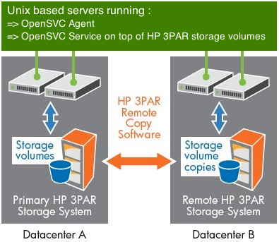
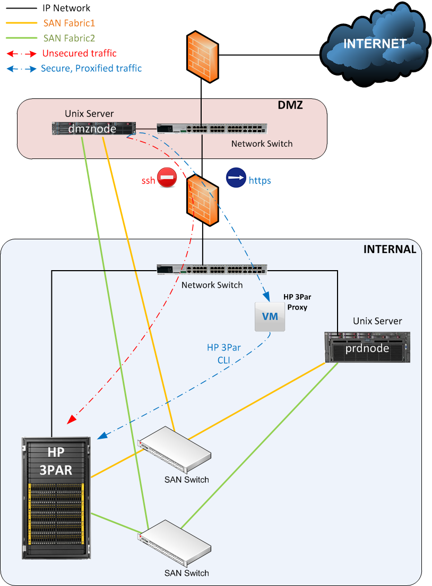

HP 3PAR replication
*******************

Introduction
============

HP 3Par arrays implement block level data replication between 2 or more arrays. This product is called "HP 3Par Remote Copy Software". This feature allow opensvc to drive services using a remote copy group, monitoring replication state at the array level, handling remote copy group "reverse" action, dealing with incremental updates when needed. This kind of service is often used to build metrocluster or geocluster systems, drastically lowering time needed to relocate production to another location, with application level granularity, and improving overall IT availability. The following documentation presents the configuration of such a service. This setup just require using the OpenSVC agent, which is free of charge.

Configuration
=============

Pre-requisites
--------------

* 2 Unix servers with OpenSVC agents. This tutorial use 2 linux debian servers. Their names are ``node1`` and ``node2``, respectively located at site1 (production) and site2 (disaster recovery). For complete OpenSVC beginner, please consider reading `this tutorial <howto.getting.started.html>`_. It's quite the same, except that nodes are in 2 different sites, and storage is HP 3Par technology, with remote replication enabled.
* 2 HP 3Par arrays, configured with "HP 3Par Remote Copy Software". Arrays are named ``hp3par1.opensvc.com`` and ``hp3par2.opensvc.com``, respectively located at site1 and site2.
* 1 OpenSVC service. This tutorial use service ``svc1.opensvc.com``, which is composed of 1 LVM2 volume group ``vg_svc1``, 1 LVM2 logical disk ``/dev/mapper/v_svc1-rootdisk``, 1 ext4 filesystem built on LVM2 logical disk mounted on ``/opt/svc1.opensvc.com``, 1 linux LXC container located in the previous filesystem.
* Storage volumes replicated through HP 3Par remote copy group. The most efficient implementation is to create one HP 3Par remote copy group per application or per OpenSVC service. This is a key factor to be able to relocate at the application level. By convention in this document, we will refer to HP 3Par remote copy group by using the acronym RCG:

 - ``MYRCG`` is the RCG name in the local HP 3Par array
 - ``MYRCG.r12345`` is the RCG name in the remote HP 3Par array

* Server ``node1`` is zoned to array ``hp3par1.opensvc.com``, and see primary storage volumes. Server ``node2`` is zoned to array ``hp3par2.opensvc.com`` and see secondary, replicated storage volumes.

As we will pilot storage volume replication, we need to connect to the HP 3Par arrays, that's why you have to choose between connection methods :

* ssh : node directly ssh to the array to issue commands
* proxy : node submit command through a proxy (See Proxy Section)

The HP 3Par CLI software commands must be installed in the standard location on the nodes running this service resource type.

HP 3Par configuration
---------------------

To make this tutorial easier, we will use the direct ssh connection to the arrays.
We recommend that you create a dedicated user, so as to enable OpenSVC software to trigger HP 3Par commands in the array. This will allow you to have dedicated logs, describing commands passed from OpenSVC agent.
When created in the HP 3Par arrays (``createuser`` command), the user is expected to have the ``Super`` role, because of the commands used by the OpenSVC agent, like ``setrcopygroup`` for example.

Once created (If needed, use ``ssh-keygen -b 1024 -t dsa``, and be sure to keep an empty passphrase), public ssh key for opensvc user has to be registered on the HP 3Par Inserv Storage Server, using the ``setsshkey -add`` command.

At this point, you have to be able to connect both arrays, from both nodes, as opensvc dedicated user, and issue any command in the arrays, passwordless.

Agent configuration file
------------------------

First of all, we need to teach OpenSVC agents how to connect HP 3Par array. The ``<OSVCETC>/auth.conf`` file is used to specify the connection method to each array.
Configuration below describes our 2 arrays:

* Name between square brackets [] is the array alias used by OpenSVC. It have to be unique on a per agent basis. It also the array name, reported in the ``Target`` column while issuing ``showrcopy groups`` command
* ``type`` specify OpenSVC that the declared ressource is a HP 3Par array
* ``username`` is the username used to connect to the HP 3Par array. It must have enough rights in the array to manage the replicated volumes
* ``manager`` field contains the ip address or fully qualified domain name of the HP 3Par Inserv Storage Server
* ``key`` contains the absolute path to the private ssh key used to authenticate ``username`` on the array

::

	#
	root@node1:~ # cat /etc/opensvc/auth.conf
	[hp3par1.opensvc.com]
	type = hp3par
	username = opensvc
	manager = hp3par1.opensvc.com
	key = /home/opensvc/.ssh/id_dsa

	[hp3par2.opensvc.com]
	type = hp3par
	username = opensvc
	manager = 192.168.100.199
	key = /home/opensvc/.ssh/id_dsa

This simple setup will make OpenSVC agent ssh to HP 3Par arrays, with ``/home/opensvc/.ssh/id_dsa`` as private key file, using ``opensvc`` array user.

Service configuration file
--------------------------

Now it's time to explain OpenSVC software that the service is relying on HP 3Par storage volumes.

If you are in a hurry, the config section to append to the ``service.env`` file is:

::

	[sync#1]
	type = hp3par
	mode = async
	array@node1 = hp3par1.opensvc.com
	array@node2 = hp3par2.opensvc.com
	rcg@node1 = MYRCG
	rcg@node2 = MYRCG.r12345
	sync_max_delay = 5

Below is explained each configuration option:

::

	#
	# HP 3Par Remote Copy
	#
	;[sync#0]
	;type = hp3par

	#
	# 'mode'
	#   mandatory. type of replication used. either sync or async
	#
	;mode = async

	#
	# 'array@node'
	#   mandatory. defines the array names. those parameters are used 
	#   by each node to know which array is considered as local.
	#   array names hp3par1, hp3par2 must be :
	#     1/ referenced in auth.conf
	#     2/ appear with those same names in the Target col of showrcopy groups MYRCG*
	#
	;array@node1 = hp3par1
	;array@node2 = hp3par2

	#
	# 'rcg@node'
	#   mandatory. defines RCG names on each array.
	#
	;rcg@hp3par1 = MYRCG
	;rcg@hp3par2 = MYRCG.r12345

	#
	# 'sync_max_delay'
	#   mandatory. specify the expected replication period. 
	#   usually 5 minutes with HP 3Par.

OpenSVC Operations
==================

Query service status
--------------------

On node1 (production side):

::

	root@node1:~ # svc1.opensvc.com print status
	svc1.opensvc.com
	overall                   up
	|- avail                  up
	|  |- container#0    .... up       svc1.opensvc.com
	|  |  '- ip#1        ...E up       svc1.opensvc.com@eth0
	|  |- vg#1pr         .... up       /dev/sdgq, /dev/sdax, /dev/sden, /dev/sdgi
	|  |- vg#1           .... up       vg_svc1
	|  '- fs#1           .... up       /dev/mapper/v_svc1-rootdisk@/opt/svc1.opensvc.com
	|- sync                   up
	|  |- sync#i0        .... up       rsync svc config to drpnodes, nodes
	|  '- sync#1         .... up       hp3par async MYRCG
	'- hb                     n/a

All ressources are up (except hb, which is not used here, because optional OpenHA sofware is not dealing with service high availability)

On node2 (disaster recovery side):

::

        root@node2:~ # svc1.opensvc.com print status
        svc1.opensvc.com
        overall                   down
        |- avail                  down
        |  |- container#0    .... down     svc1.opensvc.com
        |  |  '- ip#1        ...E down     svc1.opensvc.com@eth0
        |  |- vg#1pr         .... down     /dev/sdfi, /dev/sdej, /dev/sddk, /dev/sdgh
        |  |- vg#1           .... down     vg_svc1
        |  '- fs#1           .... down     /dev/mapper/v_svc1-rootdisk@/opt/svc1.opensvc.com
        |- sync                   up
        |  |- sync#i0        .... up       rsync svc config to drpnodes, nodes
        |  '- sync#1         .... up       hp3par async MYRCG.r12345
        '- hb                     n/a

All ressources are down, except the one dedicated to synchronisation:

* sync#i0 = up means that node1 and node2 are in sync from the OpenSVC service point of view
* sync#1 = up means that storage volumes members of HP 3Par RCG named MYRCG.r12345 are in expected state (async mode replicating at a 5 minutes period)

Service Relocation
------------------

High level steps
----------------

Some events require that you relocate your production from one site to another (server downtime, power supplies downtime, disaster recovery test plan, ...). Those events are often a painfull task to plan, and to execute. That's where OpenSVC software brings lots of facilities, making the operation much easier, and stressless for people involved.

Synthetically, our service is relocated from one datacenter to the other as easilly as running the commands below :

**Production Side**:

::

	svc1.opensvc.com stop

**Disaster Recovery Side**:

::

	svc1.opensvc.com start

In case of a real disaster, we agree that we won't be able to issue the first command, and the second one is enough to start production at disaster site.

Detailed steps
--------------

This chapter will detail each steps needed, with checks, and status gathering, to fully understand what happens.

Let's begin our service relocation by first checking that the production is running fine on the production site:

**Production Side : node1@site1**:

::

	root@node1:~ # svc1.opensvc.com print status
	svc1.opensvc.com
	overall                   up
	|- avail                  up
	|  |- container#0    .... up       svc1.opensvc.com
	|  |  '- ip#1        ...E up       svc1.opensvc.com@eth0
	|  |- vg#1pr         .... up       /dev/sdgq, /dev/sdax, /dev/sden, /dev/sdgi
	|  |- vg#1           .... up       vg_svc1
	|  '- fs#1           .... up       /dev/mapper/vg_svc1-rootdisk@/opt/svc1.opensvc.com
	|- sync                   up
	|  |- sync#i0        .... up       rsync svc config to drpnodes, nodes
	|  '- sync#1         .... up       hp3par async MYRCG
	'- hb                     n/a

As service is running fine (overall status is up), we can proceed and stop the service.

**Production Side : node1@site1**:

::

	root@node1:~ # svc1.opensvc.com stop
	13:29:15 INFO    SVC1.OPENSVC.COM         logs from svc1.opensvc.com child service:
	
	13:29:15 INFO    SVC1.OPENSVC.COM.CONTAINER#0 lxc-stop -n svc1.opensvc.com -o /var/tmp/svc_svc1.opensvc.com_lxc_stop.log
	13:29:16 INFO    SVC1.OPENSVC.COM.CONTAINER#0 stop done in 0:00:00.686984 - ret 0 - logs in /var/tmp/svc_svc1.opensvc.com_lxc_stop.log
	13:29:16 INFO    SVC1.OPENSVC.COM.CONTAINER#0 wait for container down status
	13:29:16 INFO    SVC1.OPENSVC.COM.FS#1    umount /opt/svc1.opensvc.com
	13:29:18 INFO    SVC1.OPENSVC.COM.VG#1    vgchange --deltag @node1.opensvc.com vg_svc1
	13:29:18 INFO    SVC1.OPENSVC.COM.VG#1    output:
	  Volume group "vg_svc1" successfully changed
	
	13:29:19 INFO    SVC1.OPENSVC.COM.VG#1    kpartx -d /dev/vg_svc1/rootdisk
	13:29:19 INFO    SVC1.OPENSVC.COM.VG#1    vgchange -a n vg_svc1
	13:29:19 INFO    SVC1.OPENSVC.COM.VG#1    output:
	  0 logical volume(s) in volume group "vg_svc1" now active
	
	13:29:21 INFO    SVC1.OPENSVC.COM.VG#1PR  sg_persist -n --out --release --param-rk=0x238170552475005 --prout-type=5 /dev/sdgq
	13:29:22 INFO    SVC1.OPENSVC.COM.VG#1PR  sg_persist -n --out --register-ignore --param-rk=0x238170552475005 /dev/sdgq
	13:29:22 INFO    SVC1.OPENSVC.COM.VG#1PR  sg_persist -n --out --register-ignore --param-rk=0x238170552475005 /dev/sdax
	13:29:22 INFO    SVC1.OPENSVC.COM.VG#1PR  sg_persist -n --out --register-ignore --param-rk=0x238170552475005 /dev/sden

OpenSVC stops the service by turning off the LXC container, umounting filesystem, remove lvm tag, delete logical disk partition mappings, disable lvm volume group, remove scsi reservations from HP 3Par array.

We control the service status, every ressource is now down, except replication ones, which is the expected state.

**Production Side : node1@site1**:

::

	root@node1:~ # svc1.opensvc.com print status
	svc1.opensvc.com
	overall                   down
	|- avail                  down
	|  |- container#0    .... down     svc1.opensvc.com
	|  |- vg#1pr         .... down     /dev/sdgq, /dev/sdax, /dev/sden, /dev/sdgi
	|  |- vg#1           .... down     vg_svc1
	|  '- fs#1           .... down     /dev/mapper/vg_svc1-rootdisk@/opt/svc1.opensvc.com
	|- sync                   up
	|  |- sync#i0        .... up       rsync svc config to drpnodes, nodes
	|  '- sync#1         .... up       hp3par async MYRCG
	'- hb                     n/a

As replication is asynchronous, we will ensure that same data image is present on both sides (site1 and site2)

**Production Side : node1@site1**:

::

	root@node1:~ # svc1.opensvc.com syncupdate
	13:30:26 INFO    SVC1.OPENSVC.COM.SYNC#I0 skip sync: not in allowed period (['03:59', '05:59'])
	13:30:27 INFO    SVC1.OPENSVC.COM.SYNC#1  skip sync: not in allowed period (['03:59', '05:59'])

.. note:: outside of the authorized synchronisation period, we have to use the ``--force`` option
	
::

	root@node1:~ # svc1.opensvc.com syncupdate --force
	13:30:35 INFO    SVC1.OPENSVC.COM.SYNC#I0 won't sync this resource for a service not up
	13:30:35 INFO    SVC1.OPENSVC.COM.SYNC#1  syncrcopy -w MYRCG
	13:30:37 INFO    SVC1.OPENSVC.COM.SYNC#1  Completed synchronization for group MYRCG
	
.. note:: we are now sure that same datas are physically located in both arrays. We can safelly start the production at site2 with guaranty of no data loss (RPO=0)

**Disaster Recovery Side : node2@site2**:

::

	root@node2:~ # svc1.opensvc.com start
	13:32:10 INFO    SVC1.OPENSVC.COM.SYNC#1  we are joined with hp3par1.opensvc.com array
	13:32:10 INFO    SVC1.OPENSVC.COM.SYNC#1  stoprcopygroup -f MYRCG (on hp3par1.opensvc.com)
	13:32:11 INFO    SVC1.OPENSVC.COM.SYNC#1  setrcopygroup reverse -f -waittask MYRCG.r12345
	13:32:16 INFO    SVC1.OPENSVC.COM.SYNC#1  setrcopygroup for reverse MYRCG.r12345
	reverse started with tasks: 2576
	Waiting for tasks to complete
	Task 2576 done
	13:32:17 INFO    SVC1.OPENSVC.COM.VG#1PR  sg_persist -n --out --register-ignore --param-sark=0x238170551488311 /dev/sdfi
	13:32:17 INFO    SVC1.OPENSVC.COM.VG#1PR  sg_persist -n --out --register-ignore --param-sark=0x238170551488311 /dev/sdej
	13:32:17 INFO    SVC1.OPENSVC.COM.VG#1PR  sg_persist -n --out --register-ignore --param-sark=0x238170551488311 /dev/sddk
	13:32:17 INFO    SVC1.OPENSVC.COM.VG#1PR  sg_persist -n --out --register-ignore --param-sark=0x238170551488311 /dev/sdgh
	13:32:17 INFO    SVC1.OPENSVC.COM.VG#1PR  sg_persist -n --out --reserve --param-rk=0x238170551488311 --prout-type=5 /dev/sdfi
	13:32:22 INFO    SVC1.OPENSVC.COM.VG#1    vgchange --addtag @node2.opensvc.com vg_svc1
	13:32:23 INFO    SVC1.OPENSVC.COM.VG#1    output:
	  Volume group "vg_svc1" successfully changed
	13:32:23 INFO    SVC1.OPENSVC.COM.VG#1    vgchange -a y vg_svc1
	13:32:23 INFO    SVC1.OPENSVC.COM.VG#1    output:
	  1 logical volume(s) in volume group "vg_svc1" now active
	13:32:24 INFO    SVC1.OPENSVC.COM.FS#1    e2fsck -p /dev/mapper/vg_svc1-rootdisk
	13:32:24 INFO    SVC1.OPENSVC.COM.FS#1    output:
	/dev/mapper/vg_svc1-rootdisk: clean, 21958/1310720 files, 2799240/5238784 blocks
	13:32:24 INFO    SVC1.OPENSVC.COM.FS#1    mount -t ext4 -o defaults,discard /dev/mapper/vg_svc1-rootdisk /opt/svc1.opensvc.com
	13:32:24 INFO    SVC1.OPENSVC.COM.CONTAINER#0 lxc-start -d -n svc1.opensvc.com -o /var/tmp/svc_svc1.opensvc.com_lxc_start.log -f /var/lib/lxc/svc1.opensvc.com/config
	13:32:24 INFO    SVC1.OPENSVC.COM.CONTAINER#0 start done in 0:00:00.006283 - ret 0 - logs in /var/tmp/svc_svc1.opensvc.com_lxc_start.log
	13:32:24 INFO    SVC1.OPENSVC.COM.CONTAINER#0 wait for container up status
	13:32:24 INFO    SVC1.OPENSVC.COM.CONTAINER#0 wait for container ping
	13:32:25 INFO    SVC1.OPENSVC.COM.CONTAINER#0 wait for container operational
	13:32:30 INFO    SVC1.OPENSVC.COM         logs from svc1.opensvc.com child service:

.. note:: first lines of log show up the HP 3Par stuff. OpenSVC agent on node2 confirm the replication relation with array on site1 (hp3par1.opensvc.com). It stops the RCG, and reverse it, so as to promote site2 storage volume as read/write. Once HP 3Par task is done, node2 puts scsi reservation on hp3par2.opensvc.com, add lvm tag on vg_svc1, activate the lvm volume group, mount filesystem, and start LXC container. As you can see in the logs, time needed is no more than 15 seconds.

**Disaster Recovery Side : node2@site2**:

::

	root@node2:~ # svc1.opensvc.com syncresume
	13:33:43 INFO    SVC1.OPENSVC.COM.SYNC#1  startrcopygroup MYRCG.r12345

.. note:: Although service is now running fine on node2@site2, the data replication is not restarted (the HP 3Par RCG is still stopped). That's why need to restart the RCG. The OpenSVC ``syncresume`` option is made for that, and will trigger a ``startrcopygroup`` in the HP 3Par array.

Let's check the service state after relocation at site2:

**Disaster Recovery Side : node2@site2**:

::

	root@node2:~ # svc1.opensvc.com print status
	svc1.opensvc.com
	overall                   up
	|- avail                  up
	|  |- container#0    .... up       svc1.opensvc.com
	|  |  '- ip#1        ...E up       svc1.opensvc.com@eth0
	|  |- vg#1pr         .... up       /dev/sdfi, /dev/sdej, /dev/sddk, /dev/sdgh
	|  |- vg#1           .... up       vg_svc1
	|  '- fs#1           .... up       /dev/mapper/vg_svc1-rootdisk@/opt/svc1.opensvc.com
	|- sync                   up
	|  |- sync#i0        .... up       rsync svc config to drpnodes, nodes
	|  '- sync#1         .... up       hp3par async MYRCG.r12345
	'- hb                     n/a

If you need to rollback to site1, just use the same commands. Feel free to contact admin@opensvc.com if you are in trouble implementing this solution.

.. note:: those actions can be triggerred either with command line, or by using the OpenSVC collector portal. Of course, for massive operations (like tens of services hosted on a single server), you can use "catchall commands" like ``allupservices/alldownservices/allservices/allprimaryservices/allsecondaryservices`` to relocate multiple services at one time.

Proxy configuration
===================

Introduction
------------

Considering an infrastructure where servers are segregated in 2 zones, internal, and dmz, every host in the internal lan is capable of connecting to the HP 3Par array. Therefore, there is a problem with servers located in the dmz zone. ssh traffic need to be opened from every host in dmz to HP 3Par array, which is located in the internal network. If we add the fact that the default role for opensvc user in the HP 3Par array is very permissive, we can say that this setup is not secured and highly increase risk of data loss if someone manage to get access to the HP 3Par array from inside the dmz.

OpenSVC company decided to develop a software called "HP 3Par Proxy" (`Source tracked here <http://git.opensvc.com/>`_), so as to increase level of security, and lower risk of compromission. This software is provided and maintained by OpenSVC. It is written in python, and basically works like that : listen to incoming connections from OpenSVC agents, checks if requests are allowed or not, deny access if request does not match config file entry or forward the command to the HP 3Par array if access is allowed, after that send back array answer to the OpenSVC agent as a json data structure.

Prerequisites
-------------

* dmz/firewalled servers installed with OpenSVC agent, and OpenSVC services relying on HP 3Par storage volumes
* firewall rule allowing every dmz server to https to the proxy service ip address on the internal lan
* HP 3Par Proxy Software (`Provided by OpenSVC <http://git.opensvc.com/?p=proxy3par/.git;a=snapshot;h=HEAD;sf=tgz>`_ ), which is integrated as an OpenSVC service, somewhere on the internal lan
* HP 3Par Command Line utilities, installed on the node where the proxy is running

Configuration
-------------

Below is an example of config.py:

::

	cli = "/opt/3PAR/inform_cli_3.1.2/bin/cli"
	ssl_key = "/srv/svcproxy.opensvc.com/ssl/server.key"
	ssl_crt = "/srv/svcproxy.opensvc.com/ssl/server.crt"
	access_log = "/srv/svcproxy.opensvc.com/log/access.log"
	error_log = "/srv/svcproxy.opensvc.com/log/error.log"
	
	pwf = {
	 "hp3par1.opensvc.com": "/path/to/hp3par1.opensvc.com.credentials",
	 "hp3par2.opensvc.com": "/path/to/hp3par2.opensvc.com.credentials",
	}
	
	creds = {
	 ("dmzsvc1.dmz.opensvc.com", "3b2c325d-4321-6789-b32f-b987654cb092874a", "hp3par1.opensvc.com"): [
	   "showrcopy groups RCG.SVC1",
	   "showrcopy links"
	 ],
	 ("svc2.dmz.opensvc.com", "2a3b4e5d-9876-1234-b32r-d12349dca099812b", "hp3par2.opensvc.com"): [
	   "showrcopy groups RCG.SVC2",
	   "showrcopy links"
	 ]
	}

First keyword ``cli`` is used to tell proxy software the HP 3Par cli command full path.
Parameters ``ssl_key`` and ``ssl_crt`` are used to specify the ssl certificate to present to https client located in OpenSVC agents.
Keywords ``access_log`` and ``error_log`` are used to log access and errors to the HP 3Par proxy.

Section named ``pwf`` list all the HP 3Par arrays known by the proxy software. First parameter is the fully qualified domain name of the HP 3Par Inserv host. Second paramater is the full path to the credential file to use to be able to make a passwordless connection to the array. (You can generate this file by using the command ``setpassword –saveonly –file /path/to/hp3par1.opensvc.com.credentials user1`` assuming you want the proxy software to use the ``user1`` user in the array)

Section named ``creds`` list all authorized commands. The previous example have 2 authorized rules : 
* the server identified by OpenSVC uuid ``3b2c325d-4321-6789-b32f-b987654cb092874a`` is allowed to run ``showrcopy groups RCG.SVC1`` and ``showrcopy links`` on array ``hp3par1.opensvc.com`` for OpenSVC service ``dmzsvc1.dmz.opensvc.com``
* the server identified by OpenSVC uuid ``2a3b4e5d-9876-1234-b32r-d12349dca099812b`` is allowed to run ``showrcopy groups RCG.SVC2`` and ``showrcopy links`` on array ``hp3par2.opensvc.com`` for OpenSVC service ``dmzsvc2.dmz.opensvc.com``

This file is voluntarily simple and does not make OpenSVC agent work with HP 3Par arrays. Instead, use the template file available in the tar.gz archive.

Example of refused command
--------------------------

The proxy directly return the requesting agent that the operation failed. Return code = 1

::

	{"err": "this command is not allowed for this node-service-array id", "ret": 1, "out": ""}

Example of allowed command
--------------------------

After authorizing a request from an agent, the proxy run the command on the array, and send back the answer to the OpenSVC agent. Return code = 0

::

	{"err": "", "ret": 0, "out": "RCG.SVC1,hp3par1.opensvc.com,Started,Primary,Periodic,\"Last-Sync 2014-03-25 16:12:47 CET , Period 5m, auto_recover,over_per_alert\"\n ,VV_SVC1_ROOT,31110,VV_SVC1_ROOT,31079,Synced,2014-03-25 16:12:48 CET\n\n"}

Command set
===========

:command:`start`
    Checks if local array is primary or secondary.
    * If primary, just activate the replication state monitoring.
    * If secondary, break and reverse the data-replication. Equivalent to ``stoprcopygroup -f RCG.local`` and ``setrcopygroup reverse -f -waittask RCG.remote``. The devices are promoted to read-write access. Replication is not restarted, you need to use the `syncresume` for that purpose (We want to be able to test data at the secondary site without impacting data on the primary site)

:command:`syncupdate`
    While in asynchronous replication mode, trigger an immediate incremental data replication to the remote array. Equivalent to ``syncrcopy -w RCG`` in the array. As an example, it can be useful to ensure data consistency on the remote array, before trigerring snapshots. Useless in synchronous mode.

:command:`syncbreak`
    This command stop the RCG. Equivalent to ``stoprcopygroup -f RCG.local``.

:command:`syncresume`
    This command start the RCG. Equivalent to ``startrcopygroup RCG.local``.

:command:`syncswap`
    This command is only allowed on the secondary array. It stops, then reverse, then start the RCG. You are strongly advised to use this command only when application is stopped.

Status
======

:command:`up`
    The last replication occured less than 'sync_max_delay' minutes ago. The replication is in the expected mode (async or sync).

:command:`warn`
    The last replication occured more than 'sync_max_delay' minutes ago.
    The RCG is not in "Started" state
    The RCG is "async" and not defined as "Periodic"
    The RCG is "async", defined as "Periodic", without any "Period" set in the array
    The RCG option "auto_recover" is not set
    One or more volume is not in the "Synced" state

:command:`down`
    RCG is in an unexpected state or not present in the array.

